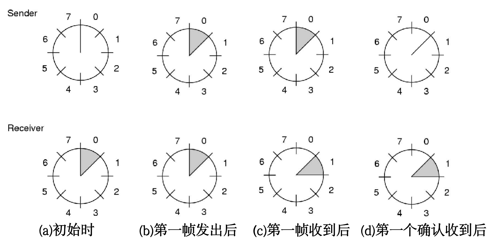
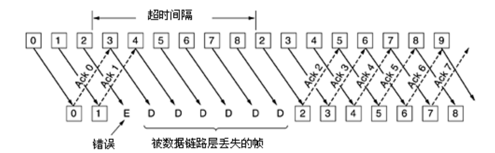
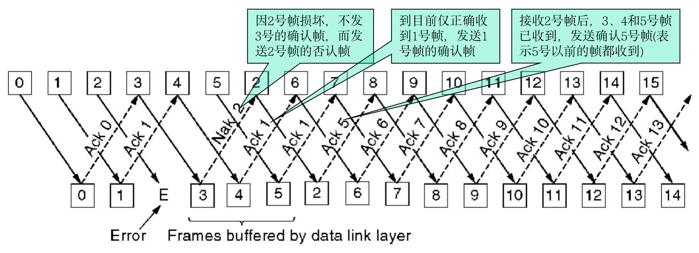

# 第3章 数据链路层
使用物理层提供的服务在通信信道上发送和接受比特：
- 向网络层提供定义良好的接口
- 处理传输错误
- 调节数据流，确保慢速的接收方不会被快速的发送方淹没

## 3.1 数据链路层的设计问题
#### 3.1.1 提供给网络层的服务
##### 无确认的无连接
- 源机器向目标机器发送独立的帧，目标机器并不对这些帧进行确认
- 特点
 - 不需建立逻辑连接，不用释放逻辑连接
 - 不试图检测丢帧或试图恢复丢失帧
- 用于错误率低的场合，靠上层恢复；实时通信，延迟比受损更严重
- 例如：Ethernet

##### 有确认的无连接
- 不使用逻辑连接，但每一帧需独立确认
- 用于不可靠的信道
- 例如：802.11

##### 有确认的有连接
- 建立逻辑连接，编号每一帧并确认收到
- 特点
  - 最复杂服务：建立/维护/释放连接，初始化/释放变量和计数器
  - 所有帧只被接收一次，且按照正确顺序接收
  - 需要三阶段：建立连接，初始化变量/计数器；传输一个或多个帧；释放连接和维护该连接的资源
- 用于长距离且不可靠的链路，避免带宽浪费
- 例如：卫星信道、长途电话电路

#### 3.1.2 成帧
- 数据链路层将网络层的数据包封装成**帧 frame**
- 将比特流拆散成离散帧，每个帧发送前计算**校验和 checksum**用于纠错，帧到达目标机器后，通过计算新校验和进行比对，如果发生的错误则要采取措施
- 有如下几种拆分比特流的方法
##### 字节计数法
   - 头部的一个字用来记录帧的长度
   - 缺陷：第一个比特的错误后果严重，接收方要求重传时，定位不到需要重传的起始位置，所有帧的起始位置都信息都损失了
   - 很少用
##### 字节填充的标志字节法
   - 每个帧用特殊的字节作为开始和结束，称为**标志字节 flag byte**，两个连续的FLAG位表示本帧的结束和下一帧的开始
   - 问题：二进制数据传输时，正常编码中需要出现FLAG的编码，对传输造成阻碍
   - **字节填充 byte stuffing**：规定转义字节ESC，前面加了ESC的FLAG和ESC不视为特殊字节，而是数据的一部分
   - 到达网络层之前必须删除转义字节
##### 比特填充的比特字节法
   - 在比特级别完成帧的划分，而非像字节填充法按字节划分
   - 每个帧的开始与结束由特殊的比特模式01111110划分
   - 数据中遇到连续5个1，就填充一个0，从而与上述模式区分
##### 物理层编码违禁法
   - 比特映射到物理层的信号时，物理层添加一些冗余比特，例如4B/5B把4个数据比特映射成5个信号比特
   - 在编码模式的约束下，有些信号不会被使用，就用这些“违法信号”作为分界符

#### 3.1.3 差错控制
- 确保所有的帧都被传递给机器的网络层，并保证正确的顺序
- 协议要求接收方返回特殊的**控制帧**，表示确认帧已经安全抵达
- 当硬件发生故障而控制帧丢失时，引入**计时器**确保发送方不会一直等下去，超时则需重传
- 为防止重传导致接收方无法区分两个相同的帧，一般需要为帧分配**序列号**

#### 3.1.4 流量控制
- 防止发送方的发送速度超过接收方能接受帧的速度
- 常见的方法有两种
##### 基于反馈的流量控制 feedback-based flow control
接收方给发送方返回信息，运行其发送更多数据或进行其他控制
##### 基于速率的流量控制 rate-based flow control
使用内置机制限制发送速率，无需接收方的反馈信息

***

## 3.2 差错检测和纠正
#### 3.2.1 纠错码 error-correcting code
- 将**冗余**信息加入待发送的信息中，使得接收方能够推断被发送的数据内容，也称前向纠错FEC
- 海明码
- 二进制卷积码
- 里德所罗门码
- 低密度奇偶校验码

#### 3.2.2 检错码 errer-detecting code
- 将**冗余**信息只足以检测出是否发生错误
- 奇偶
- 校验和
- 循环冗余校验

***

## 3.3 基本数据链路层协议

#### 3.3.1 乌托邦式单工协议 Utopia
- 数据单向传输
- 双方网络层永远就绪，数据处理时间忽略不计，缓存空间无限大，通信信道不会损坏或丢失帧
- 协议由两个单独的过程组成：
##### 发送过程
- 运行在**源机器**的数据链路层上
- 尽可能将数据放到线路上：
  - 从网络层获取数据包
  - 构造出境帧
  - 通过物理层发送
- 不做差错控制和流量控制

##### 接收过程
- 运行在**目标机器**的数据链路层上
- 只负责接受帧，帧一定是无损坏的：
   - 帧从硬件缓冲区转移到数据链路层
   - 帧传递给网络层
   - 返回，等待下一帧

#### 3.3.2 无错信道上的单工停-等式协议 stop-and-wait
- 认为接收方接受能力有限
- 发送方发送一帧，必须等待接收方确认才能继续发送

#### 3.3.3 有错信道上的单工停-等式协议 stop-and-wait
- 进一步认为通信信道可能出错，帧可能损坏
- 引入计时器、校验和、序列号：
  - 发送方发送一帧，等待接收方确认才能继续发送，如果**计时器**超时，则会将这一帧重发
  - 接收方会通过**校验和**检查帧是否损坏，但如果恰好帧损坏而校验和不变，协议将失败
  - 防止重传导致接收方无法区分两个相同的帧，帧分配**序列号**，1比特就够用
- **自动重复请求 ARQ**：发送方前移之前必须等待一个肯定确认

***

## 3.4 滑动窗口协议 sliding window protocol
- 捎带确认 piggybacking：尽可能不单独发送控制帧，而是等待一段时间来将确认信息附加在下一个出境的帧上
- **滑动窗口协议**都是双工协议
- 任何出境帧都包含一个序号，在停-等式协议中n=1，但滑动窗口协议中n不固定
- 发送方和接收方都要维持一组序号，各形成窗口：
  - 发送窗口的下界: 已发送但未得到确认的帧，或可被发送帧的最小序号
  - 发送窗口的上界: 要发送的下一个帧的序号
  - 接收窗口的下界: 希望接收的帧的序号
  - 接收窗口的上界: 允许接收的帧的最大序号

下图中n=3

#### 3.4.1 1位滑动窗口协议
- 发送方在接收到接收方对前一帧的确认到来才能发送下一帧
- 过早超时会使帧多次发送，导致带宽浪费

#### 3.4.2 回退N协议
- 长发送时间+高带宽+短帧导致效率极低，希望保持多个帧同时传输，这种技术称为**管道化 pipelining**
- 是发送窗口n>1，接受窗口n=1的滑动窗口协议
- 管道化传输时如果中间的某一帧发生损坏，需要与以往不同的处理，有以下两种技术：
##### 回退n go-back-n
- 简单丢弃坏帧的所有后序帧，即不对坏帧返回确认

##### 选择重传 selective repeat
- 只重传坏帧
- 接收方接受到坏帧时发送**否定确认NAK**
- 在正常接收后续帧的同时，不断发送相同的**ACK**指示当前接收成功的位置，后续帧将进入接收方缓存区暂存，暂时不算接收成功
- 坏帧重新传输成功后，直接发送最新缓存帧的**ACK**，传输恢复
