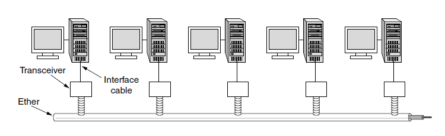
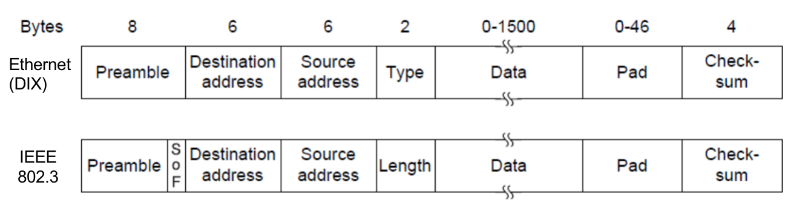
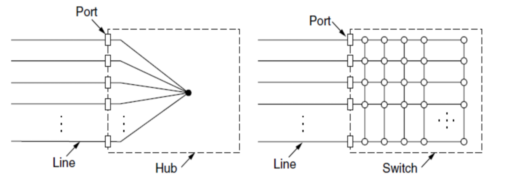
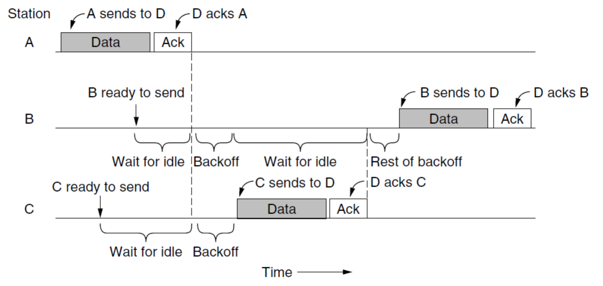
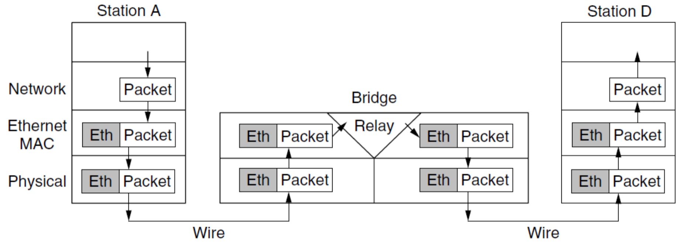

# 第4章 介质访问控制子层 Meduim Access Control
- 广播网络：多方竞争信道使用权；当只有一条信道时，多个站点欲进行交流，需要确定下一个发言者。
- 介质访问控制MAC（Medium Access Channel）子层：用来确定这种**多路访问信道**的下个发言者的协议
- **MAC**是数据链路层的一个子层

## 4.1 信道分配问题 199

#### 4.1.1 静态信道分配
- 将信道容量拆分给多个用户使用（FDM），传统方法
- 如：FM广播电台
- 低效，不适用于发送者多且不固定，流量呈突发性强的计算机系统，浪费空闲信道
- FDM 频分复用 和 TDM 时分复用 效率都很低

#### 动态信道分配假设
- **流量独立 independent traffic**
  N个独立站点，每个站点都产生要传输的帧，生成帧后站点堵塞，直至成功发送
- **单信道 Single Channel**
  所有通信共用一个信道
- **冲突可观察 observable Collision**
  两帧同时传输，在时间上重叠，产生混乱信号，称为**冲突**，能被所有站检测到
- **时间连续或分槽 Countinous or slotted time**
  时间可以被假设成连续的，也可以被设置为离散的**时间槽**，并使帧的传输只能始于某个时间槽
- **载波侦听或不听 Carrier Sense or no carrier sense**
  站点可在使用信道之前侦听信道是否被使用，如发现为忙，则任何站点不会尝试使用信道；
  也可以不做侦听，盲目传输

***

## 4.2 多路访问协议 202

#### 4.2.1 ALOHA
##### 纯ALOHA
- 站点有数据就传输，发送方检测是否冲突损坏
- 发现损坏，则等待随机时间重发，随机用来防止冲突帧重发的节奏完全一致
- 损坏无大小，坏一点也是坏

##### 分槽ALOHA slotted ALOHA
- 站点遵从统一的时间槽边界，发送帧必须等到下个分槽
- 提高传输效率

#### 4.2.2 载波侦听与多路访问协议
##### 1-坚持载波检测多路访问 1-persistent CSMA
- 有数据要发送时**持续**监听，直到发现空闲立即发送
- 无冲突检测：只在发送之前检测是否冲突，发送期间不检测，冲突则等待随机时间，再做以上判断
- 称为1-坚持是因为空闲时发送概率为1
- 贪婪争抢，更多冲突

##### 非坚持载波检测多路访问 nonpersistent CSMA
- 有数据要发送时**不持续监听**，如果信道闲就直接发送，否则等待随机时间再判断是否空闲
- 无冲突检测：只在发送之前检测是否冲突，发送期间不检测，冲突则等待随机时间，再做以上判断
- 更好信道利用率，更大延迟

##### p-坚持载波检测多路访问 p-persistent CSMA
- 有数据要发送时**持续**监听，发现空闲时按概率p发送数据，1-p概率推迟到下个时间槽
- 无冲突检测：只在发送之前检测是否冲突，发送期间不检测，冲突则等待随机时间，再做以上判断

##### 带冲突检测的CSMA (CSMA/CD) CSMA with Collision Detection
- 冲突检测：
  - 边发送边监听，发现冲突立刻停止，所有站点会进入**竞争时隙**
- **CSMA/CD**模型：
  - 冲突的根源：A站点发送但信号未到达B站点的时间内，B站点发送了
  - 认为信道上交替出现竞争期、传输期和空闲期
    - 竞争期：站点之间互相争夺信道使用权，交替产生不完整的、带冲突的传输和等待，称为**竞争期**
    - 传输期：几轮竞争后，某个站点**抓住**了信道，它将会进行一段相对长的传输，其他站点不会在此期间干扰
    - 空闲期：没有站点正在传输
  - 如果经过$2\tau$（$\tau$为最远两站点的信号传播时间）时间未监听到冲突，站点就确保自己**抓住**了信道进入**传输期**，因为：
    - 所有其他站点都因在$[0,\tau]$通过载波侦听知道它的发送，从而终止自己的发送
    - 所有可能在路上的其他信号（发出于$[0,\tau]$，传播于$[0,2\tau]$）都已传播结束

    也正因如此，一轮**竞争**不超过$2\tau$
- 可以将**CSMA/CD**视为一个分槽ALOHA系统：
  - 传输期下，站点能无冲突独享若干连续“时间槽”，不间断传输一个帧，期间不会被冲突打断
  - 因而帧（相对传播时间而言）越长时，**CSMA/CD**越有优势
- 冲突检测的前提：冲突检测是发送方在发送时持续监听信道，如果发现监听到的与自己发送的不同，则说明出现冲突，因此，“干扰信号”相对于发送信号不能太弱，否则检测不出来。

#### 4.2.3 无冲突协议
- 原理决定其本身不产生冲突
- 适用于线缆长（$\tau$大）、帧长短的情况
  - 该情况下冲突不仅降低带宽、而且使得帧的发送时间不稳定

##### 位图协议：基本位图法 basic bitmap method
- 共N个站点，先用1个“竞争槽”中的N个位来确认发送顺序，每个站点独占1位。
- 说是竞争槽，但是因为每位各自独占，所以不会冲突。

##### 令牌环 token ring
- 令牌token是一种特殊的帧，代表了发送权限：站点中等待发送的帧队列，收到令牌后，站点可以发送帧，并把令牌发送给下一站。
- 令牌环不是在物理上形成了环，而是通过类似链表的方式，为每个站点指明next，构成网络拓扑上的环。

#### 4.2.4 有限竞争协议

#### 4.2.5 无线局域网协议
##### 无线局域网的特点
- 无线局域网：范围有限、范围内全体接受，无法定向，不能使用CSMA/CD
- **隐藏终端问题**：竞争者离得太远，导致无法检测到潜在的竞争者，导致冲突

- **暴露终端问题**：两个发送方的各自同时发送，对两个接收方距离较远无影响，但是两个发送方互相暴露，认为彼此造成干扰而不传输，导致浪费

##### 冲突避免多路访问 MACA
- 发送方A发送RTS帧 require to send 这个帧很短，并包含将要发送的字节长度
- 接收方B回复CTS帧 clear to send ，复制RTS的字节长度
- 听到RTS的其他站点C必须保持沉默，因为C离发送方A太近，但时长只要保证CTS不被干扰即可；之后，当A->B通信时，C也可以自由发送，因为干扰不到B
- 听到CTS的其他站点D必须保持沉默，因为D离接收方B太近，时长由CTS中获取，D在A->B通信时必须沉默
- 两个站点同时向一个站点发送RTS将导致RTS丢失，这两个没收到CTS的站点将在随机时间后重试

***

## 4.3 以太网 Ehernet 216
- 以太网是有线局域网的主要形式
##### 两大类以太网
- 经典以太网
- 交换式以太网：使用交换机连接不同的计算机

- 以太网和`IEEE802.3`几乎无区别，在课程中可以认为是一种事物的两种称呼

#### 4.3.1 经典以太网物理层

- 以太网电缆有最大距离限制，超过这个范围，信号将无法传播

#### 4.3.2 经典以太网MAC子层协议
##### 帧格式

##### 目标地址 Source address 与 单播、广播、组播
- 单播 unicasting：目标地址最高位为0，会被一个站点接收
- 组播 broadcasting：目标地址最高位为1，表示组地址，会被多个站点接收
- 广播 multicasting：目标地址全1，则这个帧会被网络中的所有站接收

##### 以太网CSMA/CD
- 经典以太网采用：1-坚持CSMA/CD（1-persistent CSMA/CD）贪婪+冲突检测
- 所有帧至少需要$2\tau$时间才能完成发送，原因见CSMA/CD部分

- 帧的最小长度：$2\tau \times 传输速率$ 

##### 二进制指数后退 binary exponential backoff
- 经典以太网使用1-坚持CSMA/CD，其中随机等待的时长需要确定
- 第一次冲突，随机等待$[0,1]$个时间槽
- 第二次冲突，随机等待$[0,3]$个时间槽
- 第n次冲突，随机等待$[0,2^n-1]$个时间槽
- 10次冲突后，最大等待时间槽被固定为1023不再上涨，避免延迟太大
- 16次冲突后，发送失败报告，交由高层处理

#### 4.3.4 交换式以太网 Switched/Fast Ethernet
- 集线器：将若干个站点插到一台集线器上进行连接，方便维护，逻辑上仍然是**经典以太网**
- 交换式以太网：一个帧到来时，交换机进行判断，只向一个端口发送此帧，这个端口连接着集线器，集线器中的所有站点还是要依靠CSMA/CD来解决冲突，但是其他端口都不知道有该帧存在。

***

## 4.4 无线局域网
- 无线局域网的主要标准是`802.11`

#### 4.4.3 `802.11` MAC子层协议
- 无线电几乎总是半双工的，无法在传输的同时侦听频率上的噪声，因为接受信号相对发送信号太弱
##### 带冲突避免的CSMA (CSMA/CA) CSMA with Collision Avoidance
- 发送前侦听信道，且并发送前先进行随机后退，相比之下：CSMA/CD是冲突时才随机后退
- 发送成功后，目标站立即发送一个短确认**ACK**，信道此时恢复空闲状态
- 信道空闲时：
  - 站点通过侦听一个很短的时间段DIFS获知信道空闲
  - 所有准备好的站点都进行**随机后退**倒计时
  - 倒计时最先结束的站点先发送，其余站点暂停倒计时
  - 信道再次空闲时，新准备好的站点生成新的倒计时，上次未争夺到站点倒计时继续
- 发送站未接收到发送确认**ACK**，则认为发生错误，该站点需要加倍等待，形成指数后退

##### 无线局域网和以太网的两个区别
- 早期后退有助于避免冲突，即使只发生一个冲突，因为整个帧都被传输出去了，因此冲突代价太昂贵。
- 无线环境下存在隐藏/暴露终端问题，相比之以太网内的所有站总能听到彼此。

##### CSMA/CD 与 CSMA/CA对比
- CSMA/CD主要着眼点在冲突的侦测，当侦测到冲突时，进行相应的处理，要求设备能一边侦测一边发送数据，适用以太网。 
- CSMA/CA主要着眼点在冲突的避免，协议里也看到经常是等待一段时间再做动作，通过退避尽量去避免冲突吗，通过发送一些特别小的信道侦测帧来测试信道是否有冲突，适用无线局域网，因为无法进行冲突检测，且冲突代价昂贵。

***

## 4.8 数据链路层交换 256
#### 4.8.1 网桥的使用
- 网桥是用来扩展数据链路层的
- 网桥配备了一个大的（哈希）表，用来记录要将帧转发到那个端口
  - 目标地址的端口与源端口相同：那么网桥丢弃该帧
  - 目标地址的端口与源端口不同：则转发到对应端口
  - 端口未知：使用**泛洪法 flooding algorithm**，发送到除源端口以外的所有端口
- 网桥无只需知道MAC地址即可开始帧的转发，且计算速度极快，因此完整接收一帧之前即可完成转发，这种转发方式被称为**直通式交换cut through switching**或虫孔路由**wormhole routing**
- 网桥中有一个**中继 relay**模块，属于MAC层
