# 第5章 网络层
- 将数据包从源机器路由到目标机器

!!! question
    ##### IP地址由哪几部分组成
    ##### IPv4一共有多少位
    ##### 什么是子网掩码
    ##### 漏桶算法和令牌桶算法的用途
    - 漏桶算法能够强行限制数据的传输速率
    - 令牌桶算法能够在限制数据的平均传输速率同时还允许某种程度的突发传输。
    ##### 漏桶算法和令牌桶算法对流量整形的区别
    ##### 因特网的IP是采用透明分段还是非透明分段
    - 非透明的，不需要重组
    ##### 怎样理解隧道技术

## 5.1 网络层的设计问题 274
#### 5.1.1 存储转发数据包交换
##### 存储-转发数据包交换
- 主机想发送一个数据包，它就将数据包传输给最近的路由器数据包到达路由器
- 路由器在链路层完成对校验和的验证，先被**存储**在路由器上
- 数据包沿路径被**转发**到下一个路由器，直至到达目标主机

#### 5.1.2 提供给传输层的服务

#### 5.1.3 无连接服务的实现
- 所有数据包都被独立的注入网络，独立路由，不需要提前建立任何设置，这种数据包也可被称为**数据报 datagram**
- **IP协议 Internet Protocol**是整个Internet的基础，是**无连接服务**的重要范例。每个数据包携带一个目标IP地址，路由器使用该地址来单独转发每一个数据包。
  - IPv4使用32位IP
  - IPv6使用128位IP
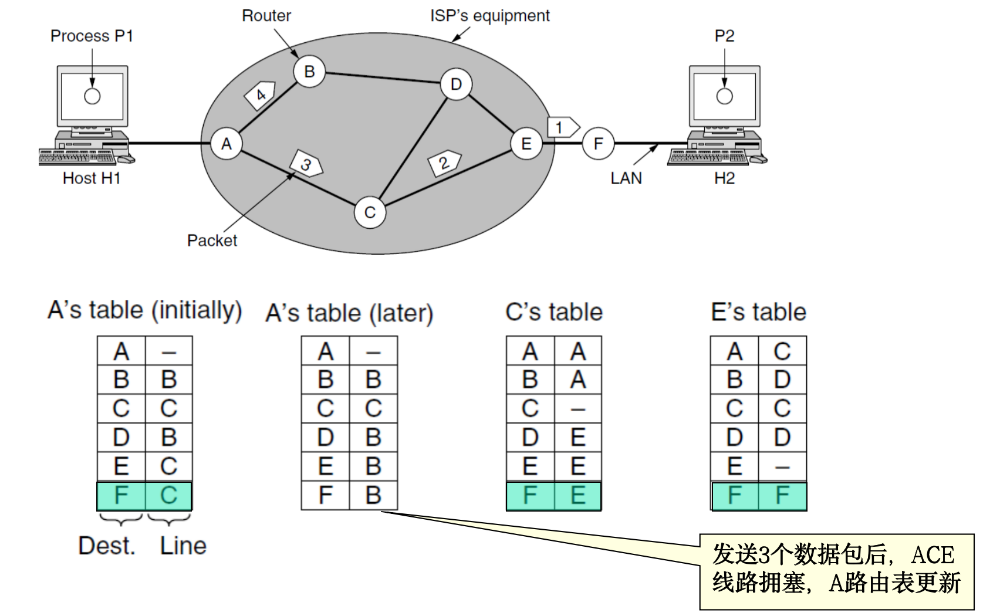

#### 5.1.4 面向连接服务的实现
- 面向连接服务需要一个**虚电路网络**
- 在发送数据数据包之前，必须先建立起一条从源路由器到目的路由器之间的路径，这个连接称为**虚电路 VC**
- 每个数据包都包含一个标示符，指明该数据包属于哪个虚电路
- 使用该虚电路进行通信
- 通信结束后虚电路终止
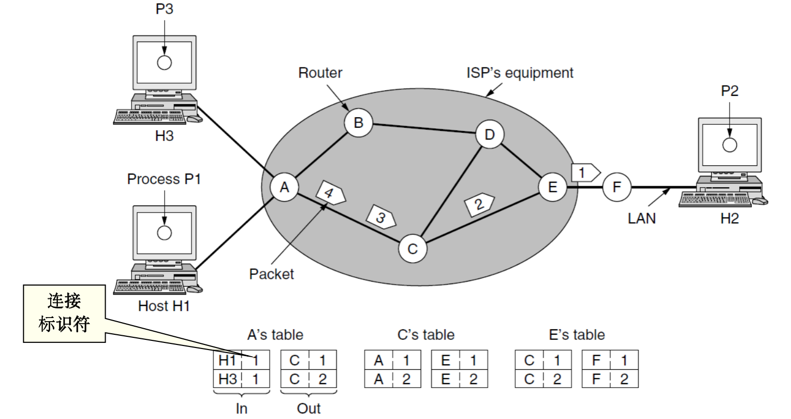

#### 5.1.5 虚电路和数据报网络比较
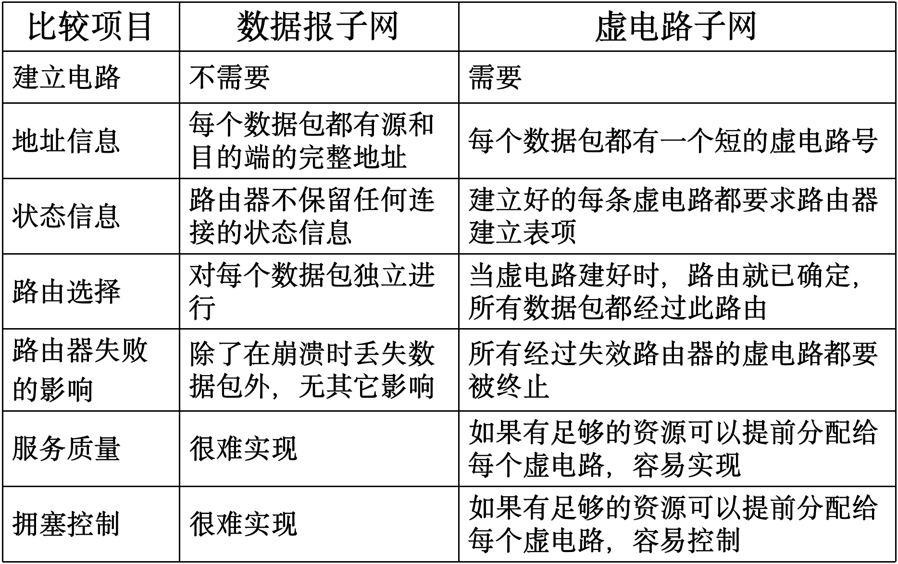

##### 连接建立时间与地址查找时间的权衡
- 虚电路：需要在建立连接时花费时间
- 数据报：每次路由时，查找过程复杂，花费时间
##### 路由器内存空间与带宽的权衡
- 虚电路：数据包只要包含虚电路号，不用包含完整的目的地址，但路由器需要维护虚电路的状态信息。
- 数据报：每个数据报都要携带完整的目的/源地址，但路由器不需要维护虚电路的状态信息。
##### 服务质量 QoS
- 虚电路：很容易保证服务质量，可以提前预留资源，适用于实时操作，但比较脆弱。
- 数据报：不太容易保证服务质量，但是对于通信线路的故障，适应性很强。

***

## 5.2 路由算法 routing algorithm 279
- 路由算法负责确认入境数据包应该被发送到哪一条输出线路上
- 是网络层的一部分
##### 路由和转发的区别
- **转发 forwarding**：指在一个具体的路由器中，将一个输入分组，根据转发表中的规则发送到输出接口的过程。
- **路由 routing**：指一个网络中的所有路由器使用特定的路由协议，计算出分组从源到目的地节点所采用的路线。
- 
#### 5.2.1 优化原则
- 所有的源到一个指定目标的最优路径的集合构成**汇集树 sink tree**，以目标节点为根
- 路由算法的目标是为所有路由器找到**汇集树**

#### 5.2.2 最短路径算法 shortest path
- 分布式的路由算法：不是全部路由器都知道网络的所有细节
- **最短路径**的度量指标：跳数、物理距离、平均延迟或是诸多因素的综合
- 采用Dijkstra法计算源节点到所有目标节点的最短路径

#### 5.2.3 泛洪算法 flooding
- 每个进来的数据包将被发送到除了它进来的那条线路外的其它输出线路上
- 属于静态算法
- 是有效的广播手段，且健壮性强，多数路由器被摧毁也能正常运行
##### 防止产生大量重复包的两种方法
- 每个包的头中维护一个**跳计数器**，每经过一跳后该计数器-1，为0时则丢弃该数据包
- 每个包的头中含一个序号，源机器每发送一个新包就+1，路由器记录每个抵达包的(源路由器，序号)数对，当一个链路状态数据包到达时：
  - 在维护的表中不存在，是**新的**：则除了它到来的那条线路外，向其他线路转发该数据包
  - 在维护的表中存在，是**重复的**：则丢弃
  - 在维护的表中不存在，但表中存在**源站点**值相同的项且**序号**更大的项，是**过时的**，则丢弃

#### 5.2.4 距离矢量算法 distance vector
- 属于**动态路由算法**
- 每个路由器维护一张表，表中给出了当前已知的到每个目的地的最佳距离，以及所使用的线路，并通过与相邻路由器交换距离信息来更新表
1. 路由器首先确认与自身相邻节点的延迟
2. 接下来确认剩下的每个非相邻节点：遍历相邻节点，计算**到相邻节点的延迟**+**相邻节点表中到目标的延迟**，选取具有最小延迟的相邻节点填入表中
- 注意本路由器的旧表不参与运算
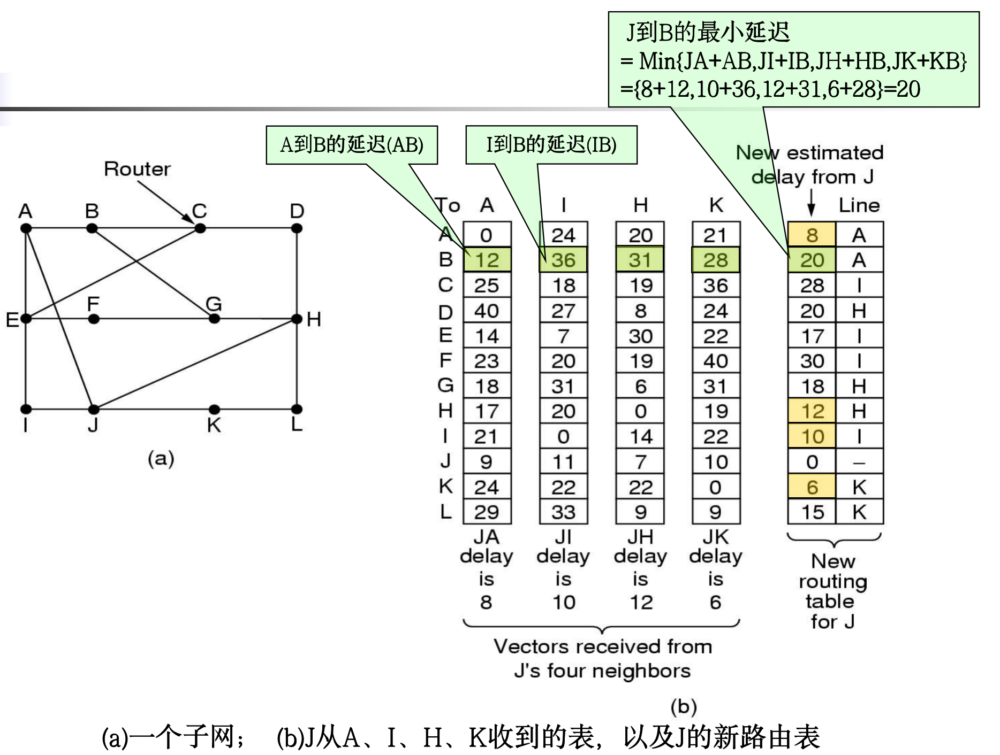
- 整个网络最佳路径的寻找过程成为**收敛 convergence**

#### 5.2.5 链路状态路由 link state routing
- 网络拓扑结构发生改变时，距离矢量算法收敛太慢，不考虑带宽，并可能存在**无穷计算问题**，于是设计了**链路状态路由算法**
- **链路状态路由算法**是大型网络和Internet应用最广泛的路由算法
##### 设计思想
1. 发现邻居节点，了解其网络地址
2. 设置到每个邻居节点的距离或者成本度量值
3. 构造一个包含所有刚刚获知的链路信息包
4. 将这个包发送给其他路由器，并接受来自所有其他路由器的信息包
5. 计算出到每个其他路由器的最短路径
##### 发现邻居
路由器启动后，通过发送HELLO数据包发现邻居节点
##### 设置链路成本
发送一个的ECHO数据包，要求另一端立即送回一个应答，往返时间除以2即为延迟，有时需要考虑负载和带宽
##### 构造链路状态包
- 数据包构成
  - 发送方的标识符
  - 序号 Seq
  - 年龄 Age
  - 邻居列表：路由器的邻居+到这个邻居的延迟
- 创建数据包的时机：按一定的时间周期，或仅在重要事件发生时

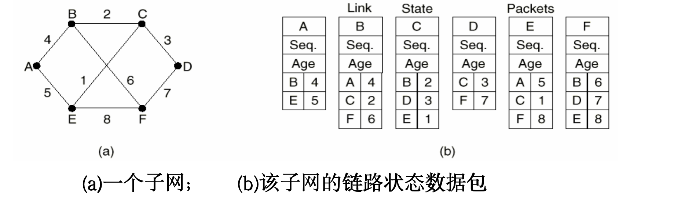

##### 分发路由器状态包
- 使用**泛洪法**发布链路状态数据包
  - 为控制泛洪规模，采用5.2.3中的第二种方法
> - 每个包的头中含一个序号，源机器每发送一个新包就+1，路由器记录每个抵达包的(源路由器，序号)数对，当一个链路状态数据包到达时：
>   - 在维护的表中不存在，是**新的**：则除了它到来的那条线路外，向其他线路转发该数据包
>   - 在维护的表中存在，是**重复的**：则丢弃
>   - 在维护的表中不存在，但表中存在**源站点**值相同的项且**序号**更大的项，是**过时的**，则丢弃
- 几个问题及其改进
  - **序号**回转可能产生混淆。**解决办法**：使用32位序号。
  - 路由器崩溃后，如果**序号**再从0开始，则下一个数据包被认为是**过时**的而丢弃。**解决办法**：数据包中增加**年龄 age**域，每秒钟年龄减1，为零时，来自该路由器的信息被丢弃
  - 序号被破坏：解决办法：增加**年龄 age**域一并解决
- 提高健壮性
  - 令链路状态数据包泛洪到路由器时，先进入**保留区**等待一段时间，并与其它已到达的来自同一路由器的链路状态数据包比较序号和丢弃
  - 所有的链路状态数据包需要应答

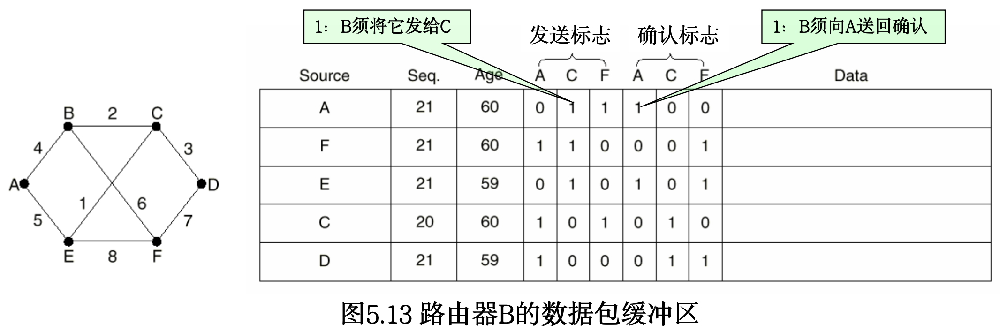

#### 5.2.6 层次路由 hierarchical routing
- 网络规模增长迅速，路由器不可能为每个其他路由器维护表项，路由需要分层次进行
- 路由器被划分为**区域 region**
- 路由器表记录如下内容：
  - 如何将数据包路由到本区域内的其他路由器
  - 如何将数据包路由到其他区域
- 对于更大规模的网络，层次更多
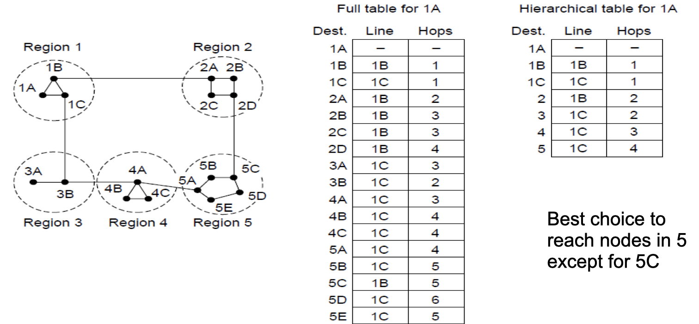

***

## 5.3 拥塞控制算法 congestion control 302
##### 拥塞 congestion
- **拥塞**：网络中存在太多数据包，导致数据包被延迟和丢失，从而降低传输性能
- 控制拥塞最有效的方法是减少传输层注入网络的负载
- **网络层**和**传输层**共同承担拥塞处理责任，本章着眼于网络层
##### 拥塞崩溃 congestion collapse
- 大量包积压等待，延迟时间过长的数据包需要丢弃、重传，导致网络传递有用信息的

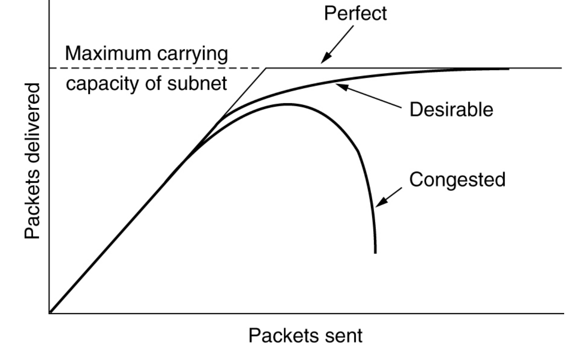

#### 5.3.1 拥塞控制的途径
- 拥塞的出现意味着负载（暂时）大于（网络某一部分）资源可以处理的能力

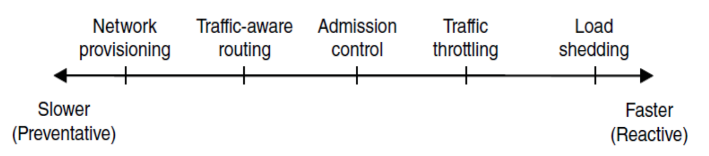
##### 网络供给 network provisioning
建立一个带宽与流量相匹配的网络
- 当出现拥塞时，动态增加网络资源
- 购买带宽
##### 流量感知路由 traffic-aware routing
充分利用现有的网络容量
- 根据每天的流量模式定值路由
- 改变最短路径权重
##### 准入控制 admission control
在容量不可增加时，采用降低负载的策略
- 在虚电路网络中，拒绝新链接的建立
##### 流量限制 traffic throttling
网络向数据包源端发送反馈信息，减缓流量本身
##### 负载脱离 load shedding
网络不得不丢弃无法传递的数据包时，选择正确的丢弃策略也能防止拥塞崩溃

***

## 5.4 服务质量 QoS 311
- 注重提供与应用相匹配的服务质量
- 服务质量机制允许以较低成本满足应用需求，并兑现其所能做的性能保证
#### 5.4.1 应用需求
##### 流 flow
- **流**是从一个源到一个目标的数据包流
- 流的4个特征合起来决定一个流所要求的**服务质量**：
  - 带宽
  - 延迟
  - 抖动
  - 可靠性（丢失）
- QoS方法：流量整形，分组调度，准入控制，综合服务，区分服务

#### 5.4.2 流量整形 traffic shaping
- **流量整形**指条件进入网络数据流的平均速率和突发性所采用的技术
##### 漏桶 leaky bucket
- 如果在一台主机上，桶中的数据包数目达到了最大值，又发送数据包，则该数据包必须等待或被丢弃
- 将用户发出的不平滑的数据数据包流转变成网络中平滑的数据包流
- 漏桶算法适用于
  - 固定数据包长的协议，如ATM
  - 可变数据包长的协议，如IP，但要使用字节计数
- 漏桶算法缺点：无论负载突发性如何，漏桶算法强迫输出按平均速率进行，不灵活
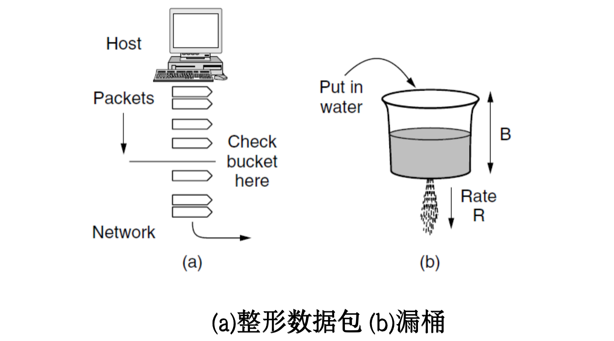

##### 令牌桶 token bucket
- 希望当大的通信量到来时，输出也能加速,最大到桶的大小n
- 漏桶存放令牌，每隔一段时间产生一个令牌，令牌累积到超过漏桶上界n时就不再增加
- 数据包传输之前必须获得一个令牌，传输之后删除该令牌
- 在桶满时，会丢失令牌，但绝不丢弃数据包

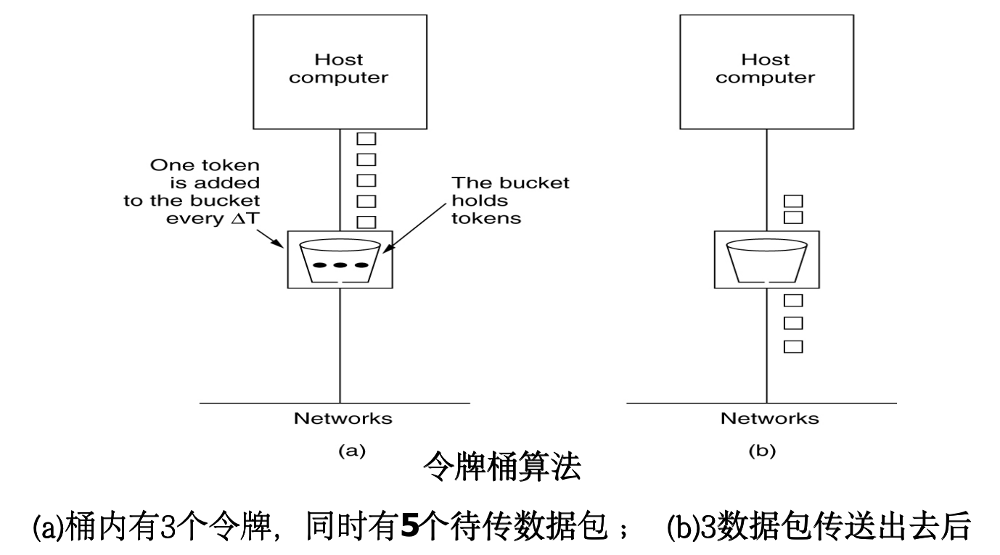

#### 5.4.3 包调度 packet scheduling
- 保证服务质量还需要沿包经过的网络路径预留足够的资源
- 包调度算法分配带宽和路由资源，确定下一次把缓冲区的哪些数据发送到输出线路
##### 先来先服务 FCFS
- 导致**尾丢包 tail drop**：队满时容易丢弃新来的数据包
##### 公平队列 fair queueing
- 路由器为每个流设置单独的队列
- 线路空闲时循环扫描队列，按轮转顺序获得包的发送机会，使得n个主机至多每n轮发送一个数据包
- 以**字节**为单位的公平队列：以包为单位轮转发送对短包不公平，因此改为每轮只发一个字节
- **加权公平队列 WFQ**：在此基础上，可为某个队列增加权重w，则该队列每轮发w个字节，以实现优先级

#### 5.4.4 准入控制
#### 5.4.5 综合服务
#### 5.4.6 区分服务
##### 加速转发
将数据包分为常规的和加速的两种，加速数据包单独享用一条物理线路

***

## 5.5 网络互联 internetwork
#### 5.5.4 互联网路由
#### 5.5.5 数据包分段
- 网络或链路限制其数据包的最大长度
- 限制长度原因：
  - 硬件
  - 操作系统
  - 协议
  - 标准
  - 期望减少错误导致的重传次数
  - 期望防止数据包占用信道时间过长
##### 透明分段 transparent
- 每个路由器接受到被**分段**的数据包后，都进行重组
- 分段对沿途后续的网络**透明**
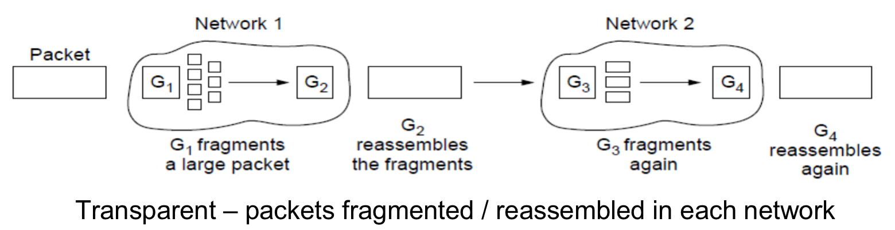
##### 非透明分段 non-transparent
- 避免在中间路由器上重组**分段**，每个段都被当作原始数据包一样被对待
- **重组**只在主机上进行
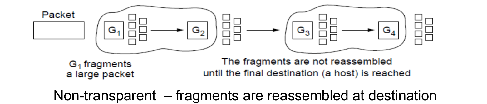

## 5.6 Internet的网络层 335
#### 5.6.1 IPv4协议
- 每个IP数据报由头和正文构成
##### 头中的信息
- 版本：目前IPv4主导
- 头长度：因为头的长度不固定
- 区分服务 differentiated services：区分不同的服务种类，如文件传输、语音数据等，用以采取最佳的应对措施
- 标识：用来确认新到达的分段属于那个数据报，见5.5.5数据包分段
- 总长度
- 不分段位DF：置1禁止路由器对数据包分段
- 更多分段位MF：用来确认所有的段已到达
- 生存期：每一跳-1，为0时数据包被丢弃
- 头校验和：确保重要信息不出错，如源地址和目标地址
- 源地址和目标地址
- 选项

#### 5.6.2 IP地址
- IP采用一种全局通用的地址格式，为全网的每个主机和路由器分配一个IP地址
- 一个IP并不指向一台主机，而是指向一个网络接口，同一网络（如以太网）上的所有主机，其地址IP地址是相同的
- 如果一个主机在两个网络中，它就有两个IP地址，但一般不会出现这种情况
- 路由器有多个网络接口，故有多个IP地址
##### 前缀 prefix
- IP地址具有层次性，这与以太网不同
- 一个网络拥有一个IP**前缀**，相当于分配了一块**前缀**相同的连续IP空间
- 每个32位地址由高位的可变长地址和地位的主机两部分组成
- 网络地址：32位IP加斜线`/`，斜线后的数字表示网络部分（高位部分）的长度
- 前缀仅通过IP无法推断，路由协议必须将**前缀**长度携带给路由器，构造一个32位二进制数，将需要的前缀位置1，其他位置0，与IP进行AND操作来提取前缀，称为**子网掩码 subnet mask**

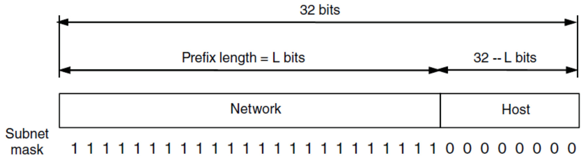
##### 子网 subnet
- **子网划分 subnetting**：将内部的一个网络块划分成几个部分供多个内部网络使用，但对外表现得像单个网络
- 网络地址管理由**Internet域名和地址分配机构 ICANN**负责
- 将IP前缀进一步细分为子网
- 路由器将数据包的目标地址与每个子网的掩码进行AND运算，将结果与子网的前缀比较，以知晓应该转发到那个子网
- 子网的划分对外**不透明（不可见）**，子网划分的改变无需改动外部数据库或联系ICANN
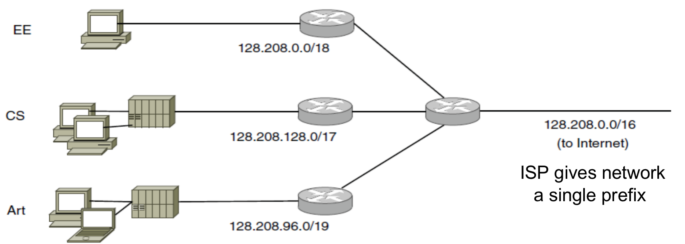

#### 5.6.3 IPv6协议
- 128位
- 解决IPv4地址短缺的技术之一

#### 5.6.4 因特网控制协议 (ICP) Internet Control Protocols

##### 地址解析协议 (ARP)
- 让所有节点能够通过一个IP地址找到对应的MAC地址
- 主机不知道目标IP的以太网地址时，发送广播包向以太网上所有主机请求该IP的以太网地址
- 有对应IP的主机用自己记录的以太网地址作为应答

##### 动态主机配置协议 (DHCP)
- DHCP服务器分配IP地址
- 主机启动时，发现自己没有IP地址，就向自己所在的网络广播一个报文，请求IP地址
- DHCP服务器接受到请求，就为主机分配一个空闲IP地址，并通过包返回给主机
- **地址租赁 address leasing**：IP不能永久分配给一个主机，到期后主机需要续订

#### 5.6.6 内部网关路由协议 (OSPF) Open Shortest Path First
- 因特网由大量**自治系统 Autonomous System**组成，它们由不同组织独立运营
- **自治系统**内使用的路由协议称为**内部网关路由协议**，域内路由协议
- 链路状态路由协议：节点之间交换状态，形成拓扑结构
- 使用5种消息形成泛洪拓扑结构
- Dijkstra法计算路径

#### 5.6.7 外部网关路由协议 (BGP) Exterior Routing Protocol
- 域间路由协议
- 如何在**自治网络**之间进行传输
##### 域内协议与域间协议的不同
- 域内协议：尽可能有效的将数据从发送方传送到接收方，不考虑政治因素
- 域间协议：考虑大量政治因素

