# 第6章 传输层
- 跨越许多道网络，实现所需的连接服务
- 为网络层提高可靠性
- 将数据传递服务从两台计算机之间扩展到两台计算机的进程之间

## 6.1 传输服务 383
- 传输层内，实现传输层这些功能的软硬件称为**传输实体 transport entity**
- **段 segment**表示**传输实体**之间发送的消息，也称**传输协议数据单元 TPDU**
- 帧、包、段由外向里嵌套，嵌套关系如图：
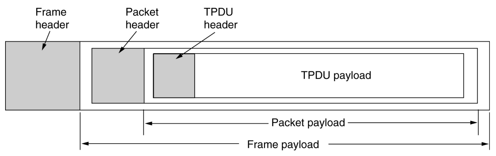

#### 6.1.1 提供给上层的服务
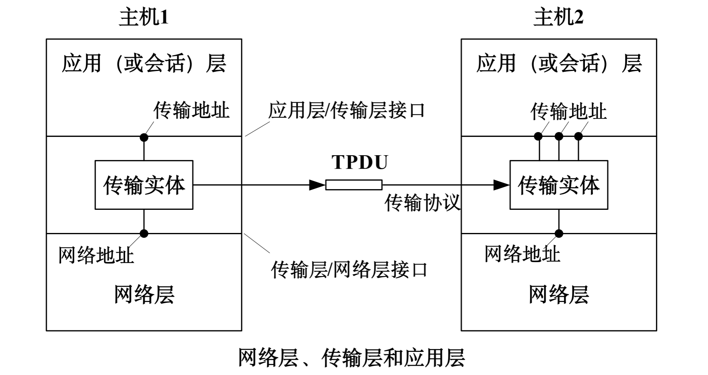

#### 6.1.2 传输服务原语
- 传输服务有一组**原子语句（原语）**
- 应用程序通过**原语**访问传输服务

#### 6.1.3 Berkeley 套接字 Berkeley socket
- Berkeley 套接字是另一组**原语**，由TCP使用
- 连接的释放是对称的，双方同时执行CLOSE**原语**后连接就被释放了

***

## 6.2 传输协议的要素 392
#### 6.2.3 连接释放
- 不需要连接的时候，传输层的实体必须将它释放
##### 非对称释放 asymmetric release
任何一方都可以关闭双向连接，有数据丢失的危险
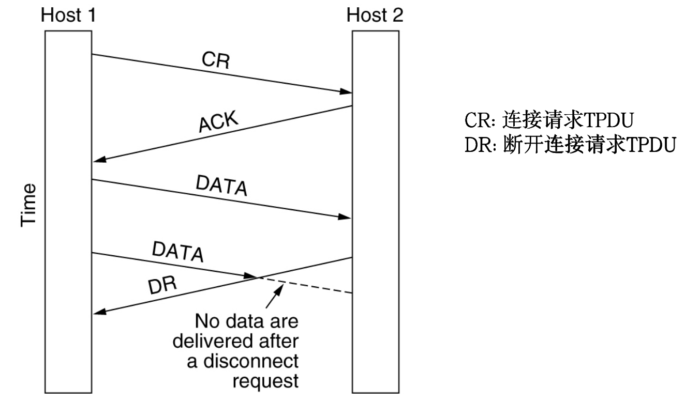
##### 对称释放
每个方向的连接单独关闭，双方都执行DISCONNECT才能关闭整条连接

***

## 6.3 拥塞控制 409

#### 6.3.1 理想的带宽分配

##### 最大-最小公平性 max-min fairness
- **最大-最小公平分配**指：如果分配给一个流的带宽在不减少另一个流带宽的前提下无法进一步增长，就不给这个流更多带宽
- 如图：
  - 可见R1->R2有空闲流量，但不会使用，因为R2->R3已满，不能侵占B的R2->R3的流量
  - R4->R5为瓶颈
- 思路：所有的流从速率0开始，逐渐增加速率，当任何一个流的速率达到瓶颈，就停止该流的数据增加，其他流继续增加各自的速率，直到所有的流达到瓶颈
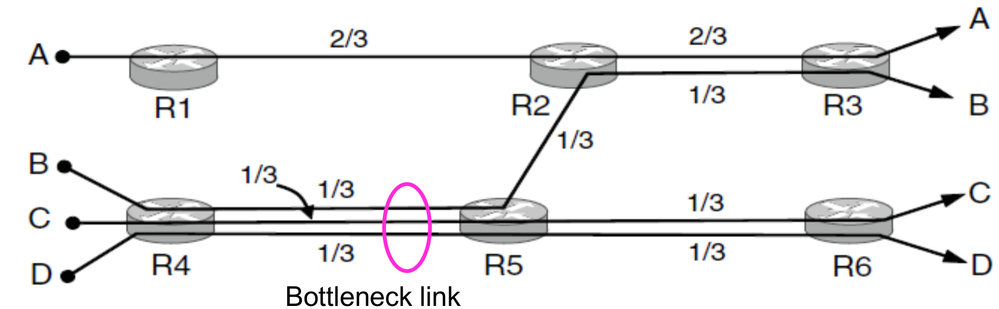

##### 收敛
- 拥塞控制算法能否快速收敛到公平而有效的带宽分配上
- 网络是动态的
- 算法不稳定可能导致：收敛过慢、无法收敛到正确的操作点、在正确操作点附件震荡

#### 6.3.2 调整发送速率
发送速率受两个因素制约：
##### 流量控制 flow control
接收端缓冲区不足
##### 拥塞控制 congestion control
网络容量不足

##### 加法递增乘法递减 (AIMD) additive increase multiplicative decrease
- 设想两个流争夺带宽，算法希望逼近最优操作点，兼顾公平性与效率
  - 落在**公平线**上保证带宽分配公平：带宽1=带宽2
  - 落在**效率线**上保证整个网络带宽使用效率最高且不拥塞：带宽1+带宽2=100%
  - 最优操作点为**公平线**和**效率线**的交点
  - 加法递增乘法递减能向最优操作点收敛
- 流程：
  - **加法递增**：未拥塞时按固定值均匀增大两个流的带宽
  - **乘法递减**：受到拥塞信号后，两个流按各自比例减少带宽
- 稳定性观点：拥堵易而恢复难，递增政策要轻柔，递减政策要积极
- AIMD被**TCP协议**所采用，而**TCP**是**Internet**拥塞控制的主要形式
  - TCP调整速率是通过调整**滑动窗口**大小实现的
  - TCP要通过测量**往返时间 RTT**判断速率，上述的AIMD对距离较远的主机不公平

*** 

## 6.4 Internet传输协议：UDP 417
#### 6.4.1 UDP概述
- Internet协议集支持无连接传输协议：**用户数据报协议 UDP user datagram protocol**，提供一种无需建立连接即可发送封装的IP数据报的方式
- **UDP**的**段**由8字节的头和有效载荷字段构成
- 查询IP地址可通过向DNS服务器发送UDP数据包的方式

***

## 6.5 Internet传输协议：TCP 425
#### 6.5.1 TCP概述
- **传输控制协议 TCP transmission control prtocol**：是为了在不可靠的互联网络上提供可靠的**端到端**字节流而专门设计的

#### 6.5.2 TCP服务模型
- **套接字编号（地址）**：由**主机IP**+**16位端口号**组成
- **端口 ort**：表示一台计算机中的特定进程所提供的服务
  - 1024以下的端口被保留，称为**知名端口 well-known port**
  - 其余端口可由用户使用
- TCP服务由发送端和接收端创建的称为**套接字 socket**的端点来获得
- 一个TCP连接就是一个**字节流**，而不是**消息流**，端到端之间不保留消息的边界

#### 6.5.4 TCP的头
- TCP的头仅存储端口号，而**套接字编号**前半部分的IP地址存储在在IP层

#### 6.5.5 TCP的建立
- TCP使用**三次握手法**来建立连接
- 即使双方同时尝试建立连接，最终也只会建立一条连接
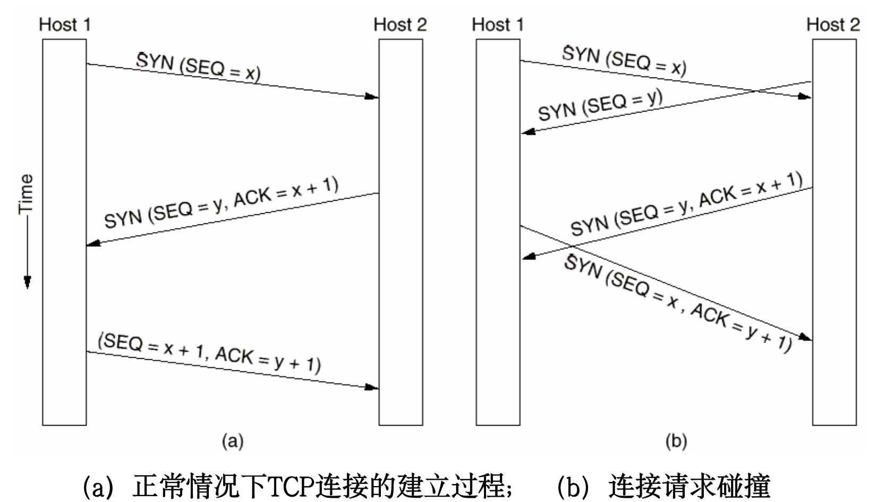

#### 6.5.6 TCP连接释放
- 释放通常需要4个TCP段，有时第一个ACK和第二个FIN合并，这样只需要3个
- 释放连接时，FIN的发送端启动一个计时器，在收到确认后释放连接
- 若无确认并且超时，也直接释放连接，这样对方也因会超时而发现无人监听连接，使连接释放

#### 6.5.7 TCP连接管理模型
- TCP建立连接和释放连接的过程可以用**有限状态机**来描述

#### 6.5.8 TCP滑动窗口
- TCP窗口管理将**正确接受段的确认**和**接收端的接收缓冲区分配**分离开
- SEQ：发送端将要写入的缓冲区窗口号
- ACK：接收端确认信息，下次发送端的SEQ
- WIN：接收端剩余窗口大小
- 即使窗口已满，紧急数据仍然可以发送
- **窗口探测 window probe**：发送端发送一个1字节的段，强制接收方返回下一个期望的字节和窗口大小
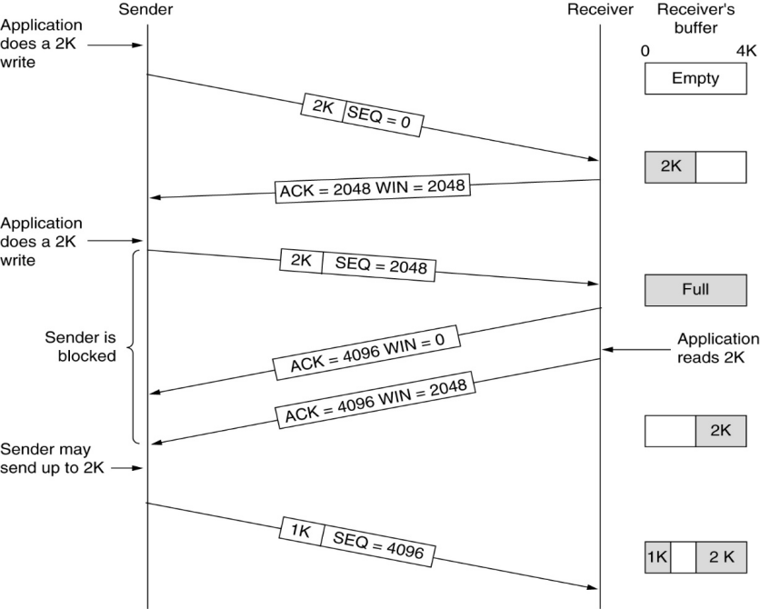

- 发送端不一定接到应用程序传递来的数据就马上传递出去，接收端也不一定收到了就立刻确认
##### 延迟确认 delayed acknowledgement
- 要发送的数据太少时，数据会被包裹上各种头，还要求接收端发出确认，开销太大，明显浪费带宽
- 通过将确认和窗口更新延迟一段时间，希望在此期间能搭载更多数据
##### Nagel算法
- 思路：发送方不要发送太小的数据段
- 初始化：先发送一个小数据包，缓冲之后的所有字节
- 当小数据包得到确认后，将刚刚缓冲的所有字节放在一个TPC段中一并发出，再继续开始缓冲，直到再一次得到确认再发送
##### 低能窗口综合症 silly window syndrom
- 数据以大块形式被传递给发送端TCP实体，但接收端每次只读取1个字节，导致接收端每有一点可用缓冲区，都立刻通知发送端可以发送，发送端也就只发1个字节，导致效率低下
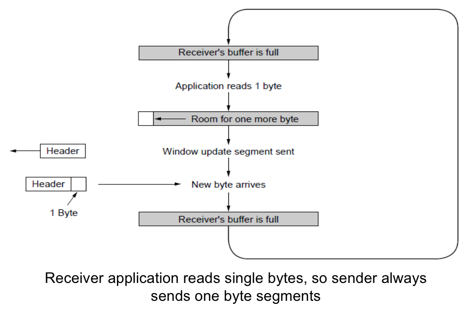
##### Clark算法
- 思路：接收方不要请求太小的数据段
- 强制接收端等待有一定大小的可用缓冲区后，再通知发送端
- 例如：令`可用缓冲区大小 >= MIN(可接受最大数据段, 缓冲区一半大小)`，作为触发接收方发送确认的条件
- **Nagel算法**和**Clark算法**结合解决**低能窗口综合症**的解决方案

#### 6.5.9 TCP计时器管理 TCP timer manager
- TCP维护了多个计时器
##### 重传计时器 (RTO) Retransmission TimeOut
- TCP发出一个段时，同时启动RTO
- 如果超时前被确认，则计时器停止
- 如果超时，该段被重传并重启计时器
- 超时时长是根据网络性能动态调整的

#### 6.5.10 TCP拥塞控制
- 传输层接收到从网络层反馈来的拥塞信息，并减慢它发送到网络的流量速率
##### 两个窗口
- 拥塞窗口 congestion window
  - TCP维持一个**拥塞窗口**，窗口大小是任何时候发送端可以向网络发送的字节数，速率则是`窗口大小/连接往返间`
  - 拥塞窗口由发送端维护
- 流量控制窗口 flow control window
  - **流量控制窗口**指出接收端可以缓冲的字节数
  - 由接收端维护
- 要并发的跟踪这两个窗口，可以发送的字节数是而二者中的较小值

##### 确认时钟 ack clock
- 如图，发送端的链路快而接收端的链路慢。接收端发送**确认返回**的速率，正是数据包通过路径最慢（瓶颈）链路的速率，也是发送端应该使用的发送速率
- 因此TCP使用一个**确认时钟 ack clock**，来使输出流量平滑
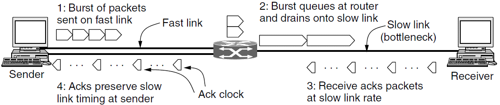

##### 慢速启动 slow start
- 如果网络**拥塞窗口**从小规模启动，**加法递增乘法递减 AIMD**（6.3.2）则需要花费一定时间，故采用**慢启动**法
- 发送端先把一个数据包注入网络
- 每次受到确认后，下次注入的包数翻倍，即**拥塞窗口**大小翻倍
- **拥塞窗口**很快过大，使太多的数据包太快的注入网络
- 为保持对慢速启动的控制，发送方为每个连接维护**慢启动阈值 slow start threshold**
  - 阈值初始化为任意高
  - 每次丢包或超时，阈值就被设为当前的一半，并重新**慢速启动**
  - 超过阈值，TCP将把**慢启动**切换为**线性增加**（加法递增）
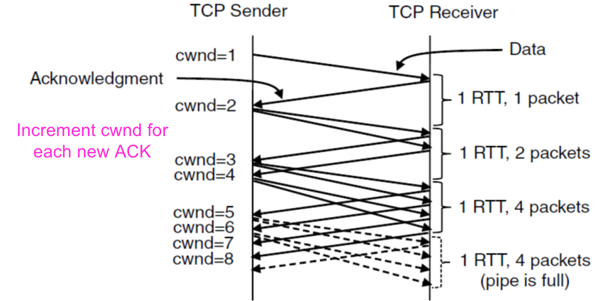

##### 快速重传 fast retransmission
- 发送端采用**快速重传fast retransmission**来快速识别它的包是否丢失
  - 当接收端发现某个包的后续包先到达了，就发送一个**重复确认 duplicate acknowledgement**，其确认段带有相同的确认号
  - 包可以选择网络的不同路径，因此顺序颠倒也算正常现象，但是如果发生3次**重复确认**，TCP就假设包已经丢失
  - 丢失包的序号已经确认，不用等待计时器超时，可以直接开始重新发送

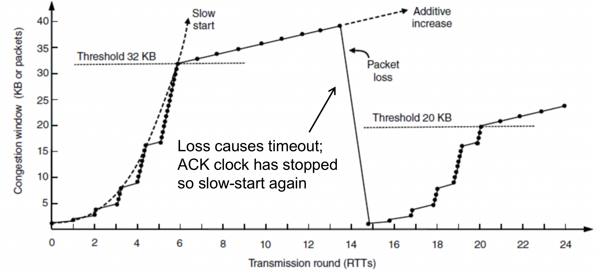
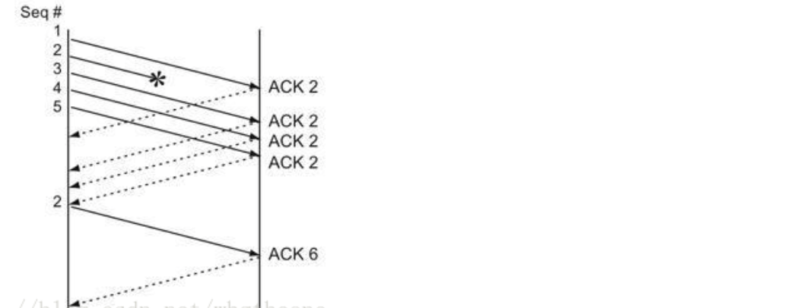

##### 快速恢复 fast recovery
- 不再反复**慢速启动**，只在第一次进行完整的慢速启动流程
- 启发式机制
- 每次发生包丢失需要快速重传时，将**慢启动阈值**减半，形成**锯齿 sawtooth**：
  - 加法递增：每个RTT增加一段
  - 乘法递减：每个RTT减半
  - 也就是AIMD规则

