# 第1章 引言

#### 计算机网络与分布式系统：
- 计算机网络：一组单一技术相互连接的自主计算机集合
- 分布式系统：一组计算机组成的系统，一般建立在计算机网络之上，对外呈现为**单一**的关联系统，系统内的计算机彼此透明
- 二者使用相同的物理结构

#### 网络硬件 13
- 单播
- 广播
- 组播

## 1.2 网络硬件
##### 按传输技术分类
  - 广播式链路：一个发送方和所有接收方/一组接收方(广播`multicasting`/组播`broadcasting`)
  - 点到点链路`point-to-point`：一个发送方和一个接收方(单播`unicasting`)

#### 按规模分类
  - 个域网`PAN`：设备围绕着一个人进行通信
  - 局域网`LAN`：私有网络，区域内共享资源和交换信息
    - 总线网
    - 环型网
  - 广域网`WAN`

***

#### 1.3.1 协议层次结构
为降低复杂性，网络都组织成一个“层次栈 stack of layer”或称“分级栈 stack of level”，每一层都为上一层提供特定的服务，并屏蔽自身的实现细节
- **协议 protocol**：两台机器的同一层相互对话时，所使用的规则和约定
- 对等体 peer：不同机器上的相同层次
- 物理介质 physical medium：层次栈的第1层
虽然直观上是两个对等体在对话，但是所有通信都必须逐级向下必须传到物理介质：
- 接口 interface：下层向上层提供的原始操作和服务
- 网络体系结构 network architecture：层和协议的集合
消息从上层向下层传递时，会被切割成更小的单元。

#### 1.3.3 面向连接与无连接服务
##### 面向连接服务 connection-oriented service
- 必须先建立连接，再使用连接传输数据，最后释放连接
- 所有数据位按顺序到达
- 按电话系统建模

##### 无连接服务 connectionless service
- 每个报文携带了完整的目标地址
- 报文之间相互独立
- 报文由系统的中间节点路由
  - 存储-转发交换 store-and-forward switching：中间节点只有接收完报文的**全部内容**后才会转发
  - 直通式交换 cut-through switching：中间节点没有接收完毕报文就开始转发
- 报文到达顺序不确定
- 按邮政系统建模

## 1.4 参考模型 32
#### 1.4.1 OSI参考模型 OSI reference model
- 开发系统互联参考模型，未被使用但很有意义
##### 物理层 physical layer
- 在一条通信信道上传输原始比特
- 机械、电子与时序接口
##### 数据链路层 data link layer
- 将原始传输设施转变为不漏检传输错误的线路
- 发送方将数据拆分成**数据帧 data frame**
- 接收方确认正确收到了每一帧，并返回**确认帧 acknowledgement frame**
- 流量条件、共享信道访问
##### 网络层 network layer
- 控制子网的运行
- 如何将数据包从源端路由到接收方
- 拥塞控制（一般和高层协议综合）、服务质量
##### 传输层 transport layer
- 接受来自上一层的数据，必要时将其分割成较小的单元
- 确保数据单元正确达到另一端
- 保证底层硬件技术发生的改动对上层透明
##### 会话层 session layer
- 在不同机器直接建立会话
- 对话控制 dialog control，令牌管理 token management、同步功能 synchronization
##### 表示层 presentation layer
- 传递信息的语义和语法
- 不同机器内有不同的数据表示法，需要抽象的数据结构统一管理
##### 应用层 application layer
- 用户需要的各种协议
- 例如HTTP

#### 1.4.2 TCP/IP参考模型 TCP/IP reference model
##### 链路层 link layer
- **TCP/IP参考模型**以运行在不同网络之间的无连接网络层为基础
- 描述链路必须完成什么功能才能满足无连接的互联网络层的需求
- 例如：以太网，802.11

##### 互联网层 internet layer
- 为传输层提供服务，主要解决主机到主机的通信问题
- 定义官方数据包和格式
- 因特网协议 IP
  - 辅助协议：因特网控制报文协议ICMP
  - 数据包路由为核心

##### 传输层 transport layer
- 提供端到端的服务
- 传输控制协议 TCP transport control protocol
  - 可靠的、面向连接的协议
  - 还负责流量控制
- 用户数据报协议 UDP user datagram protocol
  - 不可靠的、无连接的协议
  - 适用于传输语音、视频

##### 应用层 application layer
- 为用户提供所需要的各种服务
- 高层协议，如DNS、HTTP、文件传输协议FTB，电子邮件协议SMTP等

#### OSI 和 TCP/IP的区别
- OSI没有定义协议，或者说即使有协议也无人使用，但是是一个重要的参考模型；TCP/IP则是因特网上使用的一组协议，是一个协议簇，已经被广泛使用多年了
- OSI有7层；TCP/IP有4层，不区分物理层和数据链路层，并将OSI会话层、表示层应用层、都归为TCP/IP的应用层
- OSI区分服务、接口和协议概念；TCP/IP则不加区分
- OSI由政府部分设计；而TCP/IP是在开发过程从逐步形成的

## 1.5 网络实例
#### 1.5.1 因特网
- 大量不同网络的集合，不是单个网络
- 使用某些特定的公共协议，提供特定的公共服务
- ARPANET -> NSFNET -> Internet

## 1.6 网络标准化
- 使生产商和供应商遵从统一的网络标准
- 定义了互操作所需的一切
##### 标准化组织
- 国际电信联盟 ITU
- 国际标准化组织 ISO: OSI
- 美国国际标准化组织 ANSI
- 国家标准和技术协会 NIST 
- IETF: RFC 2616, 
- IEEE: 802.3以太网, 802.11WiFi
- W3C: HTML5, CSS

***

# 第2章 物理层

#### 2.6.5 交换
##### 电路交换
- 建立端到端连接后再传输
- 来自电话系统：请求后建立连接
- 连接建立后效率很高且不会忙线，但交换能力不足时会忙线
##### 包交换
- 数据包尽快发出，到达接收端的秩序可能混乱
- 相同出发地和目的地的数据包会走不同的路径
- 对数据包大小有严格上限，防止霸占传输线路

***

# 第3章 数据链路层
使用物理层提供的服务在通信信道上发送和接受比特：
- 向网络层提供定义良好的接口
- 处理传输错误
- 调节数据流，确保慢速的接收方不会被快速的发送方淹没

## 3.1 数据链路层的设计问题
#### 3.1.1 提供给网络层的服务
##### 无确认的无连接
- 源机器向目标机器发送独立的帧，目标机器并不对这些帧进行确认
- 特点
 - 不需建立逻辑连接，不用释放逻辑连接
 - 不试图检测丢帧或试图恢复丢失帧
- 用于错误率低的场合，靠上层恢复；实时通信，延迟比受损更严重
- 例如：Ethernet

##### 有确认的无连接
- 不使用逻辑连接，但每一帧需独立确认
- 用于不可靠的信道
- 例如：802.11

##### 有确认的有连接
- 建立逻辑连接，编号每一帧并确认收到
- 特点
  - 最复杂服务：建立/维护/释放连接，初始化/释放变量和计数器
  - 所有帧只被接收一次，且按照正确顺序接收
  - 需要三阶段：建立连接，初始化变量/计数器；传输一个或多个帧；释放连接和维护该连接的资源
- 用于长距离且不可靠的链路，避免带宽浪费
- 例如：卫星信道、长途电话电路

#### 3.1.2 成帧
- 数据链路层将网络层的数据包封装成**帧 frame**
- 将比特流拆散成离散帧，每个帧发送前计算**校验和 checksum**用于纠错，帧到达目标机器后，通过计算新校验和进行比对，如果发生的错误则要采取措施
- 有如下几种拆分比特流的方法
##### 字节计数法
   - 头部的一个字用来记录帧的长度
   - 缺陷：第一个比特的错误后果严重，接收方要求重传时，定位不到需要重传的起始位置，所有帧的起始位置都信息都损失了
   - 很少用
##### 字节填充的标志字节法
   - 每个帧用特殊的字节作为开始和结束，称为**标志字节 flag byte**，两个连续的FLAG位表示本帧的结束和下一帧的开始
   - 问题：二进制数据传输时，正常编码中需要出现FLAG的编码，对传输造成阻碍
   - **字节填充 byte stuffing**：规定转义字节ESC，前面加了ESC的FLAG和ESC不视为特殊字节，而是数据的一部分
   - 到达网络层之前必须删除转义字节
##### 比特填充的比特字节法
   - 在比特级别完成帧的划分，而非像字节填充法按字节划分
   - 每个帧的开始与结束由特殊的比特模式01111110划分
   - 数据中遇到连续5个1，就填充一个0，从而与上述模式区分
##### 物理层编码违禁法
   - 比特映射到物理层的信号时，物理层添加一些冗余比特，例如4B/5B把4个数据比特映射成5个信号比特
   - 在编码模式的约束下，有些信号不会被使用，就用这些“违法信号”作为分界符

#### 3.1.3 差错控制
- 确保所有的帧都被传递给机器的网络层，并保证正确的顺序
- 协议要求接收方返回特殊的**控制帧**，表示确认帧已经安全抵达
- 当硬件发生故障而控制帧丢失时，引入**计时器**确保发送方不会一直等下去，超时则需重传
- 为防止重传导致接收方无法区分两个相同的帧，一般需要为帧分配**序列号**

#### 3.1.4 流量控制
- 防止发送方的发送速度超过接收方能接受帧的速度
- 常见的方法有两种
##### 基于反馈的流量控制 feedback-based flow control
接收方给发送方返回信息，运行其发送更多数据或进行其他控制
##### 基于速率的流量控制 rate-based flow control
使用内置机制限制发送速率，无需接收方的反馈信息

***

## 3.2 差错检测和纠正
#### 3.2.1 纠错码 error-correcting code
- 将**冗余**信息加入待发送的信息中，使得接收方能够推断被发送的数据内容，也称前向纠错FEC
- 海明码
- 二进制卷积码
- 里德所罗门码
- 低密度奇偶校验码

#### 3.2.2 检错码 errer-detecting code
- 将**冗余**信息只足以检测出是否发生错误
- 奇偶
- 校验和
- 循环冗余校验

***

## 3.3 基本数据链路层协议

#### 3.3.1 乌托邦式单工协议 Utopia
- 数据单向传输
- 双方网络层永远就绪，数据处理时间忽略不计，缓存空间无限大，通信信道不会损坏或丢失帧
- 协议由两个单独的过程组成：
##### 发送过程
- 运行在**源机器**的数据链路层上
- 尽可能将数据放到线路上：
  - 从网络层获取数据包
  - 构造出境帧
  - 通过物理层发送
- 不做差错控制和流量控制

##### 接收过程
- 运行在**目标机器**的数据链路层上
- 只负责接受帧，帧一定是无损坏的：
   - 帧从硬件缓冲区转移到数据链路层
   - 帧传递给网络层
   - 返回，等待下一帧

#### 3.3.2 无错信道上的单工停-等式协议 stop-and-wait
- 认为接收方接受能力有限
- 发送方发送一帧，必须等待接收方确认才能继续发送

#### 3.3.3 有错信道上的单工停-等式协议 stop-and-wait
- 进一步认为通信信道可能出错，帧可能损坏
- 引入计时器、校验和、序列号：
  - 发送方发送一帧，等待接收方确认才能继续发送，如果**计时器**超时，则会将这一帧重发
  - 接收方会通过**校验和**检查帧是否损坏，但如果恰好帧损坏而校验和不变，协议将失败
  - 防止重传导致接收方无法区分两个相同的帧，帧分配**序列号**，1比特就够用
- **自动重复请求 ARQ**：发送方前移之前必须等待一个肯定确认

***

## 3.4 滑动窗口协议 sliding window protocol
- 捎带确认 piggybacking：尽可能不单独发送控制帧，而是等待一段时间来将确认信息附加在下一个出境的帧上
- **滑动窗口协议**都是双工协议
- 任何出境帧都包含一个序号，在停-等式协议中n=1，但滑动窗口协议中n不固定
- 发送方和接收方都要维持一组序号，各形成窗口：
  - 发送窗口的下界: 已发送但未得到确认的帧，或可被发送帧的最小序号
  - 发送窗口的上界: 要发送的下一个帧的序号
  - 接收窗口的下界: 希望接收的帧的序号
  - 接收窗口的上界: 允许接收的帧的最大序号

下图中n=3

#### 3.4.1 1位滑动窗口协议
- 发送方在接收到接收方对前一帧的确认到来才能发送下一帧
- 过早超时会使帧多次发送，导致带宽浪费

#### 3.4.2 回退N协议
- 长发送时间+高带宽+短帧导致效率极低，希望保持多个帧同时传输，这种技术称为**管道化 pipelining**
- 是发送窗口n>1，接受窗口n=1的滑动窗口协议
- 管道化传输时如果中间的某一帧发生损坏，需要与以往不同的处理，有以下两种技术：
##### 回退n go-back-n
- 简单丢弃坏帧的所有后序帧，即不对坏帧返回确认
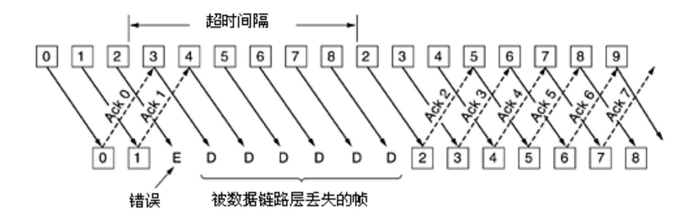

##### 选择重传 selective repeat
- 只重传坏帧
- 接收方接受到坏帧时发送**否定确认NAK**
- 在正常接收后续帧的同时，不断发送相同的**ACK**指示当前接收成功的位置，后续帧将进入接收方缓存区暂存，暂时不算接收成功
- 坏帧重新传输成功后，直接发送最新缓存帧的**ACK**，传输恢复

***

# 第4章 介质访问控制子层 Meduim Access Control
- 广播网络：多方竞争信道使用权；当只有一条信道时，多个站点欲进行交流，需要确定下一个发言者。
- 介质访问控制MAC（Medium Access Channel）子层：用来确定这种**多路访问信道**的下个发言者的协议
- **MAC**是数据链路层的一个子层

## 4.1 信道分配问题 199

#### 4.1.1 静态信道分配
- 将信道容量拆分给多个用户使用（FDM），传统方法
- 如：FM广播电台
- 低效，不适用于发送者多且不固定，流量呈突发性强的计算机系统，浪费空闲信道
- FDM 频分复用 和 TDM 时分复用 效率都很低

#### 动态信道分配假设
- **流量独立 independent traffic**
  N个独立站点，每个站点都产生要传输的帧，生成帧后站点堵塞，直至成功发送
- **单信道 Single Channel**
  所有通信共用一个信道
- **冲突可观察 observable Collision**
  两帧同时传输，在时间上重叠，产生混乱信号，称为**冲突**，能被所有站检测到
- **时间连续或分槽 Countinous or slotted time**
  时间可以被假设成连续的，也可以被设置为离散的**时间槽**，并使帧的传输只能始于某个时间槽
- **载波侦听或不听 Carrier Sense or no carrier sense**
  站点可在使用信道之前侦听信道是否被使用，如发现为忙，则任何站点不会尝试使用信道；
  也可以不做侦听，盲目传输

***

## 4.2 多路访问协议 202

#### 4.2.1 ALOHA
##### 纯ALOHA
- 站点有数据就传输，发送方检测是否冲突损坏
- 发现损坏，则等待随机时间重发，随机用来防止冲突帧重发的节奏完全一致
- 损坏无大小，坏一点也是坏

##### 分槽ALOHA slotted ALOHA
- 站点遵从统一的时间槽边界，发送帧必须等到下个分槽
- 提高传输效率

#### 4.2.2 载波侦听与多路访问协议
##### 1-坚持载波检测多路访问 1-persistent CSMA
- 有数据要发送时**持续**监听，直到发现空闲立即发送
- 无冲突检测：只在发送之前检测是否冲突，发送期间不检测，冲突则等待随机时间，再做以上判断
- 称为1-坚持是因为空闲时发送概率为1
- 贪婪争抢，更多冲突

##### 非坚持载波检测多路访问 nonpersistent CSMA
- 有数据要发送时**不持续监听**，如果信道闲就直接发送，否则等待随机时间再判断是否空闲
- 无冲突检测：只在发送之前检测是否冲突，发送期间不检测，冲突则等待随机时间，再做以上判断
- 更好信道利用率，更大延迟

##### p-坚持载波检测多路访问 p-persistent CSMA
- 有数据要发送时**持续**监听，发现空闲时按概率p发送数据，1-p概率推迟到下个时间槽
- 无冲突检测：只在发送之前检测是否冲突，发送期间不检测，冲突则等待随机时间，再做以上判断

##### 带冲突检测的CSMA (CSMA/CD) CSMA with Collision Detection
- 冲突检测：
  - 边发送边监听，发现冲突立刻停止，所有站点会进入**竞争时隙**
- **CSMA/CD**模型：
  - 冲突的根源：A站点发送但信号未到达B站点的时间内，B站点发送了
  - 认为信道上交替出现竞争期、传输期和空闲期
    - 竞争期：站点之间互相争夺信道使用权，交替产生不完整的、带冲突的传输和等待，称为**竞争期**
    - 传输期：几轮竞争后，某个站点**抓住**了信道，它将会进行一段相对长的传输，其他站点不会在此期间干扰
    - 空闲期：没有站点正在传输
  - 如果经过$2\tau$（$\tau$为最远两站点的信号传播时间）时间未监听到冲突，站点就确保自己**抓住**了信道进入**传输期**，因为：
    - 所有其他站点都因在$[0,\tau]$通过载波侦听知道它的发送，从而终止自己的发送
    - 所有可能在路上的其他信号（发出于$[0,\tau]$，传播于$[0,2\tau]$）都已传播结束

    也正因如此，一轮**竞争**不超过$2\tau$
- 可以将**CSMA/CD**视为一个分槽ALOHA系统：
  - 传输期下，站点能无冲突独享若干连续“时间槽”，不间断传输一个帧，期间不会被冲突打断
  - 因而帧（相对传播时间而言）越长时，**CSMA/CD**越有优势
- 冲突检测的前提：冲突检测是发送方在发送时持续监听信道，如果发现监听到的与自己发送的不同，则说明出现冲突，因此，“干扰信号”相对于发送信号不能太弱，否则检测不出来。

#### 4.2.3 无冲突协议
- 原理决定其本身不产生冲突
- 适用于线缆长（$\tau$大）、帧长短的情况
  - 该情况下冲突不仅降低带宽、而且使得帧的发送时间不稳定

##### 位图协议：基本位图法 basic bitmap method
- 共N个站点，先用1个“竞争槽”中的N个位来确认发送顺序，每个站点独占1位。
- 说是竞争槽，但是因为每位各自独占，所以不会冲突。

##### 令牌环 token ring
- 令牌token是一种特殊的帧，代表了发送权限：站点中等待发送的帧队列，收到令牌后，站点可以发送帧，并把令牌发送给下一站。
- 令牌环不是在物理上形成了环，而是通过类似链表的方式，为每个站点指明next，构成网络拓扑上的环。

#### 4.2.4 有限竞争协议

#### 4.2.5 无线局域网协议
##### 无线局域网的特点
- 无线局域网：范围有限、范围内全体接受，无法定向，不能使用CSMA/CD
- **隐藏终端问题**：竞争者离得太远，导致无法检测到潜在的竞争者，导致冲突

- **暴露终端问题**：两个发送方的各自同时发送，对两个接收方距离较远无影响，但是两个发送方互相暴露，认为彼此造成干扰而不传输，导致浪费

##### 冲突避免多路访问 MACA
- 发送方A发送RTS帧 require to send 这个帧很短，并包含将要发送的字节长度
- 接收方B回复CTS帧 clear to send ，复制RTS的字节长度
- 听到RTS的其他站点C必须保持沉默，因为C离发送方A太近，但时长只要保证CTS不被干扰即可；之后，当A->B通信时，C也可以自由发送，因为干扰不到B
- 听到CTS的其他站点D必须保持沉默，因为D离接收方B太近，时长由CTS中获取，D在A->B通信时必须沉默
- 两个站点同时向一个站点发送RTS将导致RTS丢失，这两个没收到CTS的站点将在随机时间后重试

***

## 4.3 以太网 Ehernet 216
- 以太网是有线局域网的主要形式
##### 两大类以太网
- 经典以太网
- 交换式以太网：使用交换机连接不同的计算机

- 以太网和`IEEE802.3`几乎无区别，在课程中可以认为是一种事物的两种称呼

#### 4.3.1 经典以太网物理层

- 以太网电缆有最大距离限制，超过这个范围，信号将无法传播

#### 4.3.2 经典以太网MAC子层协议
##### 帧格式

##### 目标地址 Source address 与 单播、广播、组播
- 单播 unicasting：目标地址最高位为0，会被一个站点接收
- 组播 broadcasting：目标地址最高位为1，表示组地址，会被多个站点接收
- 广播 multicasting：目标地址全1，则这个帧会被网络中的所有站接收

##### 以太网CSMA/CD
- 经典以太网采用：**二进制指数后退**的**1-坚持CSMA/CD**（1-persistent CSMA/CD）即：贪婪+冲突检测
- 所有帧至少需要$2\tau$时间才能完成发送，原因见CSMA/CD部分
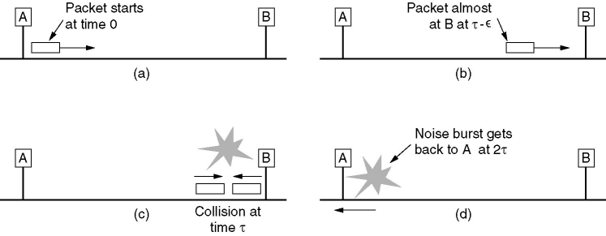
- 帧的最小长度：$2\tau \times 传输速率$ 

##### 二进制指数后退 (BEB) binary exponential backoff
- 经典以太网使用1-坚持CSMA/CD，其中随机等待的时长需要确定
- 第一次冲突，随机等待$[0,1]$个时间槽
- 第二次冲突，随机等待$[0,3]$个时间槽
- 第n次冲突，随机等待$[0,2^n-1]$个时间槽
- 10次冲突后，最大等待时间槽被固定为1023不再上涨，避免延迟太大
- 16次冲突后，发送失败报告，交由高层处理

#### 4.3.4 交换式以太网 Switched/Fast Ethernet
- 集线器：将若干个站点插到一台集线器上进行连接，方便维护，逻辑上仍然是**经典以太网**
- 交换式以太网：一个帧到来时，交换机进行判断，只向一个端口发送此帧，这个端口连接着集线器，集线器中的所有站点还是要依靠CSMA/CD来解决冲突，但是其他端口都不知道有该帧存在。

***

## 4.4 无线局域网
- 无线局域网的主要标准是`802.11`

#### 4.4.3 `802.11` MAC子层协议
- 无线电几乎总是半双工的，无法在传输的同时侦听频率上的噪声，因为接受信号相对发送信号太弱
##### 带冲突避免的CSMA (CSMA/CA) CSMA with Collision Avoidance
- 发送前侦听信道，且并发送前先进行随机后退，相比之下：CSMA/CD是冲突时才随机后退
- 发送成功后，目标站立即发送一个短确认**ACK**，信道此时恢复空闲状态
- 信道空闲时：
  - 站点通过侦听一个很短的时间段DIFS获知信道空闲
  - 所有准备好的站点都进行**随机后退**倒计时
  - 倒计时最先结束的站点先发送，其余站点暂停倒计时
  - 信道再次空闲时，新准备好的站点生成新的倒计时，上次未争夺到站点倒计时继续
- 发送站未接收到发送确认**ACK**，则认为发生错误，该站点需要加倍等待，形成指数后退

##### 无线局域网和以太网的两个区别
- 早期后退有助于避免冲突，即使只发生一个冲突，因为整个帧都被传输出去了，因此冲突代价太昂贵。
- 无线环境下存在隐藏/暴露终端问题，相比之以太网内的所有站总能听到彼此。

##### CSMA/CD 与 CSMA/CA对比
- CSMA/CD主要着眼点在冲突的侦测，当侦测到冲突时，进行相应的处理，要求设备能一边侦测一边发送数据，适用以太网。 
- CSMA/CA主要着眼点在冲突的避免，协议里也看到经常是等待一段时间再做动作，通过退避尽量去避免冲突吗，通过发送一些特别小的信道侦测帧来测试信道是否有冲突，适用无线局域网，因为无法进行冲突检测，且冲突代价昂贵。

***

## 4.8 数据链路层交换 256
#### 4.8.1 网桥的使用
- 网桥是用来扩展数据链路层的
- 网桥配备了一个大的（哈希）表，用来记录要将帧转发到那个端口
  - 目标地址的端口与源端口相同：那么网桥丢弃该帧
  - 目标地址的端口与源端口不同：则转发到对应端口
  - 端口未知：使用**泛洪法 flooding algorithm**，发送到除源端口以外的所有端口
- 网桥无只需知道MAC地址即可开始帧的转发，且计算速度极快，因此完整接收一帧之前即可完成转发，这种转发方式被称为**直通式交换cut through switching**或虫孔路由**wormhole routing**
- 网桥中有一个**中继 relay**模块，属于MAC层

***

# 第5章 网络层
- 将数据包从源机器路由到目标机器

!!! question
    ##### IP地址由哪几部分组成
    ##### IPv4一共有多少位
    ##### 什么是子网掩码
    ##### 漏桶算法和令牌桶算法的用途
    - 漏桶算法能够强行限制数据的传输速率
    - 令牌桶算法能够在限制数据的平均传输速率同时还允许某种程度的突发传输。
    ##### 漏桶算法和令牌桶算法对流量整形的区别
    ##### 因特网的IP是采用透明分段还是非透明分段
    - 非透明的，不需要重组
    ##### 怎样理解隧道技术

## 5.1 网络层的设计问题 274
#### 5.1.1 存储转发数据包交换
##### 存储-转发数据包交换
- 主机想发送一个数据包，它就将数据包传输给最近的路由器数据包到达路由器
- 路由器在链路层完成对校验和的验证，先被**存储**在路由器上
- 数据包沿路径被**转发**到下一个路由器，直至到达目标主机

#### 5.1.2 提供给传输层的服务
- 目标：传输层只关心可不可达
  - 向上提供的服务独立于路由器技术
  - 向传输层屏蔽路由器数量、类型和拓扑关系
  - 传输层可用的网络地址应有可跨越LAN WAN的统一编址方案
- Internet正向面向连接的特性进化

#### 5.1.3 无连接服务的实现
- 所有数据包都被独立的注入网络，独立路由，不需要提前建立任何设置，这种数据包也可被称为**数据报 datagram**
- **IP协议 Internet Protocol**是整个Internet的基础，是**无连接服务**的重要范例。每个数据包携带一个目标IP地址，路由器使用该地址来单独转发每一个数据包。
  - IPv4使用32位IP
  - IPv6使用128位IP

#### 5.1.4 面向连接服务的实现
- 面向连接服务需要一个**虚电路网络**
- 在发送数据数据包之前，必须先建立起一条从源路由器到目的路由器之间的路径，这个连接称为**虚电路 VC**
- 每个数据包都包含一个标示符，指明该数据包属于哪个虚电路
- 使用该虚电路进行通信
- 通信结束后虚电路终止

#### 5.1.5 虚电路和数据报网络比较
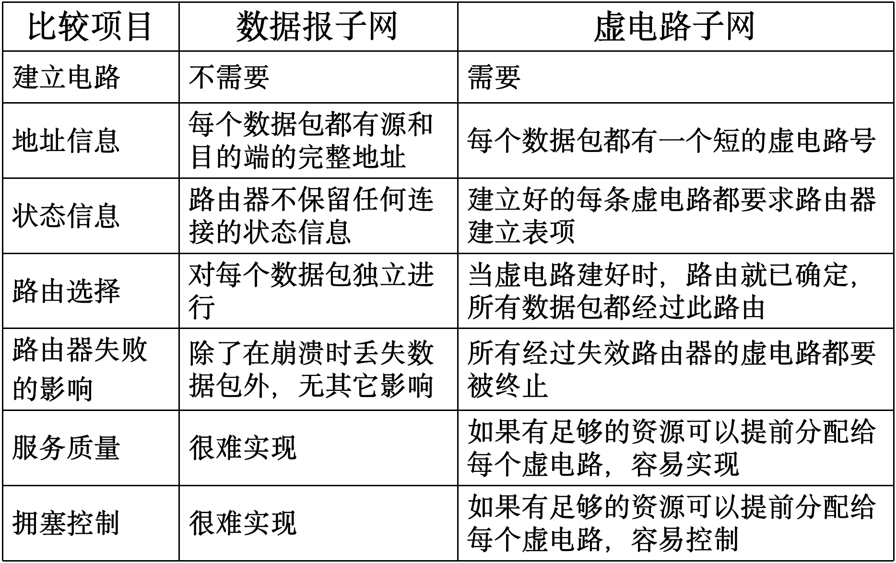

##### 连接建立时间与地址查找时间的权衡
- 虚电路：需要在建立连接时花费时间
- 数据报：每次路由时，查找过程复杂，花费时间
##### 路由器内存空间与带宽的权衡
- 虚电路：数据包只要包含虚电路号，不用包含完整的目的地址，但路由器需要维护虚电路的状态信息。
- 数据报：每个数据报都要携带完整的目的/源地址，但路由器不需要维护虚电路的状态信息。
##### 服务质量 QoS
- 虚电路：很容易保证服务质量，可以提前预留资源，适用于实时操作，但比较脆弱。
- 数据报：不太容易保证服务质量，但是对于通信线路的故障，适应性很强。

***

## 5.2 路由算法 routing algorithm 279
- 路由算法负责确认入境数据包应该被发送到哪一条输出线路上
- 是网络层的一部分
##### 路由和转发的区别
- **转发 forwarding**：指在一个具体的路由器中，将一个输入分组，根据转发表中的规则发送到输出接口的过程。
- **路由 routing**：指一个网络中的所有路由器使用特定的路由协议，计算出分组从源到目的地节点所采用的路线。
- 
#### 5.2.1 优化原则
- 所有的源到一个指定目标的最优路径的集合构成**汇集树 sink tree**，以目标节点为根
- 路由算法的目标是为所有路由器找到**汇集树**

#### 5.2.2 最短路径算法 shortest path
- 分布式的路由算法：不是全部路由器都知道网络的所有细节
- **最短路径**的度量指标：跳数、物理距离、平均延迟或是诸多因素的综合
- 采用Dijkstra法计算源节点到所有目标节点的最短路径

#### 5.2.3 泛洪算法 flooding
- 每个进来的数据包将被发送到除了它进来的那条线路外的其它输出线路上
- 属于静态算法
- 是有效的广播手段，且健壮性强，多数路由器被摧毁也能正常运行
##### 防止产生大量重复包的两种方法
- 每个包的头中维护一个**跳计数器**，每经过一跳后该计数器-1，为0时则丢弃该数据包
- 每个包的头中含一个序号，源机器每发送一个新包就+1，路由器记录每个抵达包的(源路由器，序号)数对，当一个链路状态数据包到达时：
  - 在维护的表中不存在，是**新的**：则除了它到来的那条线路外，向其他线路转发该数据包
  - 在维护的表中存在，是**重复的**：则丢弃
  - 在维护的表中不存在，但表中存在**源站点**值相同的项且**序号**更大的项，是**过时的**，则丢弃

#### 5.2.4 距离矢量算法 distance vector
- 属于**动态路由算法**
- 每个路由器维护一张表，表中给出了当前已知的到每个目的地的最佳距离，以及所使用的线路，并通过与相邻路由器交换距离信息来更新表
1. 路由器首先确认与自身相邻节点的延迟
2. 接下来确认剩下的每个非相邻节点：遍历相邻节点，计算**到相邻节点的延迟**+**相邻节点表中到目标的延迟**，选取具有最小延迟的相邻节点填入表中
- 注意本路由器的旧表不参与运算
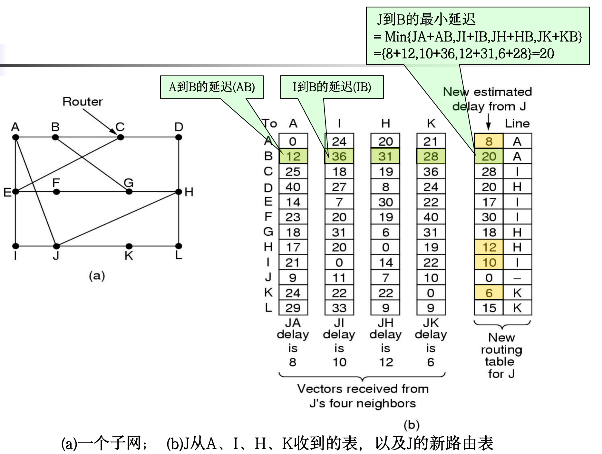
- 整个网络最佳路径的寻找过程成为**收敛 convergence**

#### 5.2.5 链路状态路由 link state routing
- 网络拓扑结构发生改变时，距离矢量算法收敛太慢，不考虑带宽，并可能存在**无穷计算问题**，于是设计了**链路状态路由算法**
- **链路状态路由算法**是大型网络和Internet应用最广泛的路由算法
##### 设计思想
1. 发现邻居节点，了解其网络地址
2. 设置到每个邻居节点的距离或者成本度量值
3. 构造一个包含所有刚刚获知的链路信息包
4. 将这个包发送给其他路由器，并接受来自所有其他路由器的信息包
5. 计算出到每个其他路由器的最短路径
##### 发现邻居
路由器启动后，通过发送HELLO数据包发现邻居节点
##### 设置链路成本
发送一个的ECHO数据包，要求另一端立即送回一个应答，往返时间除以2即为延迟，有时需要考虑负载和带宽
##### 构造链路状态包
- 数据包构成
  - 发送方的标识符
  - 序号 Seq
  - 年龄 Age
  - 邻居列表：路由器的邻居+到这个邻居的延迟
- 创建数据包的时机：按一定的时间周期，或仅在重要事件发生时

##### 分发路由器状态包
- 使用**泛洪法**发布链路状态数据包
  - 为控制泛洪规模，采用5.2.3中的第二种方法
> - 每个包的头中含一个序号，源机器每发送一个新包就+1，路由器记录每个抵达包的(源路由器，序号)数对，当一个链路状态数据包到达时：
>   - 在维护的表中不存在，是**新的**：则除了它到来的那条线路外，向其他线路转发该数据包
>   - 在维护的表中存在，是**重复的**：则丢弃
>   - 在维护的表中不存在，但表中存在**源站点**值相同的项且**序号**更大的项，是**过时的**，则丢弃
- 几个问题及其改进
  - **序号**回转可能产生混淆。**解决办法**：使用32位序号。
  - 路由器崩溃后，如果**序号**再从0开始，则下一个数据包被认为是**过时**的而丢弃。**解决办法**：数据包中增加**年龄 age**域，每秒钟年龄减1，为零时，来自该路由器的信息被丢弃
  - 序号被破坏：解决办法：增加**年龄 age**域一并解决
- 提高健壮性
  - 令链路状态数据包泛洪到路由器时，先进入**保留区**等待一段时间，并与其它已到达的来自同一路由器的链路状态数据包比较序号和丢弃
  - 所有的链路状态数据包需要应答

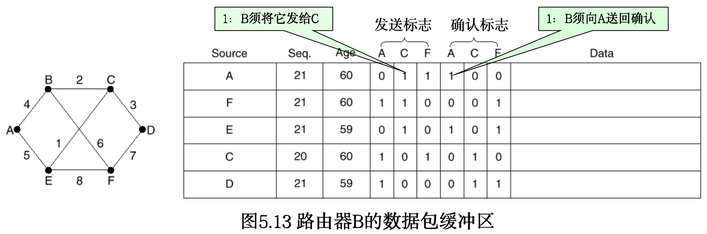

#### 5.2.6 层次路由 hierarchical routing
- 网络规模增长迅速，路由器不可能为每个其他路由器维护表项，路由需要分层次进行
- 路由器被划分为**区域 region**
- 路由器表记录如下内容：
  - 如何将数据包路由到本区域内的其他路由器
  - 如何将数据包路由到其他区域
- 对于更大规模的网络，层次更多
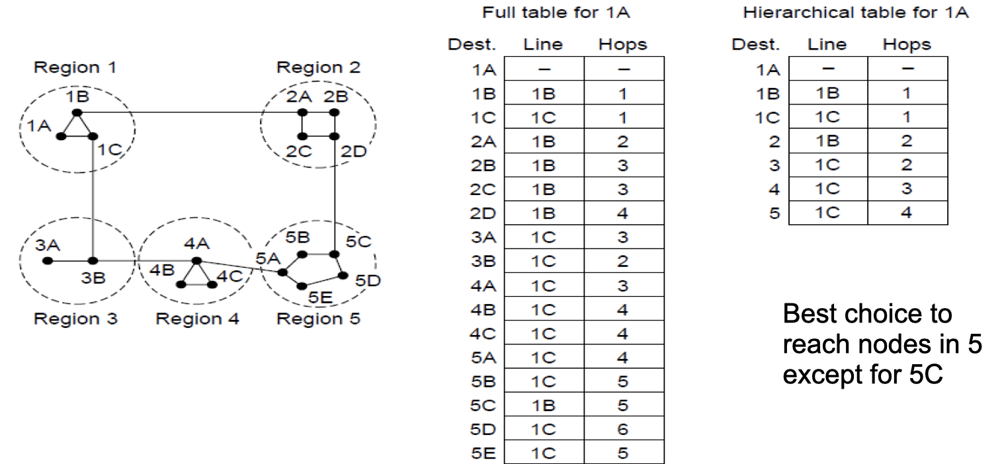

***

## 5.3 拥塞控制算法 congestion control 302
##### 拥塞 congestion
- **拥塞**：网络中存在太多数据包，导致数据包被延迟和丢失，从而降低传输性能
- 控制拥塞最有效的方法是减少传输层注入网络的负载
- **网络层**和**传输层**共同承担拥塞处理责任，本章着眼于网络层
##### 拥塞崩溃 congestion collapse
- 大量包积压等待，延迟时间过长的数据包需要丢弃、重传，导致网络传递有用信息的

#### 5.3.1 拥塞控制的途径
- 拥塞的出现意味着负载（暂时）大于（网络某一部分）资源可以处理的能力

##### 网络供给 network provisioning
建立一个带宽与流量相匹配的网络
- 当出现拥塞时，动态增加网络资源
- 购买带宽
##### 流量感知路由 traffic-aware routing
充分利用现有的网络容量
- 根据每天的流量模式定值路由
- 改变最短路径权重
##### 准入控制 admission control
在容量不可增加时，采用降低负载的策略
- 在虚电路网络中，拒绝新链接的建立
##### 流量限制 traffic throttling
网络向数据包源端发送反馈信息，减缓流量本身
##### 负载脱离 load shedding
网络不得不丢弃无法传递的数据包时，选择正确的丢弃策略也能防止拥塞崩溃

***

## 5.4 服务质量 QoS 311
- 注重提供与应用相匹配的服务质量
- 服务质量机制允许以较低成本满足应用需求，并兑现其所能做的性能保证
#### 5.4.1 应用需求
##### 流 flow
- **流**是从一个源到一个目标的数据包流
- 流的4个特征合起来决定一个流所要求的**服务质量**：
  - 带宽
  - 延迟
  - 抖动
  - 可靠性（丢失）
- QoS方法：流量整形，分组调度，准入控制，综合服务，区分服务

#### 5.4.2 流量整形 traffic shaping
- **流量整形**指条件进入网络数据流的平均速率和突发性所采用的技术
##### 漏桶 leaky bucket
- 如果在一台主机上，桶中的数据包数目达到了最大值，又发送数据包，则该数据包必须等待或被丢弃
- 将用户发出的不平滑的数据数据包流转变成网络中平滑的数据包流
- 漏桶算法适用于
  - 固定数据包长的协议，如ATM
  - 可变数据包长的协议，如IP，但要使用字节计数
- 漏桶算法缺点：无论负载突发性如何，漏桶算法强迫输出按平均速率进行，不灵活

##### 令牌桶 token bucket
- 希望当大的通信量到来时，输出也能加速,最大到桶的大小n
- 漏桶存放令牌，每隔一段时间产生一个令牌，令牌累积到超过漏桶上界n时就不再增加
- 数据包传输之前必须获得一个令牌，传输之后删除该令牌
- 在桶满时，会丢失令牌，但绝不丢弃数据包

#### 5.4.3 包调度 packet scheduling
- 保证服务质量还需要沿包经过的网络路径预留足够的资源
- 包调度算法分配带宽和路由资源，确定下一次把缓冲区的哪些数据发送到输出线路
##### 先来先服务 FCFS
- 导致**尾丢包 tail drop**：队满时容易丢弃新来的数据包
##### 公平队列 fair queueing
- 路由器为每个流设置单独的队列
- 线路空闲时循环扫描队列，按轮转顺序获得包的发送机会，使得n个主机至多每n轮发送一个数据包
- 以**字节**为单位的公平队列：以包为单位轮转发送对短包不公平，因此改为每轮只发一个字节
- **加权公平队列 WFQ**：在此基础上，可为某个队列增加权重w，则该队列每轮发w个字节，以实现优先级

#### 5.4.4 准入控制
#### 5.4.5 综合服务
#### 5.4.6 区分服务
##### 加速转发
将数据包分为常规的和加速的两种，加速数据包单独享用一条物理线路

***

## 5.5 网络互联 internetwork
#### 5.5.4 互联网路由
#### 5.5.5 数据包分段
- 网络或链路限制其数据包的最大长度
- 限制长度原因：
  - 硬件
  - 操作系统
  - 协议
  - 标准
  - 期望减少错误导致的重传次数
  - 期望防止数据包占用信道时间过长
##### 透明分段 transparent
- 每个路由器接受到被**分段**的数据包后，都进行重组
- 分段对沿途后续的网络**透明**

##### 非透明分段 non-transparent
- 避免在中间路由器上重组**分段**，每个段都被当作原始数据包一样被对待
- **重组**只在主机上进行

## 5.6 Internet的网络层 335
#### 5.6.1 IPv4协议
- 每个IP数据报由头和正文构成
##### 头中的信息
- 版本：目前IPv4主导
- 头长度：因为头的长度不固定
- 区分服务 differentiated services：区分不同的服务种类，如文件传输、语音数据等，用以采取最佳的应对措施
- 标识：用来确认新到达的分段属于那个数据报，见5.5.5数据包分段
- 总长度
- 不分段位DF：置1禁止路由器对数据包分段
- 更多分段位MF：用来确认所有的段已到达
- 生存期：每一跳-1，为0时数据包被丢弃
- 头校验和：确保重要信息不出错，如源地址和目标地址
- 源地址和目标地址
- 选项

#### 5.6.2 IP地址
- IP采用一种全局通用的地址格式，为全网的每个主机和路由器分配一个IP地址
- 一个IP并不指向一台主机，而是指向一个网络接口，同一网络（如以太网）上的所有主机，其地址IP地址是相同的
- 如果一个主机在两个网络中，它就有两个IP地址，但一般不会出现这种情况
- 路由器有多个网络接口，故有多个IP地址
##### 前缀 prefix
- IP地址具有层次性，这与以太网不同
- 一个网络拥有一个IP**前缀**，相当于分配了一块**前缀**相同的连续IP空间
- 每个32位地址由高位的可变长地址和地位的主机两部分组成
- 网络地址：32位IP加斜线`/`，斜线后的数字表示网络部分（高位部分）的长度
- 前缀仅通过IP无法推断，路由协议必须将**前缀**长度携带给路由器，构造一个32位二进制数，将需要的前缀位置1，其他位置0，与IP进行AND操作来提取前缀，称为**子网掩码 subnet mask**

##### 子网 subnet
- **子网划分 subnetting**：将内部的一个网络块划分成几个部分供多个内部网络使用，但对外表现得像单个网络
- 网络地址管理由**Internet域名和地址分配机构 ICANN**负责
- 将IP前缀进一步细分为子网
- 路由器将数据包的目标地址与每个子网的掩码进行AND运算，将结果与子网的前缀比较，以知晓应该转发到那个子网
- 子网的划分对外**不透明（不可见）**，子网划分的改变无需改动外部数据库或联系ICANN
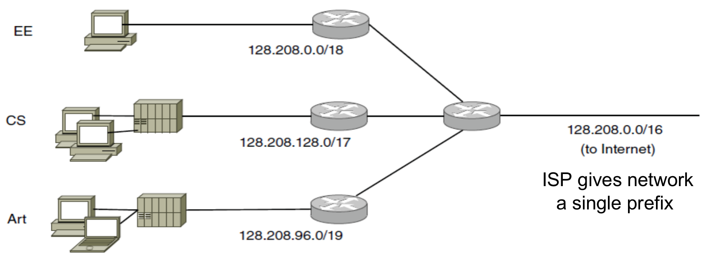

#### 5.6.3 IPv6协议
- 128位
- 解决IPv4地址短缺的技术之一

#### 5.6.4 因特网控制协议 (ICP) Internet Control Protocols

##### 地址解析协议 (ARP)
- 让所有节点能够通过一个IP地址找到对应的MAC地址
- 主机不知道目标IP的以太网地址时，发送广播包向以太网上所有主机请求该IP的以太网地址
- 有对应IP的主机用自己记录的以太网地址作为应答

##### 动态主机配置协议 (DHCP)
- DHCP服务器分配IP地址
- 主机启动时，发现自己没有IP地址，就向自己所在的网络广播一个报文，请求IP地址
- DHCP服务器接受到请求，就为主机分配一个空闲IP地址，并通过包返回给主机
- **地址租赁 address leasing**：IP不能永久分配给一个主机，到期后主机需要续订

#### 5.6.6 内部网关路由协议 (OSPF) Open Shortest Path First
- 因特网由大量**自治系统 Autonomous System**组成，它们由不同组织独立运营
- **自治系统**内使用的路由协议称为**内部网关路由协议**，域内路由协议
- 链路状态路由协议：节点之间交换状态，形成拓扑结构
- 使用5种消息形成泛洪拓扑结构
- Dijkstra法计算路径

#### 5.6.7 外部网关路由协议 (BGP) Exterior Routing Protocol
- 域间路由协议
- 如何在**自治网络**之间进行传输
##### 域内协议与域间协议的不同
- 域内协议：尽可能有效的将数据从发送方传送到接收方，不考虑政治因素
- 域间协议：考虑大量政治因素

***

# 第6章 传输层
- 跨越许多道网络，实现所需的连接服务
- 为网络层提高可靠性
- 将数据传递服务从两台计算机之间扩展到两台计算机的进程之间

## 6.1 传输服务 383
- 传输层内，实现传输层这些功能的软硬件称为**传输实体 transport entity**
- **段 segment**表示**传输实体**之间发送的消息，也称**传输协议数据单元 TPDU**
- 帧、包、段由外向里嵌套，嵌套关系如图：
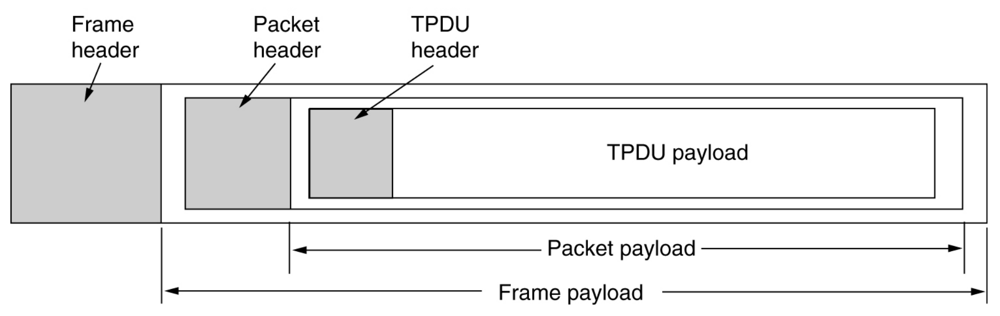

#### 6.1.1 提供给上层的服务

#### 6.1.2 传输服务原语
- 传输服务有一组**原子语句（原语）**
- 应用程序通过**原语**访问传输服务

#### 6.1.3 Berkeley 套接字 Berkeley socket
- Berkeley 套接字是另一组**原语**，由TCP使用
- 连接的释放是对称的，双方同时执行CLOSE**原语**后连接就被释放了

***

## 6.2 传输协议的要素 392
#### 6.2.3 连接释放
- 不需要连接的时候，传输层的实体必须将它释放
##### 非对称释放 asymmetric release
任何一方都可以关闭双向连接，有数据丢失的危险

##### 对称释放
每个方向的连接单独关闭，双方都执行DISCONNECT才能关闭整条连接

***

## 6.3 拥塞控制 409

#### 6.3.1 理想的带宽分配

##### 最大-最小公平性 max-min fairness
- **最大-最小公平分配**指：如果分配给一个流的带宽在不减少另一个流带宽的前提下无法进一步增长，就不给这个流更多带宽
- 如图：
  - 可见R1->R2有空闲流量，但不会使用，因为R2->R3已满，不能侵占B的R2->R3的流量
  - R4->R5为瓶颈
- 思路：所有的流从速率0开始，逐渐增加速率，当任何一个流的速率达到瓶颈，就停止该流的数据增加，其他流继续增加各自的速率，直到所有的流达到瓶颈

##### 收敛
- 拥塞控制算法能否快速收敛到公平而有效的带宽分配上
- 网络是动态的
- 算法不稳定可能导致：收敛过慢、无法收敛到正确的操作点、在正确操作点附件震荡

#### 6.3.2 调整发送速率
发送速率受两个因素制约：
##### 流量控制 flow control
接收端缓冲区不足
##### 拥塞控制 congestion control
网络容量不足

##### 加法递增乘法递减 (AIMD) additive increase multiplicative decrease
- 设想两个流争夺带宽，算法希望逼近最优操作点，兼顾公平性与效率
  - 落在**公平线**上保证带宽分配公平：带宽1=带宽2
  - 落在**效率线**上保证整个网络带宽使用效率最高且不拥塞：带宽1+带宽2=100%
  - 最优操作点为**公平线**和**效率线**的交点
  - 加法递增乘法递减能向最优操作点收敛
- 流程：
  - **加法递增**：未拥塞时按固定值均匀增大两个流的带宽
  - **乘法递减**：受到拥塞信号后，两个流按各自比例减少带宽
- 稳定性观点：拥堵易而恢复难，递增政策要轻柔，递减政策要积极
- AIMD被**TCP协议**所采用，而**TCP**是**Internet**拥塞控制的主要形式
  - TCP调整速率是通过调整**滑动窗口**大小实现的
  - TCP要通过测量**往返时间 RTT**判断速率，上述的AIMD对距离较远的主机不公平
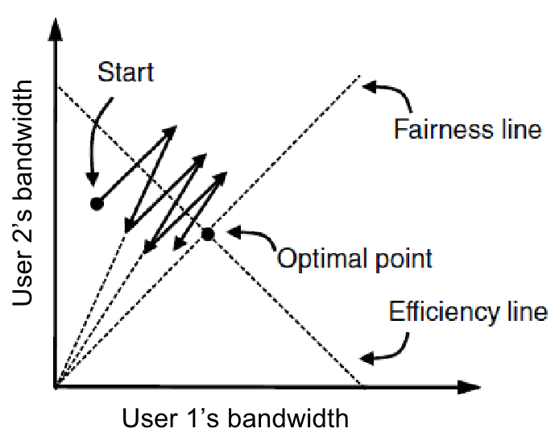

*** 

## 6.4 Internet传输协议：UDP 417
#### 6.4.1 UDP概述
- Internet协议集支持无连接传输协议：**用户数据报协议 UDP user datagram protocol**，提供一种无需建立连接即可发送封装的IP数据报的方式
- **UDP**的**段**由8字节的头和有效载荷字段构成
- 查询IP地址可通过向DNS服务器发送UDP数据包的方式

***

## 6.5 Internet传输协议：TCP 425
#### 6.5.1 TCP概述
- **传输控制协议 TCP transmission control prtocol**：是为了在不可靠的互联网络上提供可靠的**端到端**字节流而专门设计的

#### 6.5.2 TCP服务模型
- **套接字编号（地址）**：由**主机IP**+**16位端口号**组成
- **端口 port**：表示一台计算机中的特定进程所提供的服务
  - 1024以下的端口被保留，称为**知名端口 well-known port**
  - 其余端口可由用户使用
- TCP服务由发送端和接收端创建的称为**套接字 socket**的端点来获得
- 一个TCP连接就是一个**字节流**，而不是**消息流**，端到端之间不保留消息的边界

#### 6.5.4 TCP的头
- TCP的头仅存储端口号，而**套接字编号**前半部分的IP地址存储在在IP层

#### 6.5.5 TCP的建立
- TCP使用**三次握手法**来建立连接
- 即使双方同时尝试建立连接，最终也只会建立一条连接
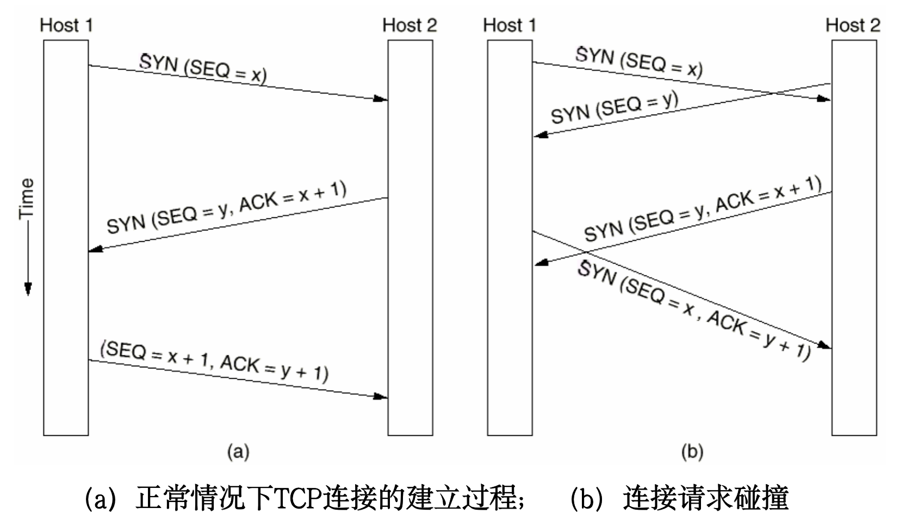

#### 6.5.6 TCP连接释放
- 释放通常需要4个TCP段，有时第一个ACK和第二个FIN合并，这样只需要3个
- 释放连接时，FIN的发送端启动一个计时器，在收到确认后释放连接
- 若无确认并且超时，也直接释放连接，这样对方也因会超时而发现无人监听连接，使连接释放

#### 6.5.7 TCP连接管理模型
- TCP建立连接和释放连接的过程可以用**有限状态机**来描述
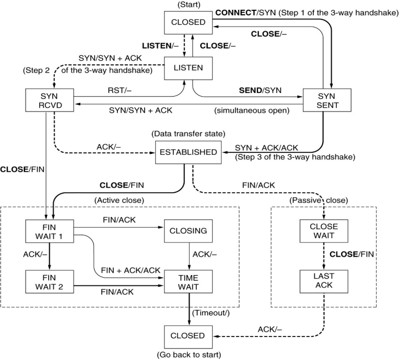

#### 6.5.8 TCP滑动窗口
- TCP窗口管理将**正确接受段的确认**和**接收端的接收缓冲区分配**分离开
- SEQ：发送端将要写入的缓冲区窗口号
- ACK：接收端确认信息，下次发送端的SEQ
- WIN：接收端剩余窗口大小
- 即使窗口已满，紧急数据仍然可以发送
- **窗口探测 window probe**：发送端发送一个1字节的段，强制接收方返回下一个期望的字节和窗口大小

- 发送端不一定接到应用程序传递来的数据就马上传递出去，接收端也不一定收到了就立刻确认
##### 延迟确认 delayed acknowledgement
- 要发送的数据太少时，数据会被包裹上各种头，还要求接收端发出确认，开销太大，明显浪费带宽
- 通过将确认和窗口更新延迟一段时间，希望在此期间能搭载更多数据
##### Nagel算法
- 思路：发送方不要发送太小的数据段
- 初始化：先发送一个小数据包，缓冲之后的所有字节
- 当小数据包得到确认后，将刚刚缓冲的所有字节放在一个TPC段中一并发出，再继续开始缓冲，直到再一次得到确认再发送
##### 低能窗口综合症 silly window syndrom
- 数据以大块形式被传递给发送端TCP实体，但接收端每次只读取1个字节，导致接收端每有一点可用缓冲区，都立刻通知发送端可以发送，发送端也就只发1个字节，导致效率低下
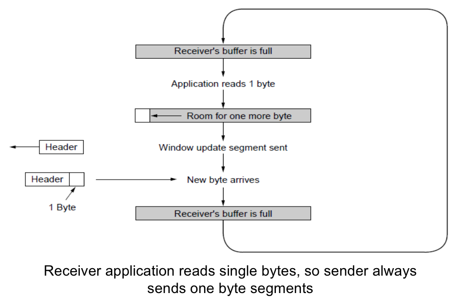
##### Clark算法
- 思路：接收方不要请求太小的数据段
- 强制接收端等待有一定大小的可用缓冲区后，再通知发送端
- 例如：令`可用缓冲区大小 >= MIN(可接受最大数据段, 缓冲区一半大小)`，作为触发接收方发送确认的条件
- **Nagel算法**和**Clark算法**结合解决**低能窗口综合症**的解决方案

#### 6.5.9 TCP计时器管理 TCP timer manager
- TCP维护了多个计时器
##### 重传计时器 (RTO) Retransmission TimeOut
- TCP发出一个段时，同时启动RTO
- 如果超时前被确认，则计时器停止
- 如果超时，该段被重传并重启计时器
- 超时时长是根据网络性能动态调整的

#### 6.5.10 TCP拥塞控制
- 传输层接收到从网络层反馈来的拥塞信息，并减慢它发送到网络的流量速率
##### 两个窗口
- 拥塞窗口 congestion window
  - TCP维持一个**拥塞窗口**，窗口大小是任何时候发送端可以向网络发送的字节数，速率则是`窗口大小/连接往返间`
  - 拥塞窗口由发送端维护
- 流量控制窗口 flow control window
  - **流量控制窗口**指出接收端可以缓冲的字节数
  - 由接收端维护
- 要并发的跟踪这两个窗口，可以发送的字节数是而二者中的较小值

##### 确认时钟 ack clock
- 如图，发送端的链路快而接收端的链路慢。接收端发送**确认返回**的速率，正是数据包通过路径最慢（瓶颈）链路的速率，也是发送端应该使用的发送速率
- 因此TCP使用一个**确认时钟 ack clock**，来使输出流量平滑

##### 慢速启动 slow start
- 如果网络**拥塞窗口**从小规模启动，**加法递增乘法递减 AIMD**（6.3.2）则需要花费一定时间，故采用**慢启动**法
- 发送端先把一个数据包注入网络
- 每次受到确认后，下次注入的包数翻倍，即**拥塞窗口**大小翻倍
- **拥塞窗口**很快过大，使太多的数据包太快的注入网络
- 为保持对慢速启动的控制，发送方为每个连接维护**慢启动阈值 slow start threshold**
  - 阈值初始化为任意高
  - 每次丢包或超时，阈值就被设为当前的一半，并重新**慢速启动**
  - 超过阈值，TCP将把**慢启动**切换为**线性增加**（加法递增）
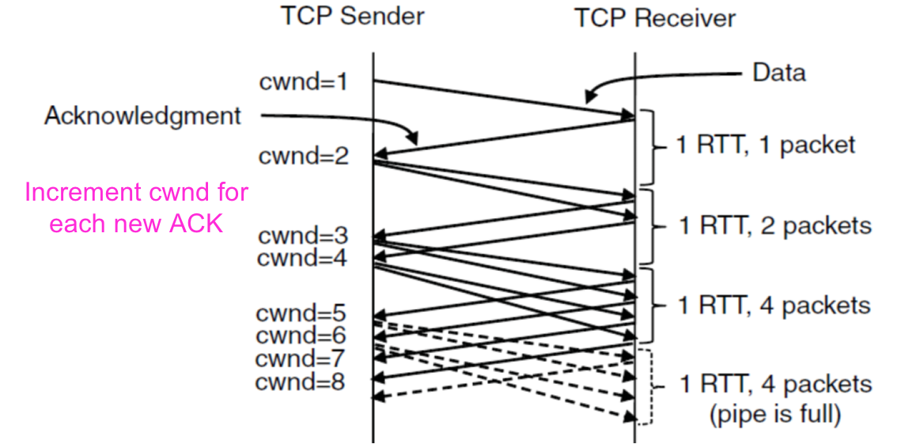

##### 快速重传 fast retransmission
- 发送端采用**快速重传fast retransmission**来快速识别它的包是否丢失
  - 当接收端发现某个包的后续包先到达了，就发送一个**重复确认 duplicate acknowledgement**，其确认段带有相同的确认号
  - 包可以选择网络的不同路径，因此顺序颠倒也算正常现象，但是如果发生3次**重复确认**，TCP就假设包已经丢失
  - 丢失包的序号已经确认，不用等待计时器超时，可以直接开始重新发送

##### 快速恢复 fast recovery
- 不再反复**慢速启动**，只在**第一次启动**和**ack超时**才进行完整的慢速启动流程
- 启发式机制
- 每次发生包丢失需要快速重传时，将**慢启动阈值**减半，形成**锯齿 sawtooth**：
  - 加法递增：每个RTT增加一段
  - 乘法递减：每个RTT减半
  - 也就是AIMD规则

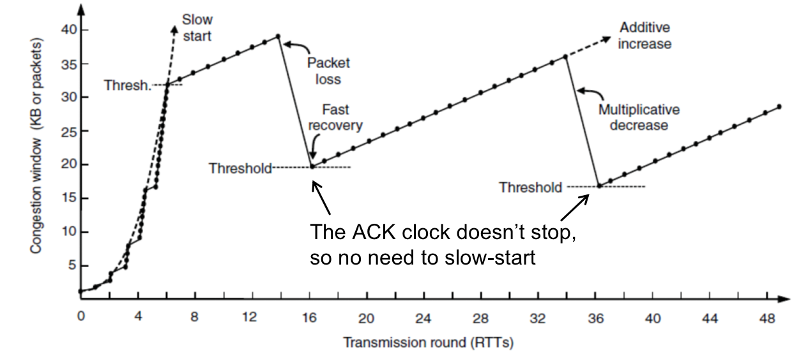

***

# 第7章 应用层
- 应用层并非应用，它不真正为用户工作
- 应用层需要协议支持

## 7.1 域名系统 DNS 471
- DNS本质是一种层次的、基于域的命名方案，并用一个分布式数据库加以实现
- 主要用途：将主机名映射成IP地址，符号地址容易记忆

***

## 7.3 万维网 World Wide Web 499
- 万维网是一个体系结构框架，该框架把分布在整个Internet上的机器上的内容链接起来供人们访问
- Web是万维网的俗称
#### 7.3.1 体系结构概述
- Web由大量分布在全球范围的内容构成，这些内容以**Web页面 Web page**或简称**页面 page**的形式表示
##### 页面命名和定位
- 需要解决几个问题
  - 页面叫什么
  - 页面在哪里
  - 如何访问该页面
- 使用**统一资源定位符 (URL) Uniform Resouce Locator**，能有效充当页面在全球范围的名字，包括3个部分：
  - 协议
  - 页面机器所在的DNS名称
  - 唯一指向特定页面的路径
- 用户点击超链接后的流程：
  - 浏览器确认URL
  - 请求DNS服务器查询DNS域名
  - DNS返回IP地址
  - 浏览器与IP的80端口建立TCP连接，80端口是HTTP协议的知名端口
  - 浏览器发送HTTP报文，请求对应路径的页面
  - 服务器发回页面作为HTTP响应

#### 7.3.4 超文本传输协议 (HTTP) HyperText Transform Protocol
- Web服务器与客户端之间传输信息的协议
- HTTP是一个简单的请求-响应协议，通常运行在TCP上

***

## 7.5 内容分发
- Internet网的最初目的是用于**通信**，但随着发展，Internet上的**内容交换**已经远远多于**通信**
- 内容分发相对于通信，使用者所使用的主机更加不固定
##### 两种内容分发的体系结构
- 内容分发网络 (CDN) Content Distribution Network
  - 在Internet的每个位置建立一组分布式机器
- 对等网络 (P2P) Peer-to-Peer
  - 让一组计算机把它们的资源集中起来，彼此互相服务提供内容

