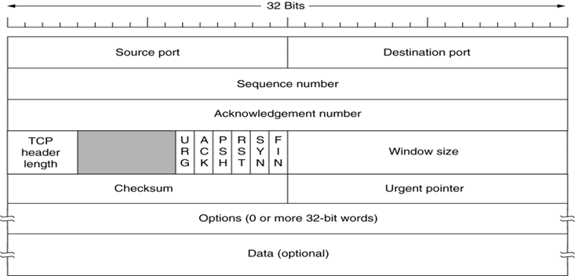
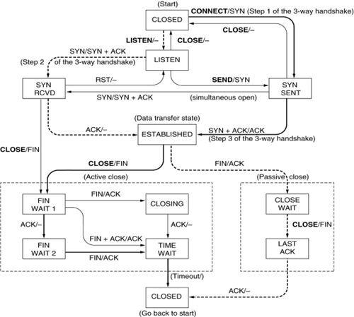
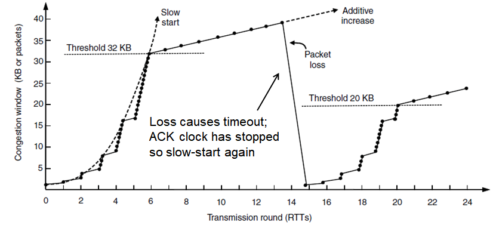
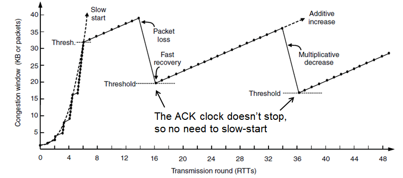

## 	绪论

- 成绩占比
  - `70%` 期末考核
  - `30%` 平时成绩
    - 随堂测验
    - 签到


## 第一章：引言

- 计算机网络`computer network`定义
  - 大量相互独立但彼此连接的计算机共同完成计算任务
  - 通过一套技术在不同系统间交流

### 1.2 网络硬件

- 分类

  - 按传输技术分类
    - 广播式链路：一个发送方和所有接收方/一组接收方(广播`multicasting`/组播`broadcasting`)
    - 点到点链路`point-to-point`：一个发送方和一个接收方(单播`unicasting`)

  - 按规模分类
    - 个域网`PAN`[^ 设备围绕着一个人进行通信]
    - 局域网`LAN`[^ 私有网络，区域内共享资源和交换信息]
      - 总线网
      - 环型网
    - 广域网`WAN`

### 1.3 网络软件

#### 1.3.1 协议层次结构

- 层次/分级栈`a stack of layer/level`[^每一层目的向上一层提供特定的**服务**，而把如何实现的服务细节对上一层加以屏蔽]
- 协议`protocol`[^ 通信双方就如何进行通信的一种约定]
- 对等体`peer`[^ 不同机器上构成相应层次的实体]
- 接口`interface`[^ 定义了下层向上层提供那些原语操作和服务]
- 网络体系结构`network architecture`[^ 层和协议的集合]

- 信息的传递需经历层层打包`pack`和解包`unpack`

#### 1.3.2 面向连接&无连接的服务

- 面向连接的服务`connection-oriented service`[^ Eg: 管道专线连接 ]
  - 报文序列
  - 字节流
- 无连接服务`connectionless service`[^ Eg: 邮政式中转分发]
  - 数据包
  - 请求-应答


### 1.4 参考模型

#### 1.4.1 七层OSI参考模型

1. 物理层`physical`：关注一条通信信道上传输原始比特

2. 链路层`data link`：将一个原始的传输设施转变成一条没有漏检传输错误的线路

3. 网络层`network`：控制子网的运行

4. 运输层`transport`：接受来自上一层的数据，必要时把这些数据分割成较小的单元，

   ​				然把这些数据单元传递给网络层，并且确保这些数据单元正确到达另一端,

   ​				决定了向会话层，是实际的最终网络用户提供哪种类型的服务

   ​				真正的端到端的层

5. 会话层`session`：允许不同机器上的用户建立会话

6. 表示层`presentation`：关注所传递信息的语法和语义

7. 应用层`application`：包含了用户通常需要的各种各样的协议

#### 1.4.2 TCP/IP参考模型

1. 链路层`link`：主机与传输线路之间的一个接口，描述链路需完成什么才能满足无连接的互联网络层的需求

   > Ethernet[^ 以太网]， 802.11[^ 无线局域网]

2. 互联网层`internet`：将整个网络体系结构贯穿在一起的关键层，允许主机将数据包注入到任何网络，并让数据包独立到达接收方

   > IP[^ 定义了官方的数据包格式和协议]，ICMP[^ 因特网控制报文协议]

1. 传输层`transport`：允许源主机和目标主机上的对等实体进行对话

   > TCP[^ 可靠的，面向连接的协议]，UDP[^ 不可靠的，面向无连接的协议]

2. 应用层`application`：包含了所需的任何会话和表示功能，所有高层协议

   > TELNET，FTP，SMTP，HTTP

#### 1.4.3 本书所使用的模型

- 物理层：规定了不同介质上用信号传输比特
- 数据链路层：两台直接相连的计算机之间发送有限长度的消息，并具有指定级别的可靠性
- 网络层：将多条链路结合到网络中，如何把网络与网络连结成互联网络，计算机之间发送数据包
- 传输层：增强网络层的传递保证，有更高的可靠性，提供数据交付的抽象
- 应用层：使用网络的应用程序


- OSI和TCP/IP参考模型的比较
  - service interface protocol
  - OSI：影响力强概念明晰；被政治局势影响产生
  - TCP/IP：成功且运转良好的协议，并成为标准；实际指导产生的协议，分层模糊易混淆

- Hybird Model[^ 现今在用的模型]

### 1.5 网络实例

#### 1.5.1 因特网`Internet`

- 大量网络的集合
- 使用特定公共协议并提供特定公共服务
- 前身：APRANET，分组交换，NSFNET
- Ethernet
  - 总线式(相对于广播式的传播方式)
  - 小范围
- Wireless Networks


### 1.6 网络标准化

#### 1.6.1-2 有影响力的组织

- 国际电信联盟`ITU`[^ International Telecommunication Union]
  - 电信标准化部门`ITU-T`：关注电话和数据通信系统
  - 无线电通信部门`ITU-R`：协调全球无线电频率利益集团间的竞争使用
  - 发展部门`ITU-D`：促进信息和通信技术的发展，缩小国际间的数字鸿沟
- 国际标准化组织`ISO`[^ International Standards Organization]：制定和发布国际标准

  - 美国国家标准组织`ANSI`[^ American National Standards Institute]
  - 国家标准和技术协会`NIST`[^ National Institute of Standards and Technology]
  - 电器和电子工程师协会`IEEE`[^ Institute of Electrical and Electronics Engineers]：最大的专业组织
    - 下属标准化组专门开发电器工程和计算机领域中的标准
  - 互联网工程任务组`IETF`[^ Internet Engineering Task Force]：
  - 万维网联盟`W3C`[^ World Wide Web Consortium]：开发协议和给出促进web长期增长的指导意见，行业联盟

- **Standards define what is needed for interoperability**(互用性)


### 1.9章总结


## 第二章：物理层[^ 比特]

> 物理层<u>**比特**</u> - 链路层<u>帧</u>

### 2.6 公共电话交换网络

#### 2.6.5 交换

- 电路交换[^ 基于实际端到端物理路径的信息交换]

  > 保证服务，可能浪费资源

  - 发送数据之前需要建立一条端到端的路径
  - 连接的建立过程预留了从发送端到接收端一路上的带宽资源，该电路上的所有数据将走相同的路径
  - 拥塞发生在建立电路时

- 包交换/分组交换[^ 路由器使用储存-转发技术，由于无固定路径，到达的秩序可能出现混乱]

  > 不保证服务，不会浪费资源

  - 规定数据包的大小：确保不发生霸占传输线路的问题
  - 没为传输数据预留带宽：排队延迟
  - 拥塞发生在转发数据包时
  - 容错性能优于电路交换


## 第三章：数据链路层[^ 帧`frame`]

> 物理层<u>比特</u> - 链路层**<u>帧</u>** - 网络层<u>包</u>

### 3.1 设计问题

- 主要功能
  - 给网络层提供定义良好的服务接口
  - 处理传输错误
  - 调节数据流，适应不同速设备不被淹没
- (数据)帧的构成：帧头，有效载荷，帧尾

#### 3.1.1 提供给网络层的服务

- 无确认的无连接：源机器向目标机器发送独立的帧，目标机器并不对这些帧进行确认

  - 特点

    - 不需建立逻辑连接，不用释放逻辑连接
    - 不试图检测丢帧或试图恢复丢失帧

  - 用于错误率低的场合，靠上层恢复；实时通信，延迟比受损更严重

    > Ethernet

- 有确认的无连接：不使用逻辑连接，但每一帧需独立确认

  - 用于不可靠的信道

    > 802.11

- 有确认的有连接：建立逻辑连接，编号每一帧并确认收到

  - 特点
    - 最复杂服务：建立/维护/释放连接，初始化/释放变量和计数器
    - 所有帧只被接收一次，且按照正确顺序接收
    - 需要三阶段：建立连接，初始化变量/计数器；传输一个或多个帧；释放连接和维护该连接的资源
    
  - 用于长距离且不可靠的链路，避免带宽浪费
  
    > 卫星信道、长途电话电路

#### 3.1.2 成帧[^ 为方便纠错拆分比特流为帧并附上校验]

- 字节计数法[^ 利用头部中的一个字段来表示该帧中字符数]

  - 问题
    - 因一个传输错误而混乱，造成此起后续所有数据无法被正确识别
    - 且接收方无法得知距离开始处多少字节

- 字节填充的标志字节法[^ 用标志字节作为帧的起始和结束分界符]

  - 解决：出错后的重新同步问题：搜索两个标志字节以获取当前帧结尾和下一帧起始

  - 问题
    - 标志字节`FLAG` `ESC`出现在数据中时影响帧的分界
      - 字节填充技术：前面再添加转义字节`ESC`
    - 只能使用8比特的字节

- 比特填充的标志比特法[^ 在比特级完成帧的划分，帧可包含任意大小单元组成的二进制比特数。开始结束由特殊比特模式决定]

  - 用填充比特的方法避免标志比特在内容中出现(标志比特连6个1，则内容每连续5个1补1个0)
  - 解决：只能使用8比特的字节为单元

  > USB

- 物理层前导码`preamble` (略)

#### 3.1.3 差错控制[^ 修复收到的错误]

- 通过计时器和控制帧使错误被接收方发现

#### 3.1.4 流量控制[^ 处理不同速设备信息间传输造成的堵塞]

- 基于反馈的流量控制`feedback-based flow control`：接收方给发送方返回信息接受情况
- 基于速率的流量控制(同时出现在链路层和更高层次)`rate-based flow control`：无需反馈限制发送方发送数据的速率


### 3.2 错误检测和纠错

> 通过在发送的数据中加入结构化的冗余信息，让差错可以被检测或被纠正

#### 3.2.1 纠错码`error-detecting`[^ 包含足够多的冗余信息让差错可背纠正]

#### 3.2.2 检错码`error-correcting`[^ 包含一些冗余信息使差错可被推断是否发生]


### 3.3 基本数据链路层协议

#### 3.3.1 乌托邦式的单工协议[^ 不考虑任何出错的情况，仅单向传输]

- 收发双方**总处于准备就绪**状态，数据**处理时间不计**，**可用缓存无穷大**，链路层通信信道**永不损坏帧或丢帧**

```C++
void sender1(void) {
    frame s;
    packet buffer;
    while(true) {
        网络层接收数据储存至buffer;
        转buffer中信息为frame;
        把frame发送给物理层;
    }
}
void recerver1(void) {
    frame r;
    event_type event;
    while(true) {
        等事件触发发生;
        接收并将硬件缓冲区的bit转为frame;
        解析frame转化并传递给网络层;
    }
}
```

#### 3.3.2 无错信道上的单工停-等式协议[^ 考虑接收方可能被高速发送方的帧淹没情况]

- 建立强大接收器
- 接收方传递数据包至网络层后发送反馈信息(哑帧)[^ 仅在一个方向上传输数据]

```c++
void sender2(void) {
    frame s;
    packet buffer;
    event_type event;
    while(true) {
        网络层接收数据储存至buffer;
        转buffer中信息为frame;
        把frame发送给物理层;
        等待直到接收到确认帧;
    }
}
void recerver2(void) {
    frame r;
    event_type event;
    while(true) {
        等事件触发发生;
        接收并将硬件缓冲区的bit转为frame;
        解析frame转化并传递给网络层;
        向发送方发送确认帧以继续发送;
    }
}
```

#### 3.3.3 有错信道上的单工停-等式协议[^ 考虑常规 出错帧 损坏帧 丢失帧情况]

- 能区分到达的帧是首次发来的新帧或是被重传的老帧
- 带有重传的肯定确认`PAR`[^ 仅在一个方向上传输数据]
- 双方链路层处于等待状态时用变量记录下个要发送的帧序号/下个期待帧序号
- 发出方发出一帧后启动/重置计时器，在足够长的计时器到时后确认帧仍未接收到/损坏则重新发送
- 接收方检查接收帧的序号，若非重复数据包则传给网络层并返回确认帧，重复则返回对应确认帧

```c++
void sender3(void) {
    seq_nr next_frame_to_send = 0;
    frame s;
    packet buffer;
    event_type event;
    网络层接收第一个数据包;
    while(true) {
        转buffer中信息为frame;
        设置frame中下一帧帧号;
        把frame发送给物理层;
        启动此帧号的计时器;
        等待直到接收到帧;
        if(event == 帧到达){
            从物理层获取帧;
            if(帧为确认返回帧){
                此帧号的计时器停止;
                网络层接收下一个数据包;
                设置下一帧帧号;
            }
        }
    }
}
void recerver2(void) {
    seq_nr frame_expected = 0;
    frame r，s;
    event_type event;
    while(true) {
        等事件触发发生;
        if(event == 帧到达){
            从物理层接收帧;
            if(帧号为预期帧号){
                解析frame转化并传递给网络层;
                设置下一期待帧帧号;
            }
        }
        向发送方发送确认帧以继续发送;
    }
}
```


### 3.4 滑动窗口协议[^ 考虑全双工数据传输]

- 捎带确认`piggybacking`：暂时延缓确认以便将确认信息搭载在下一个出境数据帧的技术
  - 更好利用了信道带宽
  - 减小接收方负担
  - 问题：下一个处境数据帧无固定时间

- 滑动窗口`sliding window`：任何时刻发送方和接收方总各维持一组序号，二者序号可一样可不一样，仅发送/接收窗口序号内的帧
  - 发送方：发送方窗口序号表示可以被发送的帧和发送未确认的帧，从网络层来的新包会被赋予窗口中的下一个最高序号，且窗口上边界前移一格；收到确认时窗口下边界前移一格
  - 接收方：接收方窗口序号对应其可以接受的帧，收到序号落在窗口下边界的帧会被传输给网络层同时整个窗口前移一格，落在窗口外的帧都将被丢弃。所有情况下，接收方都返回给发送方一个确认帧


#### 3.4.1 1位滑动窗口协议[^ 等-停式]

- 发送方在接收到接收方对前一帧的确认到来才能发送下一帧
- frame_expected 仅取值0或1
- 过早超时会使帧多次发送，导致带宽浪费

#### 3.4.2 回退n协议[^ 考虑传输时间]

- 1位滑动窗口在长发送时间、高带宽、短帧情境下会导致极大比例资源由于等待前一帧的确认的堵塞被浪费
- w位窗口
  - $$ w = 2 * 带宽延迟乘积(BD) + 1$$[^ 必须接受完整个帧确认帧才被发出]
  - $$ 链路利用率 \le \frac{w}{1+2BD}$$
- 管道化[^ 保持多个帧同时在传输的技术]：需解决数据流中帧损失后续帧的处理
  - 回退n[^适用于接收窗口大小为1]：接收方简单丢弃所有后续帧并不针对此些返回确认
    - 高信道错误率会浪费大量带宽
  - 选择重传[^ 接收窗口大于1]：丢弃坏帧返回NAK，接收并缓存坏帧后所有好帧返回ACK，等待重传
    - 否认确定(NAK)：可触发发送方对该帧的重传操作
    - 大的窗口需要数据链路层大的内存需求

#### 3.4.3选择重传协议`selective repeat`

- 为避免非顺序接收可能的接收方窗口移动，新有效序号范围与老的有重叠导致接收帧混乱情况，

  窗口最大尺寸<= 序号空间/2

- 每个缓冲区均有辅助计时器

### 3.5 数据链路协议实例

- 点到点协议`PPP(Point-to--Point Protocol)`
  - 功能：处理错误检测链路的配置；支持多种协议；允许身份认证
  - 主要特性
    - 可无歧义区分帧结束和帧开始的一种成帧方法
    - 链路控制协议`LCP(Link Control Protocol)`
    - 协商网络层选项的方式
    - 面向字节而非比特的，使用字节填充技术


## 第四章：介质访问控制子层[^ 数据链路层的子层，处于底部]

- 介质访问控制子层`MAC`：控制多路访问信道下一个使用者的协议

### 4.1 信道分配问题

#### 4.1.1 静态信道分配

- 频分多路复用`FDM`：带宽被等分，用户使用专用频段
- 失分多路复用`TDM`：
- 缺点：无法应对发送方数量多且经常变化、**突发性流量**，资源浪费低效

#### 4.1.2 动态信道分配假设

- 假设基础：流量独立，单信道，冲突可观察，时间连续或分槽，载波侦听或不停
  - 载波侦听`Carrier Sense`：使用信道前侦听信道是否正被使用


### 4.2 多路访问协议

#### 4.2.1 ALOHA

- 纯ALOHA[^ 时间是连续的]
  - 用户有数据需要发送时就传输
  - 中央计算机广播发送站发来的帧，发送站可侦听帧是否发生冲突
  - 但凡发生两个帧在相同时间占用信道，冲突发生且二帧损坏，发送方随机等待再重发送
  - 竞争系统：多用户共享同一个信道的方法会导致冲突的系统
- 分槽ALOHA[^ 时间分成离散槽]
  - 将时间分成离散的间隔，每个时间槽对应于一帧，用户仅能在下一个时槽的开始时刻传输
  - 测试帧所在同一个时间槽没有其他流量的概率是$$S=Ge^{-G}$$ G:每包时的尝试次数，S:每帧吞吐量
  - 信道负载的微小增长会极大降低信道的性能
  - 信道利用率最大1/e

#### 4.2.2 载波侦听多路访问协议

> 冲突被越来越有效地避免，利用率提高

- 载波侦听协议：站监听是否存在载波(传输)并采取相应的动作

- 坚持和非坚持CSMA

  - 坚持CSMA `1-persistent CSMA` [^ 发现信道空闲时，传输数据的概率为1]

    - 发送数据前**监听信道**使用情况
    - 信道空闲则发送数据
    - 信道忙则等待直至信道空闲
    - 冲突则随机等待时长重复上述

    - 问题
      - 两站等待前一站发完后同时开始传输导致冲突
      - 一站信号延迟传播未达时，对面站认为信道为空开始传输导致冲突
      - 带宽延迟积[^ 信道上适合的帧数] 大则影响越大
  - 非坚持CSMA `nonpersistent CSMA`[^ 较1-CSMA利用率提高，代价延迟更高]

    - 发送数据前**监听信道**使用情况
    - 信道空闲则发送数据
    - 信道忙则**暂停监听**随机时间并重复上述

  - p坚持CSMA `p-persistent CSMA`[^ 发现信道空闲时，传输数据的概率为p]

    - 发送数据前**监听信道**使用情况
    - 信道空闲则**p概率**发送数据，**1-p概率**推迟下一个时间槽发送
    - 信道忙则等待下时间槽重复上述

- 带冲突检测的CSMA `CSMA/CD`[^ 每个站快速检测发生冲突后立即停止传输帧，节省时间和带宽]

  - 冲突检测是一个模拟过程

  - 检测要求接收信号相比发射信号不能太微弱&选择能被检测到冲突的调制解调技术

  - 模型由竞争期[^ 发生冲突]、传输期[^ 正常传输]、空闲期[^ 没有传输任务]组成

  - 检测是否发生冲突的最小等待时间：$$2\tau$$

  - 与分槽ALOHA的区别：只有一个站能用来传输的时间槽后面紧跟的时间槽被用来传输该帧的其余部分，

    若帧时比传播时间长很多，此协议性能优势越大


#### 4.2.3 无冲突协议

- 位图协议
- 令牌传递
- 二进制倒计数

#### 4.2.5 无线局域网协议

- CSMA
  - 问题：未考虑无线传输特性，冲突发生在接收方
    - 隐藏终端问题：竞争者离得太远导致无法检测到潜在的竞争者，发送者检测不到视野外与目标通信的
    - 暴露终端问题：非竞争者将另目标不同的终端检测为竞争者而产生传输延迟
    - 原因：有线情形同一时刻仅能有一个传输在进行；无线情形允许多个传输同时发生
- 冲突避免多路访问`MACA`
  - 基本思想：发送方刺激接收方输出一个短帧，以便其附近的站能检测到该次传输
  - 流程
    - 发送方给接收方发送RTS帧，包括数据帧长度
    - 接收方接收到RTS帧用CTS作应答，包括RTS中的数据帧长度
    - RTS和使非目标接收方保持沉默足够长保证CTS被无冲接受，此后可自由发送
    - CTS和使非目标接收方保持沉默直到传输结束再进行传输，通过其中数据帧的长度得知传输进度 


### 4.3 以太网[^ 实际系统应用，有线局域网的主要形式]

#### 4.3.1 经典以太网物理层

- 多台计算机通过长电缆上的接口电缆相连
- 速率10Mbps
- 计算机使用以太网协议通信
- CSMA/CD调度传输

#### 4.3.2 经典以太网MAC子层协议

|       8       |    6     |   6    |  2   | 0-1500 | 0-46 |   4    |
| :-----------: | :------: | :----: | :--: | :----: | :--: | :----: |
| 前导码+定界符 | 目标地址 | 源地址 | 类型 |  数据  | 填充 | 校验和 |

- 前导码：同步时钟，SOF定界符告知即将开始帧
- 目标地址：第一位为0表示普通地址；为1表示组地址，允许对应的多站监听；全1表示广播
- 填充：保证最小帧长以获得可靠检测
  - 避免一个短帧没到达电缆远端的发送方，该帧的传输已经结束，电缆的远端，该帧与另一帧发生冲突
  - 避免发送方误认为冲突消息被正确接收
- 所有帧必须至少需要2τ时间才能完成发送，避免噪声返回发送方前就认为传输结束

#### 4.3.3 以太网系性能		

- 帧长越长，效率越高

#### 4.3.4 交换式以太网[^ 解决单根电缆断裂或者松动位置连接相关问题]

- 中央集线器：电气上简单连接所有连接线
  - 使用现有布线，易于维护；不能增加容量
  - 唯一的冲突域使用CSMA/CD算法调度各自站的传输
- 交换机：把帧输出到想去的端口
  - 每个端口拥有独立的冲突域，由于电缆的双全工，站和端口可同时往电缆上发送帧
  - 冲突**不可能发生**
  - **容量**的使用较上者更为有效
  - **缓冲队列**的引入解决了多帧前往相同目标相同的问题
  - 由于上述，**性能**较上者提升较大
  - 流量只被转发至目标端口以隔离数据，**安全性**上升

#### 4.3.5-7 快速以太网-万兆以太网

- 快速以太网[^ 带宽增至100Mbps]
  - 保留原来的帧格式、接口、过程规则，降低比特时间100ns->10ns
  - 5类双绞线在市场中广为使用
- 千兆以太网

### 4.4 无线局域网

#### 4.4.1 802.11体系结构和协议栈

- 有架构模式
  - 每个客户端与一个接入点AP关联，接入点与其他网络连接
  - 几个接入点可通过分布式系统的有线网络连接在一起
- 自组织模式
  - 一组相互关联的计算机，相互之间直接向对方发送帧
- 802.11协议栈的组成部分
  - (上)上层 - 数据链路层( 逻辑链路LLC层 - 介质访问MAC控制层 ) - 物理层(下)

#### 4.4.2 802.11物理层

- 物理层可供不同传输速率共用

#### 4.4.3 802.11MAC子层协议

- 以太网的冲突检测机制无法适用于无线介质

- 带有冲突避免的CSMA`CSMA/CA`：发送前侦听信道和检测到冲突后指数后退，不等待冲突的发生
  - 侦听确定一个很短的时间内没有信号
  - 倒计数空闲时间槽，若有帧在发送时暂停该计数器
  - 计数器递减到0，该站发送自己的帧
  - 发送成功，目标站立即发送一个短确认
  - 未收到确认，传输发生错误，发送方加倍后退选择的时间槽数，再重新试图发送
  - 相比以太网区别：
    - 冲突代价昂贵；无法检测冲突，利用确认推断是否冲突
      - 分布式协调功能DCF
      - 点协调功能PCF[^ AP控制自己覆盖范围内的一切活动]
    - 不同站的传输范围可能不同，隐藏终端/暴露终端问题
      - 物理侦听[^ 简单地检查介质是否存在有效信号]
      - 虚拟侦听[^ 每个站可保留一个信道何时要用的逻辑记录]：通过网络分配向量NAV和RTS/CTS避免(很少用)
- 不同的延迟时间槽支撑不同质量的服务
  - 增加传输成功概率可降低传输速率,或使用短帧ACK
- 节省电源的管理

#### 4.4.4 802.11帧结构

### 4.8 数据链路层交换

- 网桥[^ 把多个局域网连结起来组成更大的局域网的设备，也称为交换机]

#### 4.8.1 网桥的使用

#### 4.8.2 学习网桥

- 后向学习法[^ 组织不需要发送的流量]
- 生成树算法[^ 打破潜在的环路]


## 第五章：网络层[^ 包]

>  链路层<u>帧</u> - 网络层**<u>包</u>** - 传输层
>
>  处理端到端数据传输的最底层
>
>  为端到端通信提供了数据包交付服务
>
>  和网络层一起构成了网络协议层次的核心

### 5.1 网络层的设计问题

#### 5.1.1 储存转发数据包交换

- 组件：网络服务提供商ISP的设备[^ 通过传输线路连接的路由器]，客户端设备
- 储存-转发数据包交换：主机 - 路由器(完成校验和验证) - 转发到下一个路由器 - 目标主机

#### 5.1.2 提供给传输层的服务

- 目标：传输层只关心可不可达
  - 向上提供的服务独立于路由器技术
  - 向传输层屏蔽路由器数量、类型和拓扑关系
  - 传输层可用的网络地址应有可跨越LAN WAN的统一编址方案
- Internet正向面向连接的特性进化

#### 5.1.3 无连接服务的实现

- 数据报(datagram)和数据报网络(datagram network)
- 过程
  - 拆分消息成数据包以适应最大数据包长度
  - 使用点到点协议发送数据包给最近的路由器
  - 路由器暂存经过校验和验证的入境数据包
  - 路由器根据**路由算法**[^ 管理路由表并做出路由选择的算法]将装入新帧的数据包转发给下一个路由器
  - 重复上一步直到目标
- **每个包的路由传输路径可能有不同**
- 每个路由器的内部表指明了目标地址和所用出境线路
- IP协议[^ 整个Internet的基础]：每个数据包携带一个目标IP，路由器使用该地址单独转发每一个数据包

#### 5.1.4 面向连接服务的实现

- 虚电路(VC)和虚电路网络(virtual-circuit network)[^ 避免为每一个要发送的数据包选择一条新路经]
  - 该电路仅存在于连接存在时

- 过程
  - 建立连接
  - 严格**按照路径**路由传输
  - 连接释放，虚电路消失
- 虚电路于建立连接时确定下来
- 数据包包含标识符表明虚电路归属
- 路由器的内部表记录了连接标识符[^ 避免冲突]和数据来源
- 多协议标签交换[^ 替换出境数据包中连接标识符]
  - ISP用其为超大流量建立长期链接
  - 用于高质量服务和协助ISP流量管理

#### 5.1.5 虚电路与数据报网络的比较

|           问题 |          数据报网络          |                虚电路网络                |
| -------------: | :--------------------------: | :--------------------------------------: |
|       电路建立 |            不需要            |                   需要                   |
|           寻址 | 每个包包含全部的源和目标地址 |            每个包包含简短VC号            |
|       状态信息 |     路由器不保留连接状态     |     每个连接每个VC都需路由器保存状态     |
|       路由方式 |     每个数据包被单独路由     |    建立VC时选择路由，所有包遵循该路由    |
| 路由器失效影响 |   无影响，除崩溃时丢失的包   |        穿过故障路由的所有VC均中断        |
|       服务质量 |             困难             | 容易，预先建立在每条VC时有足够资源可分配 |
|       阻塞控制 |             困难             | 容易，预先建立在每条VC时有足够资源可分配 |

### 5.2 路由算法[^ 确定一个入境数据包应该被发送到哪一条输出线路上]

- 路由[^ 对哪一条路径做出决策，生成和更新路由表]
- 转发[^ 一个数据包到达时该采取什么动作，路由表中查找数据包对应的出境线路]
- 需满足特性：正确性、简单性、鲁棒性、稳定性、公平性、有效性
- 分类
  - 非自适应算法`nonadaptive algorithm`
    - 离线计算好路由选择，部根据当前流量和拓扑结构调整路由决策
    - 无法响应故障，用于路由选择已经很清楚的场合

  - 自适应算法`adaptive algorithm`
    - 根据当前拓扑结构变化反映出流量的变化情况，同时反映出流量变化情况
    - 算法间不同于：获取信息的来源、改变路径的时间、用于路由优化的度量


#### 5.2.1 优化原则

- 最优化原则：最优路径的一般性论述
- 汇集树[^ 从所有的源到一个制定目标的最优路径的集和构成的以目标节点为根的树]

#### 5.2.2 最短路径算法 Dijkstra

- 最短路径：在多种标准的组合权重下得出的“最短”
- 思路：从起点开始，检查整个图中具有暂时性标记的节点，将其中具有最小标记的节点为永久性的，以此类推至所有节点

#### 5.2.3 泛洪算法 flooding

- 思路：将每一个入境数据包发送到除了该数据包到达的那条线路意外的每条出境线路
- 优点：有效的广播手段；优秀的鲁棒性；总包含最短路径
- 不足：产生大量重复数据包
- 应对：数据包头设置递减计数器，路由器跟踪数据包编号

#### 5.2.4 距离矢量算法 distance vector routing[^ 最为流行的动态路由算法之一]

- 思路：
  - 每个路由器维护一张表(一个矢量)，其中列出已知到每个目标最佳距离和使用链路
  - 表通过邻居间相互交换消息不断更新，并算得到每个距离的最佳链路
- 不足：无穷计数问题(收敛速度慢：对好消息反映迅速，对坏消息异常迟钝)
  - 好消息扩散速度是每交换一次往远处走一跳，最长路径挑次交换后消息传遍
  - 坏消息由于无路由器具有一个比所有邻居最小值还大一的值而无穷增大

- 应对：带有染毒逆向的水平分裂法：防止路由器向邻居返回从该邻居获得的最佳路径
  - 没解决核心问题：**X无从得知Y给出的路径中X是否已在这条路径上**


#### 5.2.5 链路状态路由 link state routing

- 思路：
  - 发现邻居及其地址：使用全局唯一标识；使用虚拟节点模拟局域网，指定路由器替代虚拟节点运行路由协议
  - 设置链路成本：常用成本与链路带宽成反比；地理分散时链路延迟加入成本组成
  - 构造链路状态包：包括发送方标识符、序号、年龄和邻居延迟列表；周期/重要事件 触发构造数据包
  - 分发链路状态包：泛洪传播+利用保留区比较年龄留新数据包
  - 计算新路由：本地运行Dijkstra算法构建最短路径


> 以上路由算法依赖于所有路由器计算路径的处理，导致少数路由问题会破坏网络且效应会被大网络规模放大

#### 5.2.6 层次路由

- 思路：路由分层次进行，路由器不必知道其他网络拓扑结构
- 优点：节省路由表空间，适用于大型网络
- 不足：增加了路由长度(N路由器网络最优层数$lnN$。每个路由表$elnN$项，增长可接受)


### 5.3 拥塞控制算法

- 拥塞：网络中存在的**太多的数据包**导致数据包被**延迟**，被**丢失**，从而降低了传输性能的现象
- 减少拥塞最有效方式是减少传输层注入网络的负载，需网络层和传输层共同努力协同工作
- 拥塞崩溃`congestion collapse`：随着注入负载的增加到超出网络的容量，网络性能骤降
- 实际吞吐量`goodput`：网络传递有用数据包的传送速率
- 拥塞控制：确保网络能承载所有到达的流量，全局性涉及各方面的行为
- 流量控制：只与特定发送方特定接收方间点对点的流量有关，确保发送方速率不会持续超过接收方接受能力

#### 5.3.1 拥塞控制的途径

- 拥塞的出现表示负载临时大于资源可以处理的能力
- 拥塞控制方法的时间尺度：预防性 -> 反应性
  - 网络供给`rpovisioning`：建立一个带宽与流量相匹配良好的网络，出现拥塞时，动态增加网络资源
  - 流量感知的路由`traffic-aware routing`：充分利用现有的网络容量，根据每天的流量模式定值路由，通过改变最短路径权重把流量拆分到多个路径
  - 准入控制`admission control`：容量不可增加时，采用降低负载的策略，在虚电路网络中，具体为拒绝新链接的建立
  - 负载脱落`load shedding`：网络不得不丢弃无法传递的数据包时，选择正确的丢弃策略也能防止拥塞崩溃


### 5.4 服务质量

- 注重提供与应用相匹配的服务质量
- 服务质量机制允许以较低成本满足应用需求，并兑现其所能做的性能保证

#### 5.4.1 应用需求

#### 5.4.2 流量整形

#### 5.4.3 包调度


## 第六章： 传输层

> 网络层<u>包</u> - 传输层<u>**段**</u> - 应用层
>
> 拓展数据传递服务从两台计算机之间到两台计算机上进程之间
>
> 为应用层使用网络提供了抽象的模式
>
> 和网络层一起构成了网络协议层次的核心

### 6.1 传输服务

#### 6.1.1 提供给上层的服务

- 目标：向应用层的进程提供高效、可靠和成本又凶啊的数据传输服务

- 传输实体：利用网络层提供的服务实现上述目标的软硬件，常见为操作系统内核和绑定于网络应用链接库形式

- 与网络层服务的面向连接的网络服务、无连接的网络服务极相似

  - 区别：传输层代码完全运行在用户机器上；网络层代码主要运行在运营商路由器上
  - 问题：用户对网络层没有真正控制权，无法加强错误处理机制或解决服务不够用的情况

  - 传输层使传输服务更可靠于网络服务；提高不同服务的兼容性；便于程序编写

- 网络的两部分：1-4传输服务的提供者`transport service provider`；4+传输服务的用户`transport service user`

#### 6.1.2 Berkeley 套接字

- 套接字`socket`[^独立于协议的网络编程接口,网络中不同主机上的应用进程之间进行双向通信的端点的抽象]
  - 套接字API 结合 TCP协议 向用户提供了**可靠字节流**`reliable byte stream`面向连接的服务
  - 优点：应用程序可通过它使用其他的传输服务
  - 部分原语：
    - `SOCKET`创建一个新通信端点
    - `BIND`套接字与一个本地地址关联 
    - `ACCEPT`被动创建一个入境连接


### 6.2 传输协议的要素

- 传输层和数据链路层的区别
  - 链路层不必指定目标，出境直接连接特定；传输层比序显式指定接收方地址
  - 链路层建立连接过程简单；传输层连接建立复杂
  - 链路层无潜在存储容量；传输层由此带来的延迟和重复数据包需要特殊协议
  - 程度差别：传输层存在大量且数量可变的连接、连接间竞争导致的带宽波动导致缓冲和流量控制

#### 6.2.1 寻址

进程希望与另一个进程建立连接时，

- 端口`port`
- 传输服务访问点`TSAP`：标识传输层的一个特殊端点

#### 6.2.2 连接建立

- 问题
  - 数据包可能发生丢失、损坏、延迟或重复

- 解决
  - 使用ARQ和校验和处理丢失和损坏包
  - MSL(Maximum Segment Lifetime) 2t = 240S 内不使用重复序列号
  - 三次握手建立连接

#### 6.2.3 连接释放

- 问题
  - 连接释放
  - 不对称释放`Asymmetric Release`：一方单独断开连接，会导致数据丢失
  - 对称释放`Symmetric Release`：双方接收释放难以由传输层单独处理
- 解决
  - 定时器和超时重传

#### 6.2.4 差错控制和流量控制

- 差错控制
- 流量控制


### 6.3* 拥塞控制[^ Congestion Control]

>  拥塞由传输层注入到网络中的流量引起，故控制拥塞的唯一途径是放缓传输层往网络中发送数据包的速度
>
> 拥塞控制严重依赖于传输层

#### 6.3.1 理想的带宽分配

- 功率和效率：为整个传输实体有效分配带宽应该利用所有可用的网络容量
  - 实际吞吐量是提交负载的函数
  - 延迟也是提交负载的函数
  - 实际吞吐量和延迟在拥塞出现时性能开始下降
  - 功率 = 负载/延迟

- 最大-最小公平性`max-min fairness`[^ 理想的网络使用情况]：多个传输实体之间划分带宽
  - 如果分配给一个流的带宽在不减少另一个流带宽的前提下无法得到进一步增长，就不给这个流更多带宽

- 收敛：控制算法能否快速收敛到公平有效的带宽分配上
  - 好的控制算法应能随时间变化且快速稳定收敛


#### 6.3.2 调整发送速率

- 发送速率的限制
  - 流量控制：接收端没有足够缓冲区情况下
  - 拥塞控制：网络容量不足的情况下
- 传输协议调节发送速率的方式依赖于网络返回的反馈意见形式，TCP的显式拥塞通知仅警告，不给出源端减缓量
- 控制法则`control law`：增加或减少速率的方式
  - 图例说明
    - 当分配满足公平性时，两个用户将获得数量相同的带宽
    - 当分配带宽总和为100%时分配有效；超过100%时网络给双方发送拥塞信号
    - 公平线和效率线的交点是理想的操作点
  - 加法递增乘法递减`AIMD`：达到有效和公平操作点的适当流量规则
    - 加法/乘法增减会导致沿着递增线/乘法线震荡，行为将保持操作点接近效率线，并不一定公平；乘法线斜率指向原点，加法线呈45度
    - 乘法递增加法递减：会逐渐便宜最佳点
    - 加法递增乘法递减：轨迹路径快速收敛到兼顾公平与效率的最佳点
- 不同协议的竞争会导致宽带分配不平等；TCP-友好拥塞控制则无不良影响


### 6.4 Internet传输协议：UDP

- 用户数据报协议`User Datagram Protocol`：无需建立连接即可发送封装的IP数据报的方法

- 段`segment`的组成：

  - 8字节头：源端口；目标端口；UDP长度；UDP校验和
  - 有效载荷字段

- 缺失：流量控制；拥塞控制；坏段重传机制

- 优势：对数据包流精确控制；错误检测；时序功能

  > 应用：
  >
  > - 客户机-服务器应用开发`RPC`(代码简单，减少交换报文)
  > - 域名系统`DNS`
  > - 实时传输协议`RTP` 实时传输控制协议`RTCP`


### 6.5 Internet传输协议：TCP

- 可靠的、按序提交的传输特性

#### 6.5.1 TCP概述

- 传输控制协议`Transmission Control Protocol`：在不可靠互联网上提供**可靠的端到端字节流**的传输协议
- TCP传输实体：管理TCP流、与IP层之间的接口
  - 接受本地进程的用户数据流，分割成不超过64KB的分段，每个分段以独立IP数据报形式发送
  - 接收包含TCP的数据包，重构出原始字节流
- 负责流量控制；超时重传；重排序；要具备可靠的良好性能，此些IP均没提供

#### 6.5.2 TCP服务模型

- 套接字`socket`：一个套接字编号(主机的IP地址+16位数值端口`port`)
  - 获得TCP服务必须显式在两台及其的套接字间建立连接
  - 一个套接字可能同时被用于多个连接
  - 端口
    - 1024下端口为知名端口`well-known port`，仅由特权用户启动的标准服务
    - 1024-49151端口可由非特权用户使用

- TCP连接是点到点全双工的，不支持组播或广播
- 一个TCP连接是一个字节流，端到端间不保留消息的边界，接收端无法获知数据被写入字节流时的单元大小

#### 6.5.4 TCP段的头



- 每个段起始部分均为固定格式的20字节头，选项后若有数据部分，该段可达65535-20 = 65495字节的数据，第一个20指IP头，第二个20指TCP头

- 包括
  - 寻址(source/destination port)
  - 滑动窗口(sequence/acknowledgement number)
  - 流量控制(window size)
  - 错误校验(checksum)

#### 6.5.5 TCP连接建立

- 使用了三次握手法建立连接
  - A->B：`SYN(SEQ=x)`
  - B->A：`SYN(SEQ=y,   ACK=x+1)`
  - A->B：       `(SEQ=x+1, ACK=y+1)`

#### 6.5.6 TCP连接释放

- 使用了四次挥手+计时器释放连接

#### 6.5.7 TCP连接管理模型



- 粗实线：客户端正常路径
- 粗虚线：服务器端正常路径
- 细线：不经常发生的事件
- 事件/动作：状态迁移引发的事件和相应动作标记

#### 6.5.8 TCP滑动窗口

- TCP将正确接收段的确认和接收端的接收缓冲区分配分离
- 将流量控制结合进滑动窗口，接收方通过ACK和Window Size向发送方添加限制
- 窗口为0时的意外发送情形
  - 紧急数据
  - 窗口探测`window probe`[^ 防止丢包后死锁]：发送方发送1字节段强制接收端发送窗口信息
- 降低TCP性能的问题
  - 多个小数据包的发送
    - Nagle解决：发送端只发送第一次到达的数据字节，后面的数据进入缓冲直到被确认后再发送
  - 低能窗口综合症`silly window syndrome`：数据一大块形式传递给发送端TCP实体，接收端的交互式应用每次仅读取一个字符
    - Clark解决：禁止一个字节的窗口更新段+强制接收端必须等待一段时间直到缓冲区一半为空/能处理连接建立时宣告的最大数据段时

#### 6.5.9 TCP计时器管理

- 重传计时器`RTO`：TCP实体发出一个段时被启动，改计时器超时前白确认则计时器停止，计时器超时则重传
- 持续计时器`presistence timer`：避免出现接收端从窗口大小为0恢复后的更新消息丢失产生的死锁，超时则发送方发送探寻消息

#### 6.5.10 TCP拥塞控制

- 拥塞窗口`songestion window`：以AIMD控制法为基础，以丢包为二进制信号

  - 窗口大小是任意事件发送端可以往网络发送的字节数
  - 速率=窗口大小/连接的往返时间`RTT round trip time`

- 可能发送的字节数时两个窗口(拥塞窗口 流量控制窗口)中较小的那个

- 确认时钟`ack clock`：发送小的多个突发数据包，确认返回到发送端的速率恰好是数据包通过路径上最慢链路时的速度，按此速率发送则不会排队或杜塞沿途任一个路由器

  - TCP用于平滑输出流量和避免不必要的路由器队列

- 慢速启动`slow start`：拥塞窗口大小呈指数增长，每个往返时间后加倍窗口大小

  - 慢速启动在一定范围内的链接速度和往返时间上都能行之有效，并使用确认时钟将发送端的传输速率与网络路径相匹配

  - 慢启动阈值`slow start threshold`[^ 为了保持对慢速启动的控制]：最初设置为可达流量控制窗口的大小，每当检测到丢包，阈值就被设置为当前一半

  - 当慢速启动超过了阈值，TCP切换为加法递增

  - 缺陷：等待超时，超时时间需要保守，故较长

  - 重复确认`duplicate acknowledge`[^ 发送方快速识别包丢失的方法]：丢失数据包的后续数据包到达接收端时，触发给发送端返回确认，这些确认段携带相同的确认号

    > 接收端返回的ACK表示期待的下一个包，若跳包则数不变

  - 快速重传`fast retransmission`：TCP随机假设三个重复确认意味着已经丢失一个包，该包序号可推测，即整个数据序列中紧接着的下一个数据包，故该包可被立即重传，即其计时器超时前重发出去

  

- TCP Tahoe

- 快速恢复`fast recovery`[^ 保持拥塞窗口上运行确认时钟]：启发式进程，

  - TCP只有第一次或超时重传才进入慢速启动，其余遵循锯齿`sawooth`模式，加法递增，乘法递减(减半)

  

- TCP Reno

- 选择确认`SACK`：该确认列出三个已接受的字节范围，有着消息后发送端在实现拥塞窗口时可更直接确定哪些数据包需重传，并跟踪途中的数据包
  - 严格意义上的查询信息，TCP可用此更加容易从丢失多个包情况下恢复
