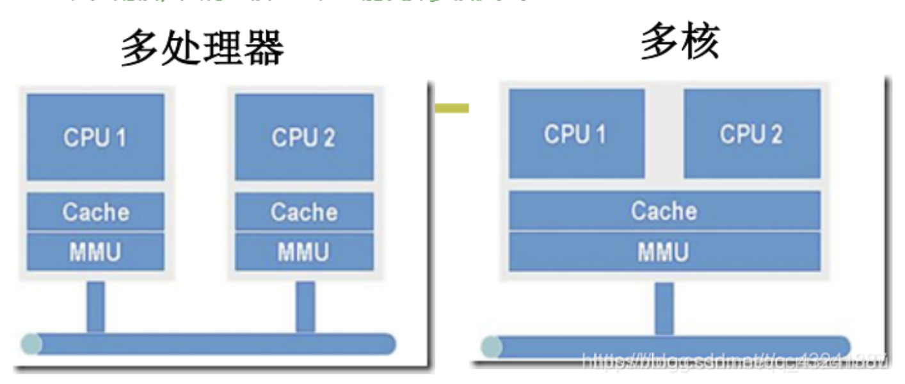
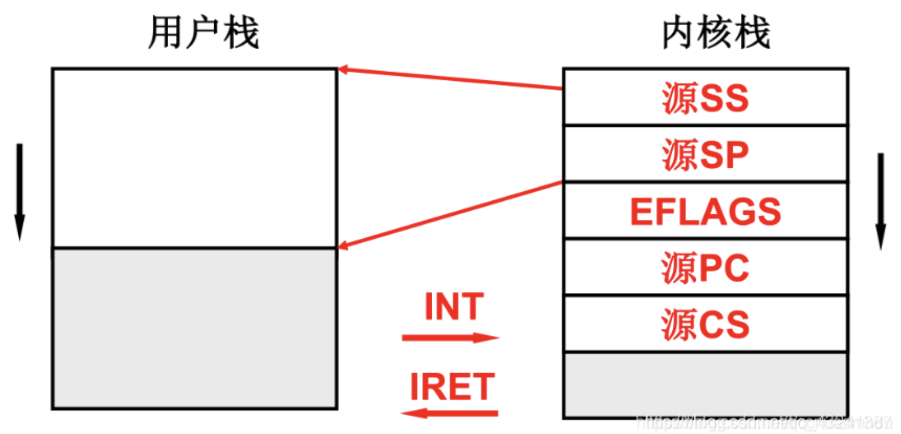
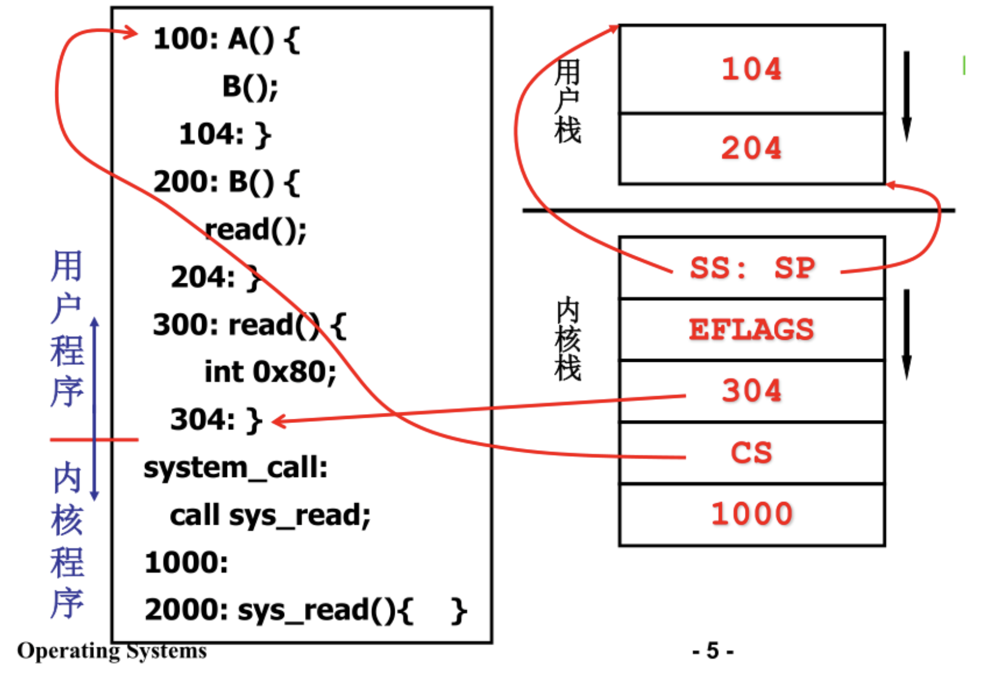
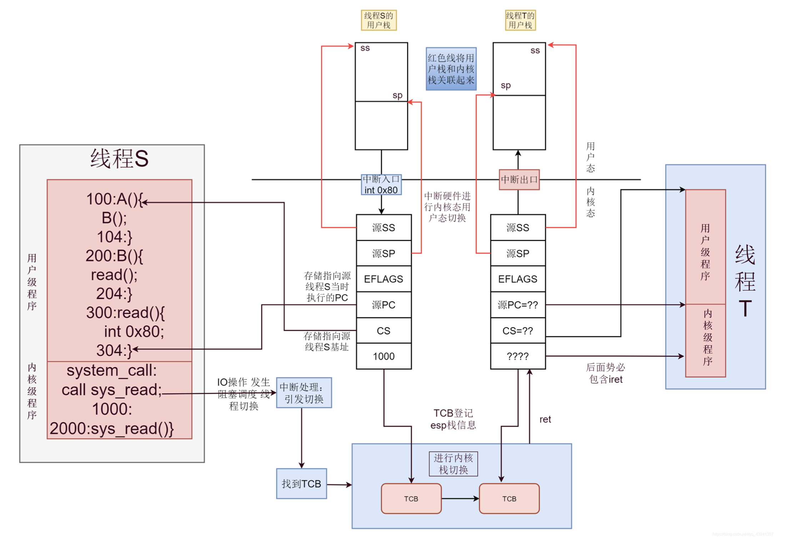
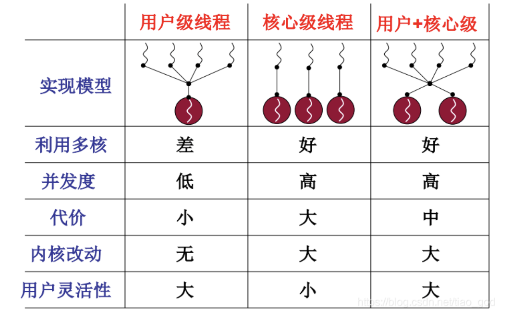

# L11 内核级线程

- 由操作系统管理的线程称为**内核级线程**
- 没有用户级进程这一说，进程直接由内核管理的，只有内核才能为进程分配资源等。

### 为什么要有内核级多线程
- 多处理器：每个CPU单独享有内存映射MMU
- 多核：多个CPU共用一个内存映射MMU
- 矛盾：许多PC是多核的，而多进程不共享内存映射表，因如下原因导致性能损失：
  - 多核PC中的**多进程**不共享MMU
  - **用户级线程**对操作系统透明，操作系统不可能为其分配核

##### 并发与并行
- 并行描述系统具有处理多个任务的能力，且一定是同时执行
- 并发不一定是要同时执行，强调系统具有处理多个任务的能力，但不一定要同时

### 内核栈
- 内核级线程可以在用户态和内核态运行，故需要两个栈，一个是内核态用的**内核栈**，另一个是用户态用的**用户栈**。
##### 用户态<->内核态 时的内核栈
- 系统需要进入内核，通过`int`中断可从用户态进入内核态，此时需要从**用户栈**切换到**内核栈**，在进入内核之前需要把用户态下的相关信息压入**内核栈**：
  - `SS:SP`：栈底栈顶，其中栈顶以栈底为基址进行偏移（实际上整个地址表示栈顶，但蕴含了底和顶的信息）
  - `EFLAGS`：标志寄存器，包含进位、溢出、标志位等信息
  - `CS:IP`：CPU将读取指令的地址，`PC`指针
  - ...
- 内核态程序运行，内核中的调用照常压入**内核栈**
- 等系统调用完成后（中断返回`IRET`），从内核栈中弹出信息，就可以回到的用户态执行到的地方继续执行，并且重新使**用户栈**。

##### 例子：
- 普通函数调用B()：用户栈压104
- 普通函数调用read()：用户栈压204
- 系统中断`int 0x80`，内核态，准许进入内核程序
- 调用sys_read，相关信息压内核栈：
  - `SS:SP`：栈底内容104，栈顶内容204
  - `EFLAGS`：标志寄存器
  - `IP` = 304
- 调用sys_read：内核栈压1000

### 内核级线程切换-五段论
五段论给出了在一个完整的S用户段->S内核段->线程调度->T内核段->T用户段的流程中，用户栈，内核栈，线程调度之间的互动关系
##### 用户栈到内核栈-int
- 线程S需要进入内核段，`int0x80`中断
- 线程S由用户栈切换到内核栈
##### 产生阻塞，引发调度-schedule
- 线程S某时可能因I/O操作等原因进入阻塞态
- 内核将调度`schedule`开始进行线程切换
##### 切换-switch_to
- `switch_to`函数被`schedule`调用
- 保护现场：把S应该执行的下一个指令地址压入S的内核栈，并把S的现场保存到S的`TCB`中，注意`TCB`指明了内核栈的位置
- 从就绪队列取出线程T
- 使用线程T的TCB恢复T线程的现场，`esp`指向T线程的栈顶
##### 内核栈切换
- 通过线程T的`TCB`定位到T的内核栈，开始执行T上次的内核程序
##### 弹出内核栈，返回用户栈
- 线程T的内核程序碰到`IRET`
- 线程T内核栈弹栈，返回T的用户态

### 用户级线程vs内核级线程

