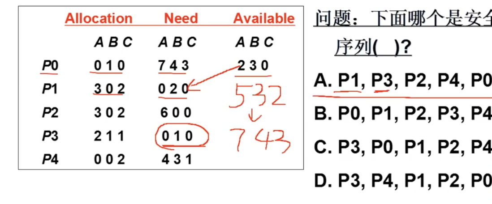
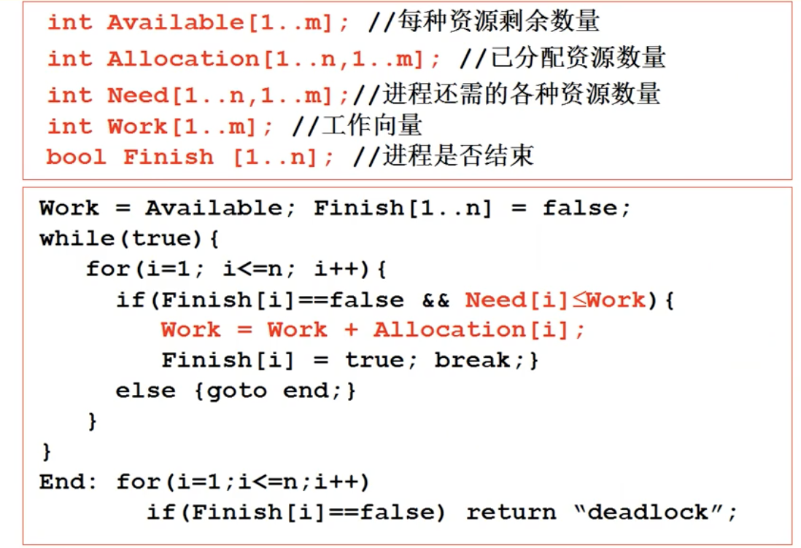
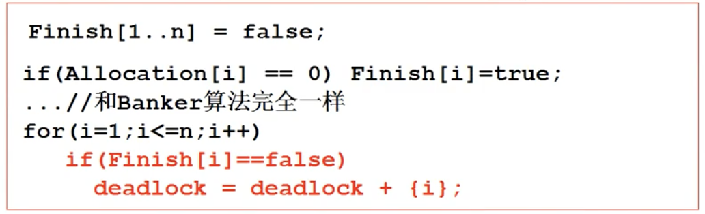

# L19 死锁处理
### 死锁
- 多个进程由于互相等待对方持有的资源，造成的谁都无法执行的情况。
- 考虑如下例子，初态mutex=1，empty=0，Producer先执行：
```C
Producer(item){
    P(mutex);       //mutex:1 -> 0
	P(empty);       //empty:0 -> -1 阻塞，等待V(empty)
	写入缓冲区（临界区）...;
	V(mutex);
	V(full);
}

Consumer(item){
    P(mutex);       //mutex:0 -> -1 阻塞，等待V(mutex)
	P(full);
	读出缓冲区（临界区）...;
	V(mutex);
	V(empty);
}
```
### 造成死锁的四个必要条件
- 互斥使用：资源固有特性
- 不可抢占：资源只能自愿放弃
- 请求与保持：进程必须先占有资源，再去申请
- 循环等待：环状的等待关系

### 死锁处理方法概述
- 死锁预防：破坏死锁的必要条件
- 死锁避免：检测每个资源请求，如果造成死锁就拒绝
- 死锁检测+恢复：检测到死锁时，就回滚
- 死锁忽略：在条件允许的情况下无视死锁，如应对PC机上发生的小概率死锁

### 死锁预防
- 法1：一次性申请所有资源，不会先占有再申请
  - 缺点：需要预知未来，编程困难；资源利用效率低
- 法2：先排序资源，强制按顺序申请
  - 缺点：资源利用效率低

### 死锁避免
- 每次资源请求都进行判断：是否会引起死锁
- 有无可完成序列，使得系统处于安全状态
##### 银行家算法（Dijkstra）
- 按顺序检查当前可用资源Available是否能满足进程需求的资源Need，如果能，就将资源分配给该进程，否则跳过该进程去检查下一个
- 进程执行完后会归还使用的资源，并产生新的资源Allocation
- 这样形成一个进程执行序列，称为**安全序列**，**安全序列**保证当前面的进程结束时，补上的资源永远足以启动序列中的下一个进程
- 反过来说，如果违背了**安全序列**，可能导致一个进程获取资源后，既没有完全满足它的Need使其开始运行，又导致其他所有进程的Need无法被满足，造成死锁
- 如果银行家算法无法为一些进程分配，则是这组进程本身无法避免死锁
- 复杂度$O(mn^2)$，$m$为资源数，$n$为进程数，执行代价较大



### 死锁检查+恢复
- 基本原因：银行家算法的$O(mn^2)$效率低，发现温提仔处理
- 采用定时检测，或资源利用率低时检测的策略，以定时检测为例
- 先放任进程运行，定时运行银行家算法，检测进程组当前状态下是否死锁，若死锁则选择一个进程**回滚**
- 效率较高，但**回滚**的实现比较麻烦

### 死锁忽略
- 死锁危害不大，产生概率较低，且通过一些手段可以清除时，便将死锁忽略即可
- 家用PC机中一般采用死锁忽略，Windows，Linux

