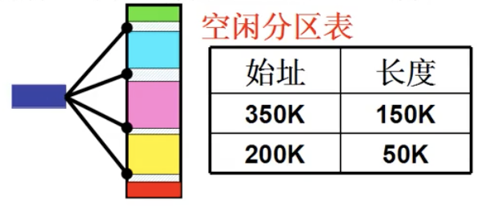
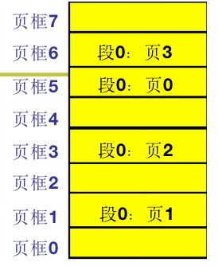
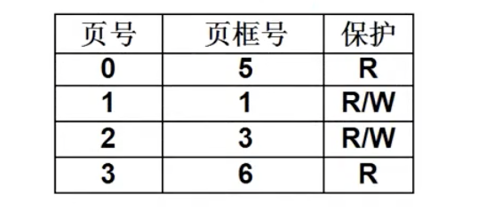

# L21 内存分区与分页
段与页的结合形成操作系统内存管理的完整过程
三步走：
- 编译：程序分段
- 在内存中找出空闲分区
- 使用表映射程序与分区

### 内存如何切割
如何找到内存的空闲区域
- 各个段需求的大小不同且是动态的，故采用**可变分区**而非固定分区
##### 再次申请
- 优先适配：
  - 依序查找空闲分区表，采纳首个空闲分区
  - 快，多数情况不用遍历表
- 最佳适配：
  - 找尽可能小的空闲分区
  - 适用于大小不规则的内存请求
- 最差适配：找尽可能大的空闲分区

### 分页
##### 内存碎片
- 只采用**内存分区**策略效率不高：内存碎片
- 希望合并空闲分区，移动段来进行内存紧缩，但内存紧缩期间进程无法执行且相当耗时，导致上层用户启动的进程无法执行

##### 分页
- 针对每个段的内存请求，系统以页为单位分配给段
- 一个段的浪费小于**一页**的大小
- 此时所谓“碎片”不会小于**一页**的大小
- 用户需要分段，OS需要分页

##### 分页后如何使用内存
- 段内部的分页的叫**页**，物理内存中顺序排列的分页叫**页框**
- 页表：**页**离散的放在**页框**中，需要对**页**来重定位

```
  对于4K的页大小：地址的高4位（HEX 1）直接表示了页，低12位（HEX 3）表示页内地址偏移
  以逻辑地址0x2240为例：
  1. 由地址计算出页号，右移12位（HEX右移3位）:0x02为页号
  2. 通过页表，把页号转为页框号:0x03
  3. 加上地址偏移形成物理地址:0x3240
```
- 页表同样交由PCB
- 硬件负责：内存管理单元MMU