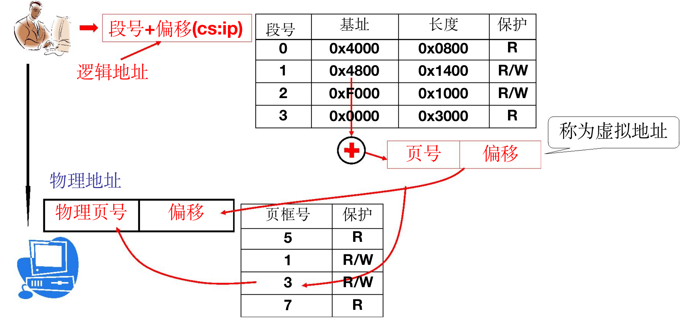
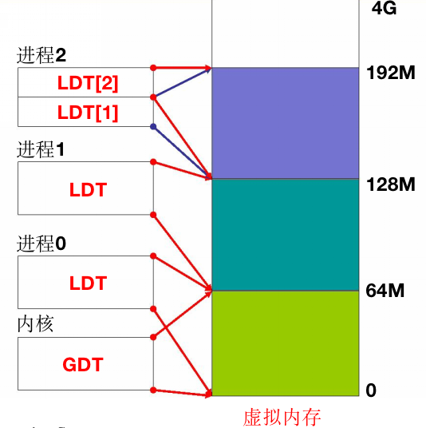
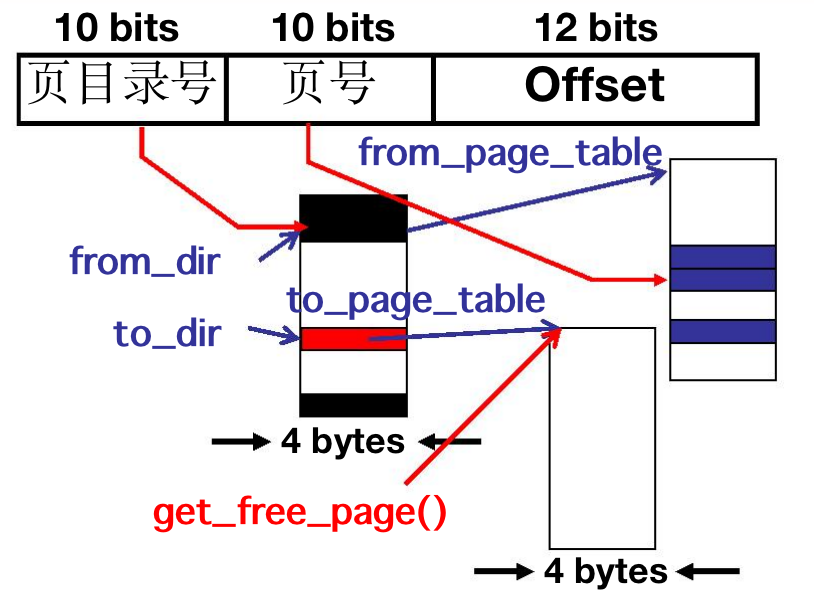

# L23段页结合的实际内存管理
- 用户需要分段，且期望段是完整的
- OS需要分页
- 整合：段->物理内存 和 页->物理内存
- 
### 虚拟内存
- 段->虚拟内存->物理内存，两次地址翻译
- 通过**段表**得出的是虚拟地址，虚拟地址直接呈现给用户
- 通过**页表**将虚拟地址映射到物理地址，由操作系统完成映射


### 段、页式内存下程序如何载入内存

### 从fork开始的流程
##### 分配虚存、建段表
```C
//fork命令调用，将产生一个新的子进程，它和父进程虚拟内存相同
int copymem(int nr, task_struct *p){
    //p即PCB
    unsigned long new_data_base;
    new_data_base = nr * 0x4000000;        //给不同进程分割段
    set_base(p->ldt[1], new_data_base);    //设置虚存基址
    set_base(p->ldt[2], new_data_base);    //两个进程一样
    ...
}
```

##### 分配物理页、建页表
```C
int copymem(int nr, task_struct *p){
    unsigned long old_data_base;    //父进程虚拟地址
    old_data_base = get_base(current->ldt[2]);  //从LDT获取虚存基址
    copy_page_tables(old_data_base, new_data_base, data_limit); //转换为物理内存基址
    ...
}

//为子进程分配物理内存，物理内存一定和父进程不同
int copy_page_tables(unsigned long from, unsigned long to, long size){  
    // from: 32位 虚拟地址 
    // 10 10 12地址结构

    // from_dir: 指向也目录项的指针
    // from>>22 可获得页目录的项编号，每项中因为存了一些信息需要4bytes
    // 因此相当于>>22*4，或者>>20再通过&0xffc清空低2位
    from_dir = (unsigned long *)((from>>20) & 0xffc);  
    to_dir =   (unsigned long *)((to>>20) & 0xffc);
    size =     (unsigned long)(size + 0x3fffff)>>22;
    //寻址页框号
    for(; size-->0; from_dir++, to_dir++){
        from_page_table=(0xfffff000&*from_dir);
        to_page_table=get_free_page();  //分配一个物理内存页
    }
    ...
}
```

##### 内存拷贝