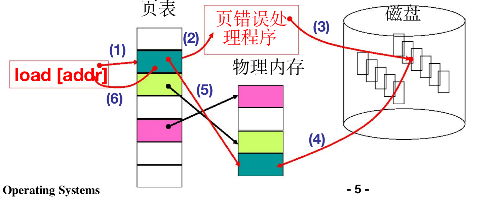

# L24 内存换入-请求调页
没有换入换出，虚拟内存不能实现
希望用较少的物理换较大的虚拟内存

### 请求调页
大虚拟内存映射到小物理内存，导致有些内容只能在磁盘中等待**换入**
当程序对虚拟内存的某个位置有请求时，如果该位置没有映射物理地址（表现为页表中缺页），操作系统就要执行**换页**操作：
1. 程序访问某虚拟地址，MMU发现缺页而无法映射到物理地址，发起一个中断，启动页错误处理程序
2. 从磁盘中获取需要的
3. 将磁盘中的内容载入到物理地址的页框中
4. 更新页表，将物理地址重新映射到虚拟地址
5. 程序继续执行，该中断恢复时`CS:IP`不后移


!!! question
    为什么选择**请求调页**而非**请求调段**
    因为请求调页粒度更小，更能提高内存效率

### 实际的系统调页

##### 14号中断-页错误中断处理
```C
void do_no_page(unsigned long error_code, unsigned long address){   
    address &= 0xfffff000; //抹去低12位的页面偏移，获得页面地址
    tmp = address–current->start_code; //页面对应的偏移
    if(!current->executable||tmp>=current->end_data){
        get_empty_page(address);
        return; 
    }
    page get_free_page();   //得到一个空闲物理页
    bread_page(page, current->executable->i_dev, nr);   //从磁盘读
    put_page(page, address);    //建立映射，更新页表
    ...
}

void get_empty_page(unsigned long address){
    unsigned long tmp = get_free_page();
    put_page(tmp, address);
    ...
}
```

##### 建立映射
```C
unsigned long put_page(unsigned long page, unsigned long address){
    //page: 物理地址

    //page_table指针指向页表，本身扮演页目录的作用
    unsigned long tmp， *page_table;    
    page_table=(unsigned long *)((address>>20)&ffc);   //找到页目录项
    //找到页表项
    if((*page_table)&1){
        page_table=(unsigned long*)(0xfffff000 & *page_table);
    }
    else{
        tmp=get_free_page();
        *page_table=tmp|7;
        page_table=(unsigned long*)tmp;
    }
    page_table[(address>>12)&0x3ff] = page|7;   //物理页放入页表
    return page;
}


```