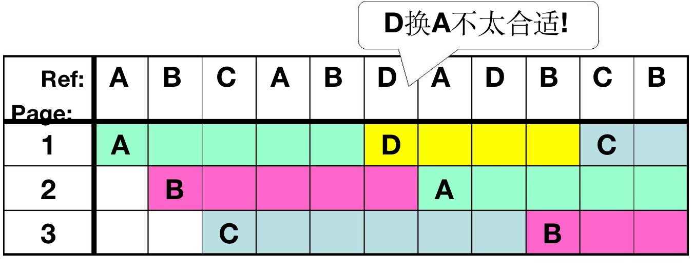
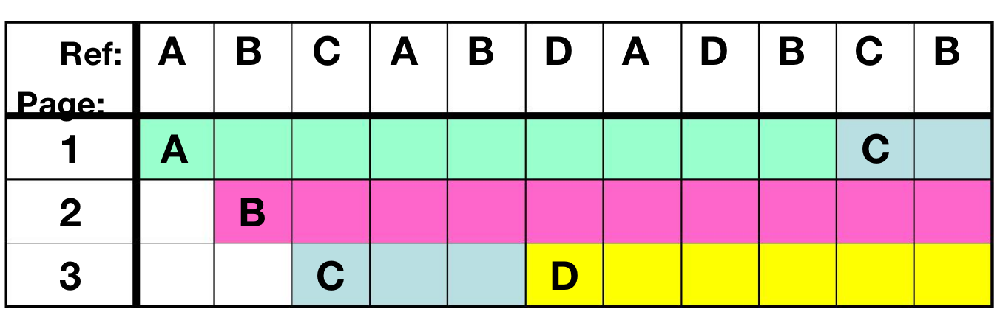
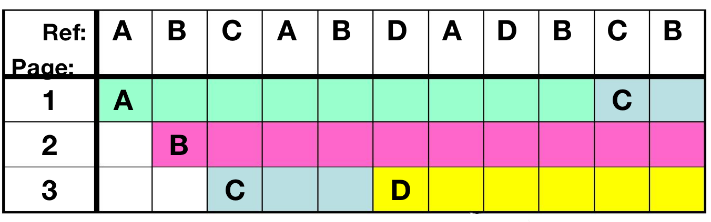
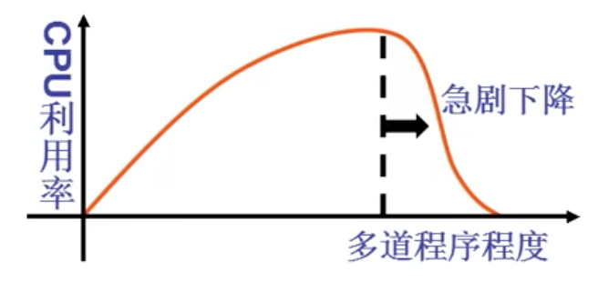
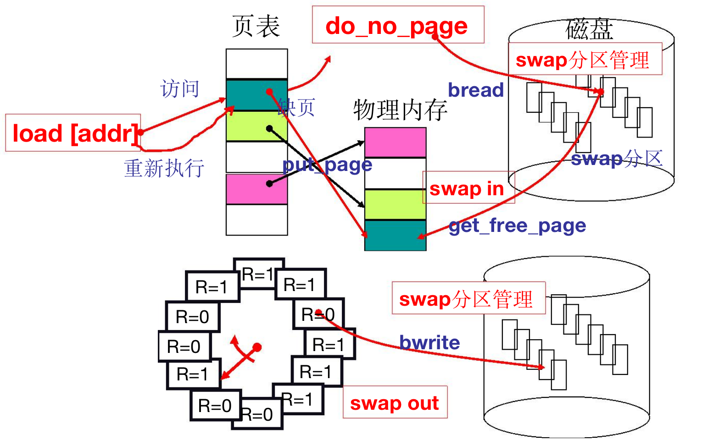

# L25 内存换出
有换入就有换出
get_free_page并不能总获得空闲页，要选择页来淘汰

### 算法设计
评价准则：缺页次数
##### FIFO
- 先入先出

##### MIN
- 选择将最远的页置换

##### LRU
- 选择之前一段时间最少被使用的页进行淘汰（最近最少使用）
- 用过去的历史预测未来

### LRU准确实现
##### 时间戳
- 每页维护一个时间戳
- 每次换出选最小（早）的时间戳
- 不可行：时间戳维护代价太大
##### 页码栈
- 最近访问的页被提到栈顶，从栈底淘汰
- 不可行：维护代价仍然较大

### LRU近似实现-二次机会SCR算法
- 每个页维护一个reference位R，由MMU维护
- 各个页的R位在数据结构中组织成循环队列，被**淘汰指针 hand**所指
- 当页被访问时，R置1
- 当需要换出时：
  - 若R为1，置0，本页不淘汰，**淘汰指针**后移继续判断
  - 若R为0，本页被淘汰，新页R置1，**淘汰指针**后移
- 在R被置0后钟表转一圈的时间内，如果页面没被访问，就将它淘汰

##### 扫描指针
- 如果缺页相对于访问频率太低会使所有页的R位都变成1，导致每次需要换页时**淘汰指针**都会转一整圈然后回到原处，淘汰了原来所指的页，退化成了FIFO算法
- 退化的原因在于R记录了过多的历史信息
- 引入**扫描指针**：定时清除R位，转速远快于**淘汰指针**
- R最近被置零后没有被使用，则将该页淘汰，从而实现了**最近最少使用**的近似
- 一快一慢所以也称clock算法

##### 颠簸问题
- 给每个进程分配的页框太少，导致频繁换入换出，进程不能执行导致CPU利用率急剧降低
- 进程增多->每个进程缺页率高->缺页率增大到一定程度，进程总在等待调页->CPU利用率低->堆积更多进程->每个进程缺页率更高

### 换入换出整体图景
- 换入换出->虚拟内存->段页结合的内存管理->程序的载入与执行->多进程图像
