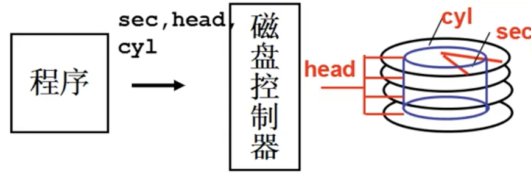
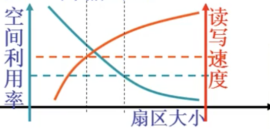

# L28 生磁盘的使用
### 磁盘的结构
##### 扇区
- 磁盘的访问单位是扇区
- 扇区大小512字节
- 扇区的大小是传输时间与碎片浪费的折中
##### 磁盘I/O过程
1. 寻道：移动磁头到指定磁道
2. 旋转：指定扇区
3. 数据传输

##### 最直接的使用磁盘
- 柱面 cyl：磁头位置，如图中的蓝色圆柱表面
- 磁头 head：哪个磁头（哪个盘面）
- 扇区 sec：旋转位置
- 缓存位置

### 一层抽象：使用盘块号读写磁盘
- 通过磁盘驱动，能使用**盘块号 block**计算出cyl,head,sec(CHS)
- 希望**盘块号**相邻的盘快可以快速读出
- 磁盘访问时间 = 写入控制器时间 + 寻道时间 + 旋转时间 + 传输时间
  - 寻道时间 > 旋转时间 >> 传输时间
  - 一次寻道+旋转到位后尽量多读写
- 层次从大到小为：柱面 > 磁头 > 扇区
##### 编址：扇区号
$$扇区号 = C*heads*sectors + H*sectors + S \\
  S = 扇区号~\%~sectors \\ 
  H = 扇区号 / sectors ~\%~heads \\ 
  C = 扇区号 / (heads * sectors)
$$
##### 扇区号到盘块号
- 操作系统将**扇区号**连续的几个扇区编为一个盘块，上层通过盘块号访问，读写以盘块为单位
- 盘块越大，则每次**寻道+旋转**后读写的扇区数越多，读写速度就越快，但内存碎片就越大。由于**寻道+旋转**占用了大部分时间，而**寻道+旋转**好了无论去读多少扇区，耗时都差不多，所以读写速度与盘块数近似正比
- 磁盘读写速度更重要，空间换时间

### 二层抽象：多个进程通过队列使用磁盘
##### 请求队列
- 多个进程访问磁盘，由请求队列管理
- 调度的目标：平均访问延迟小，寻道时间为主要矛盾

##### 先来先服务FCFS调度
- 按照上层请求顺序寻道
- 未对磁头寻道进行优化，太慢

##### 短寻道优先SSTF调度
- 磁头总是访问距离最近的下一个磁道
- 请求队列中，磁道位于中间的请求更多，容易使磁头在中间局部晃动，造成饥饿问题

##### 扫描SCAN调度
- 中间不回头的SSTF调度
- 相对公平且磁头移动较小
- 两段访问还是相对少

##### 电梯算法C-SCAN调度
- 单向的SCAN调度，结束后不折返而直接回到另一端重新开始
- 也称电梯算法，仿照电梯工作原理
- 最公平，直接移动到另一端的开销很小

### 生磁盘使用整理
1. 进程得到盘块号，算出扇区号
2. 扇区号make req，电梯算法add requset
3. 进程sleep_on
4. 磁盘中断处理
5. do_hd_requset算出CHS
6. hd_out调用outp(...)完成端口写