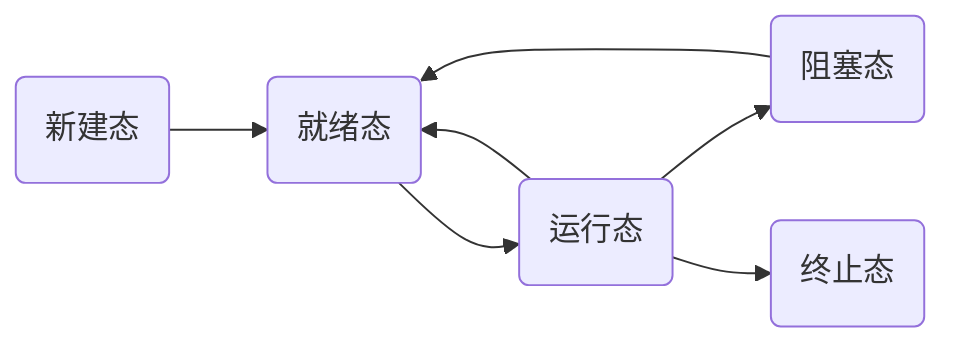

# L9 多进程图像

### 多进程如何组织
- PCB：每个进程都有一个结构体，称为PCB，来记录进程信息
- 使用数据结构（队列）来组织多个进程，如：就绪队列，磁盘等待队列等
- PCB的结构（以后会展开讨论）：
``` C
struct task_struct {
	long state;   //进程当前运行状态
	long counter; //任务运行时间计数，即运行时间片。采用递减方式，counter越大表明任务已经运行的时间越短
	long priority;//运行优先数，用于给counter赋初值。一个进程刚被创建时counter = priority。
...
}
```


### 进程的创建-fork函数
- 多进程图像从启动开始，到关机结束
- fork()函数创建一个新的进程，返回值：0-表示正处于子进程，正值-表示在父进程，负值-表示错误
- 在main中的fork()创建的第一个进程，以供用户使用，一般这个进程是shell，也可以是Windows桌面等等，我们以shell为例
- shell的核心代码就是读取用户指令，再去创建更多的进程，如下：
```C
while(1) {
  scanf("%s", cmd)
  if(!fork()){  //在父进程中
    exec(cmd);
    wait();
    }
}
```


### 进程的切换-schedule函数
```C
进程启动磁盘读写...;
pCur.state = 'W'; //设置进程为阻塞态，pCur是PCB数据
将pCur放到DiskWaitQueue...;
schedule(); //切换函数，重要！！
```
```C
schedule(){
  pNew = getNext(ReadyQueue); //调度，获取就绪队列中的一个进程
  switch_to(pCur, pNew);  //传入新旧两个PCB，进行进程切换
}
```

### 进程状态转换
- 进程状态图：


### 调度策略
- 先入先出FIFO
- 优先级

### 进程切换细节-switch_to
- 保护现场：CPU旧进程信息 -> 旧进程PCB
- 开始新进程：新进程PCB -> CPU
这一段其实是汇编代码，我们以伪代码示意：
```C
switch_to(pCur, pNew){
  pCur.ax = CPU.ax;
  pCur.bx = CPU.bx;
  ...
  pCur.cs = CPU.cs;
  pCur.retpc = CPU.pc;

  CPU.ax = pNew.ax;
  CPU.bx = pNew.bx;
  ...
  CPU.cs = pNew.cs;
  CPU.retpc = pNew.pc;
}
```

### 多进程相互影响-进程映射表
- 多个进程同时存在于内存，若进程A修改了进程B地址空间的数据，将导致严重不良后果
##### 解决办法
- 内核态-用户态保护机制：DPL，CPL
- 进程映射表
##### 进程映射表
!!! question
    考虑两个源码相同的进程，既然它们源码中的地址值是相同的，那么两者之间会不会因访问同一片物理地址而互相干扰？
- 进程源码中的地址实际上并非物理内存理地址，而是每个进程通过一张自己的映射表，进行一次映射来寻址。这样每个进程独享自己的内存空间，互不干扰。
- 所以说：进程管理连带内存管理形成多进程图像

### 多进程合作
!!! question
    进程1和进程2同时向空闲区域A放入要打印的东西，由于多进程交替执行，进程1还没有把东西全部放到A，进程2就开始在A放东西了，二者杂糅?
- 生产者-消费者实例