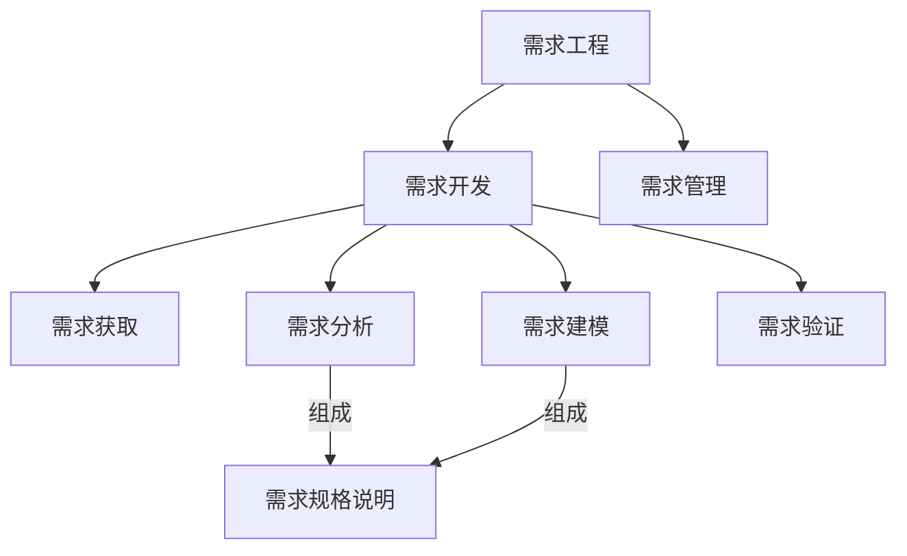

## 第一讲：绪论 
- 学习目标
> 依据需求工程理论及方法，面向对象的建模原则在需求阶段、系统分析及设计阶段面向对象的建模方法
- 课程内容
	- 需求工程
	- 需求过程(获取、分析、建模、管理)
	- 用力驱动的需求开发过程
	- 面向对象分析方法
	- 案例分析
- 成绩构成
	- `70%` 期末考试
	- `15%` 实验报告
		- 需求分析案例
		- 用例分析模型深入设计
		- 工程案例分析(小组)
	- `10%` 作业和随堂练习
	- ` 5%` 点名

### 软件需求
- 软件需求
	- 用户需求
	- 系统需求
		- 功能需求
		- 非功能需求
			- 产品需求
				- 可用性需求
				- 效率需求
					- 性能需求
					- 空间需求
				- 可靠性需求
			- 机构需求
			- 外部需求
		- 领域需求
	- 业务需求 

## 第二讲：需求基础
### 需求工程
>     是系统工程和软件工程的交叉分支，设计软件系统的目标、软件系统提供的服务、软件系统的约束和软件系统运行的环境。还涉及这些因素和系统精确规格说明以及系统进化间的关系。也提供显示需求和软件能力之间的桥梁
- 需求工程的基本活动
  - 获取需求[^ 深入实际，充分理解用户需求基础上，获取系统需求]
  - 需求分析[^ **形成需求基线集**，指定系统需要完成的任务]
  - 需求验证[^ 确保说明准确、完整表达系统的主要特性，并在技术上可行]
  - 需求管理[^ 维护需求基线、实现需求跟踪、控制变更]
  - 需求建模[^ 展现解释信息而进行的抽象描述活动，**最重要的一项任务**]

- 需求工程的特性
  - 复杂性 (需求获取耗时最长，模仿同类即可减少此方面开销)
- 需求工程师需要具备的知识和技能
  - 心里承受能力
  - 专业知识(软件)
  - 写作
  - 沟通
  - 领域知识

### 需求的定义
> 用户为了解决问题或达到某些目标需要的条件或能力
>
> 系统或系统部件为了满足合同、标准、规范或其他正是文档所规定的要求而需要具备的条件或能力
>
> 对上述中的一个条件或能力的一种文档化表述
- 需求的分类
	- 功能需求[^ 用量化的数据描述系统功能]
	- 性能需求[^ 系统整体或组成部分应该拥有的性能特征]
	- 质量属性[^ 形容词和副词描述，真实显示系统中决定成败]
	- 对外接口[^ 了解系统和其他系统间的软硬件接口]
		- 用途
		- 输入输出
		- 数据格式
		- 命令格式
		- 异常处理要求
		- 用户界面
	- 约束[^ 开发人员设计和构建系统时的选择范围]
		- 系统开发以及运行环境
		- 问题域内的相关标准
		- 商业规则
	- --
	- 硬件需求
	- 软件需求
	- 其他需求
- 功能需求的层次性
	- 业务需求`BR`
	    > - 高层次的**目标**：人力降低成本25%
	    > - 软件特性
	>     - 功能范围
	
	    ↓业务需求知道需求获取
	- 用户需求`UR`
	>    (用户具体的**任务**：能实时查课表)
	>    - 模糊
	
	    ↓转化用户需求为系统需求
	- 系统需求`SR`
	>    (给开发人员看的**系统行为**：具体实现)
	
### 优秀需求的特性
- 完整性

- 正确性[^ 真实反映用户意图，需签字予以确认]

- 精确性[^ 简洁清晰，仅描述必要的信息，实现所述指标]

- 可行性[^ 开发人员进行检查，约束的限定]

- 必要性[^ 满足用户业务需求所必须的]

- 无歧义[^ 每一项需求仅能有一种解释]

- 可验证[^ 通过分析检查模拟测试等方法预测需求是否被满足]
	> 为避免不可验证需求，描述时候需要
	> - 需求具体化
	> - 谨慎使用形容词副词
	> - 避免程度词的使用 
	
	### 常见需求定义错误
	
	- 需求未能反映用户真实需求[^ 主要情况]
	  - 原因
	    - 用户表达时潜意识的语言加工
	    - 信息在人际间传递过程中发生自然衰减和扭曲
	  - 解决
	    - 发现问题背后的问题
	    - 检查和确认
	- 模糊和歧义的需求
	  - 原因
	    - 无意：书写过程中选词造句不当
	    - 有意：应付对需求有不同立场的用户
	  - 解决
	    - 为项目中重要词汇建立公用标准词汇表
	    - 在项目前景指导下促进用户间协商解决
	- 明显的信息遗漏
	  - 原因
	    - 明显：项目范围定义不当
	    - 隐蔽：相关信息难以发现
	  - 解决
	    - 加强对业务需求的处理
	    - 难以解决，需要靠需求工程师经验加以避免
	- 不必要的需求
	  - 原因
	    - 用户和开发人员谈判筹码
	    - 用户倾向于表达各种需求
	    - 需求开发人员画蛇添足
	  - 解决
	    - 谈判技巧
	    - 根据业务需求进行用户需求的过滤选择
	    - 保持用户为中心

## 第三讲：需求获取

> 困难：信息不对称、难捕获易变

### 面谈法[^ 重要而直接，简单的需求获取技术]

> 可获得：
>
> - 事实和问题
> - 被会见者的观点和感受
> - 组织和个人的目标

- 面谈中的问题
  - 开放式问题`30%-40%`
    - 选择可以是开放不受限制，希望得到丰富(具有一定深度、广度)信息时
    - 优点：受访者压力较小，获得受访者细节，引起兴趣
    - 缺点：过量不相关细节，面谈方向失控，信息收益较低
  - 封闭式问题`60%-70%`
    - 答案有基本的形式，回答受到限制，较为具体
    - 优点：节省时间，切中要点，话题控制，快速探讨问题，贴切数据
    - 缺点：厌烦，难丰富细节，失去主要思想，不宜建立良好关系
  - 探究式问题[^ 为什么，例子，描述]
  - 诱导性问题[^ 引导回答]
  - 双问题
  - 元问题[^ 跳出主题就面谈本身询问，调节气氛]
- 面谈问题组织
  - 金字塔结构：会见需预热，与预期期望偏差较大，转移话题，结束话题
  - 漏斗结构：容易轻松的开场，会见者有情绪且需自由表达，事前了解不足，易得细节
  - 菱形结构：用问题保持会见者的兴趣和注意力
- 注意事项
  - 仪表着装
  - 礼仪
  - 委婉开始结尾收束
  - 持续时间
- 记录面谈
  - 笔录：集中精力，帮助回忆重要问题，表现态度兴趣/丢失语音信息，笔记让说话犹豫，缺少观点
  - 录音和摄像：可重现更多信息，记录过程轻松迅速/被会见者紧张，采集代价高，不易快速定位
- 优点和局限性
  - 优点：开展条件简单，经济成本较低，建立良好关系，提高涉众参与热情
  - 缺点：时间成本高，地理位置约束，双方概念结构相关，谈话人水平相关

### 问卷调查法[^ 面谈法的补充]

- 适用情况：

  - 系统涉众在地理上分布
  - 涉众数量多，了解涉众统计倾向非常重要
  - 探究性问题，了解当前总体情况
  - 为后续面谈标识问题和主题，建立工作基础框架
  
- 问题的设置顺序

  - 重要问题优先
  - 相似主题应聚集在一起
  - 考虑问题之间的关联性
  - 先非争议性后争议性

### 众包与大数据

- 众包[^ 通过大量征集他人解决方案，并用于特定任务或项目]

  - 可有偿可无偿

  - 许多公司和组织用自己的网站

  - 特定任务或项目投入方法

  - 通常通过互联网实现
- 大数据[^ 3V 大数据淘金，从互联网定位数据并处理成能发挥某种用途的形式]
  - 软件工程师职业操守

### 头脑风暴[^ 目的发明尽可能多的新的想法和潜在需求]

> 鼓励参与者在无约束的环境下进行某些问题的自由思考自由讨论以获得新的想法

- 适用情况
  - 发明描述无历史记录的全新业务功能
  - 明确模糊的业务
  - 信息不充分时的决策
- 阶段
  - 产生阶段：解开羁绊，求数量不求质量，自由讨论启发思路，可转换组合已提出想法
  - 精简阶段：去除不值得深入讨论部分->归类意见->遍历剩余想法并求共同理解->投票评估->筛选获得结果

### 焦点小组[^ 专业带领下小组讨论问题的潜在解决方法，不直接映射大众市场]

- 构成要素
  - 专门场所中有徐连优速的主持人主持
  - 设施含有圆桌会议室、单面镜、影音录制设备
  - 通常8-12参与者
  - 观察者在隔壁房间通过单面镜观察会议进程
  - 一些筛选问题选择参与者
- 优点：互动印发给讨论，新见解和促进深入思考，市场代表的评论可获得第一手资料，可观察参与者行为
- 缺点：一些参与者的活跃度被抑制，或某人主导的情况，开放评论导致多种解读，结果仅适用于小组内部，质量大程度受主持人技巧
- 在决策中的价值
  - 进行良好，则可为软件研发各阶段提供洞见
  - 发掘客户对市场空白的想法
  - 了解客户当前产品和市场范围内创意的需求
  - 提出使软件产品更易于接受的改进
- 注意事项
  - 一个主题下应多次焦点小组会议，建议三次以上以增加结果可信度
  - 主持人应有专业必要的背景能控制好主题
  - 应有周密的计划和管理，避免多人漫谈
  - 警惕焦点小组会议的常客，避免某人想法主导影响思维发散
  - 焦点小组会议非定量方法，不能得出统计结论

### 原型化方法

- 原型[^ 能在一定广度和深度范围内表现产生前的最终物件的中间物件]
  - 包括：书面描绘、场景叙述、情节串联图版、幻灯演示、动画模拟等用来探索和论证软件系统功能的物件
  - 组织发展出的原型文化仅仅将一些限定类型事物看作有效原型
- 优点：及时有力**响应用户需求**变化，减少返工，控制不**完整需求**带来的风险，提高用户软件开发中的**参与程度**，减少开发成本，增加开发者间交流确定技术方案的可行性
- 按照开发方法分类
  - 抛弃式原型产生于
    - 探索式[^ 根据缺陷需求不断调整和修正，尽可能调整选项]
    - 实验式[^ 清晰的客户需求和模糊的实现方法效果可行性开始，明确可行性和实现方案，确定评估属性]
    - 小代价换快速度，可能用简易不成熟的技术/工具，可能忽略简化不相干功能，坚决抛弃
  - 演化式原型产生于
    - 演化式[^ 清晰的原型化需求和项目积累的原型资产为开始]
    - 质量开始即最终要求，要重视此设计以达到易于进行拓展频繁改进，仅应用于清晰的需求说明方案

### 观察法[^ 适用于用户无法准确表达需求的情况]

### 获取的其他事项