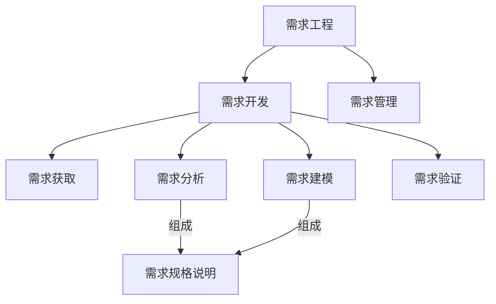
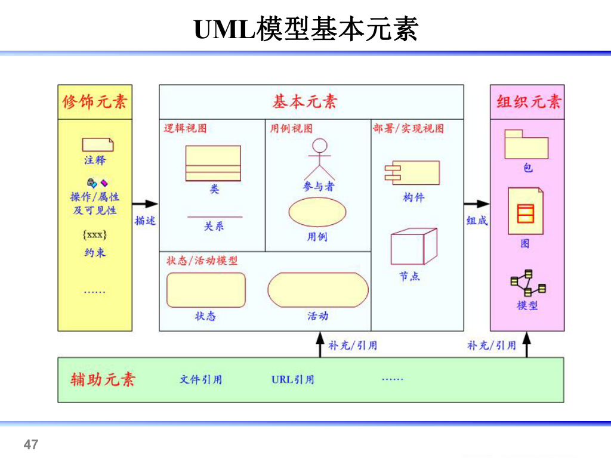
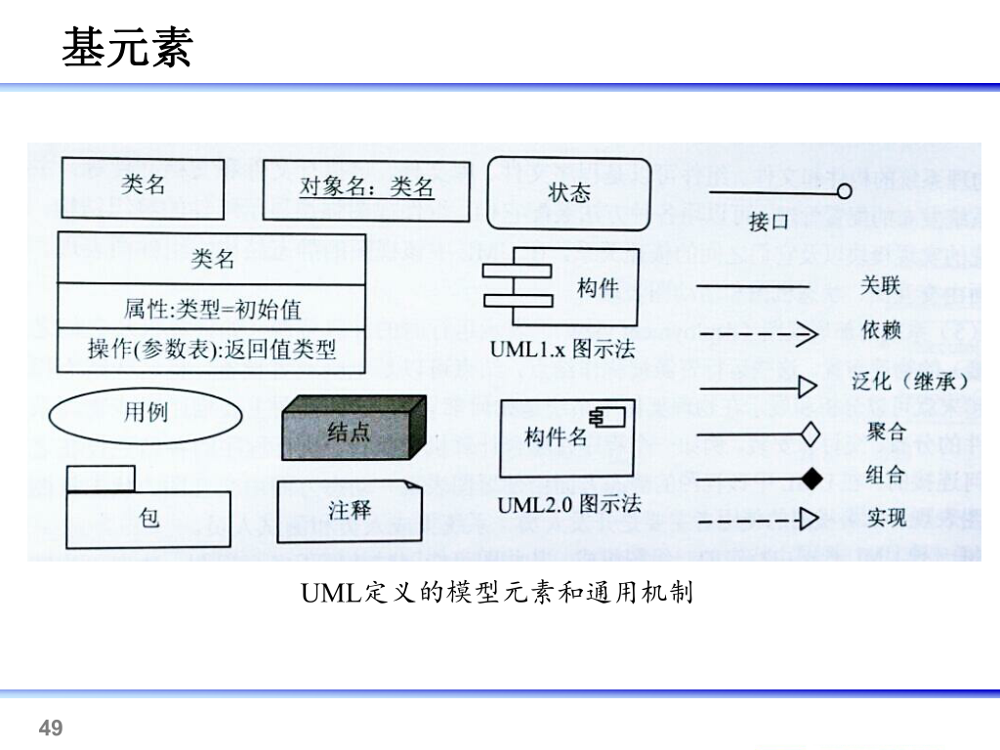
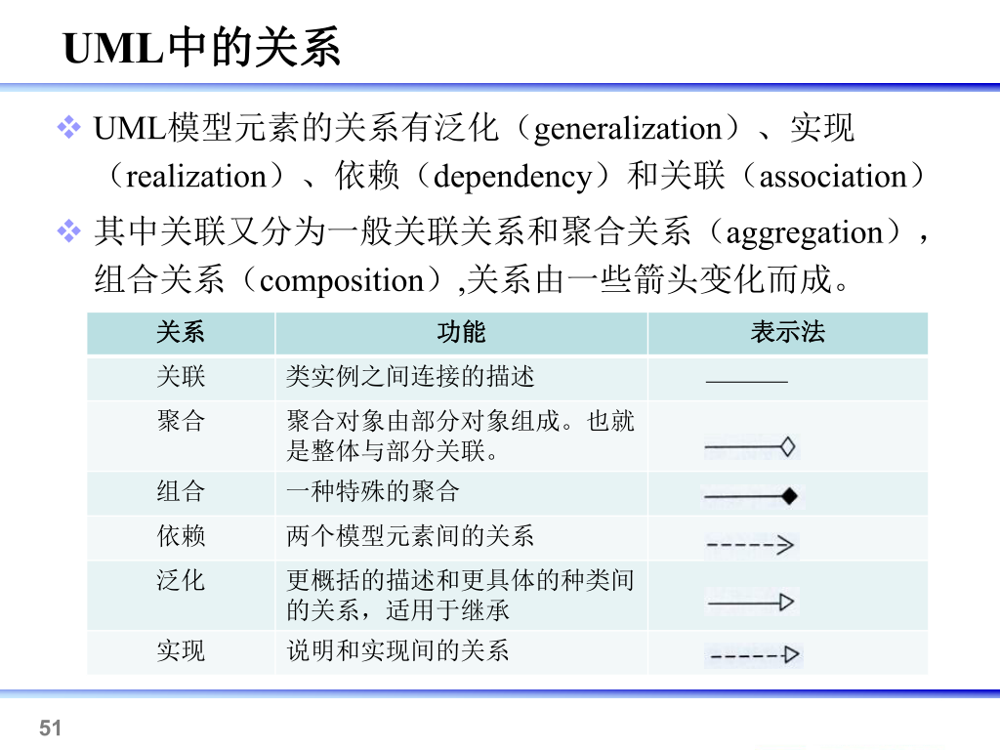

## 第一讲：绪论 
- 学习目标
> 依据需求工程理论及方法，面向对象的建模原则在需求阶段、系统分析及设计阶段面向对象的建模方法
- 课程内容
	- 需求工程
	- 需求过程(获取、分析、建模、管理)
	- 用力驱动的需求开发过程
	- 面向对象分析方法
	- 案例分析
- 成绩构成
	- `70%` 期末考试
	- `15%` 实验报告
		- 需求分析案例
		- 用例分析模型深入设计
		- 工程案例分析(小组)
	- `10%` 作业和随堂练习
	- ` 5%` 点名

### 软件需求
- 软件需求
	- 用户需求
	- 系统需求
		- 功能需求
		- 非功能需求
			- 产品需求
				- 可用性需求
				- 效率需求
					- 性能需求
					- 空间需求
				- 可靠性需求
			- 机构需求
			- 外部需求
		- 领域需求
	- 业务需求 

## 第二讲：需求基础
### 需求工程
>     是系统工程和软件工程的交叉分支，设计软件系统的目标、软件系统提供的服务、软件系统的约束和软件系统运行的环境。还涉及这些因素和系统精确规格说明以及系统进化间的关系。也提供显示需求和软件能力之间的桥梁
- 需求工程的基本活动
  - 获取需求[^ 深入实际，充分理解用户需求基础上，获取系统需求]
  - 需求分析[^ **形成需求基线集**，指定系统需要完成的任务]
  - 需求验证[^ 确保说明准确、完整表达系统的主要特性，并在技术上可行]
  - 需求管理[^ 维护需求基线、实现需求跟踪、控制变更]
  - 需求建模[^ 展现解释信息而进行的抽象描述活动，**最重要的一项任务**]

- 需求工程的特性
  - 复杂性 (需求获取耗时最长，模仿同类即可减少此方面开销)
- 需求工程师需要具备的知识和技能
  - 心里承受能力
  - 专业知识(软件)
  - 写作
  - 沟通
  - 领域知识

### 需求的定义
> 用户为了解决问题或达到某些目标需要的条件或能力
>
> 系统或系统部件为了满足合同、标准、规范或其他正是文档所规定的要求而需要具备的条件或能力
>
> 对上述中的一个条件或能力的一种文档化表述
- 需求的分类
	- 功能需求[^ 用量化的数据描述系统功能]
	- 性能需求[^ 系统整体或组成部分应该拥有的性能特征]
	- 质量属性[^ 形容词和副词描述，真实显示系统中决定成败]
	- 对外接口[^ 了解系统和其他系统间的软硬件接口]
		- 用途
		- 输入输出
		- 数据格式
		- 命令格式
		- 异常处理要求
		- 用户界面
	- 约束[^ 开发人员设计和构建系统时的选择范围]
		- 系统开发以及运行环境
		- 问题域内的相关标准
		- 商业规则
	- --
	- 硬件需求
	- 软件需求
	- 其他需求
- 功能需求的层次性
	- 业务需求`BR`
	    > - 高层次的**目标**：人力降低成本25%
	    > - 软件特性
	>     - 功能范围
	
	    ↓业务需求知道需求获取
	- 用户需求`UR`
	>    (用户具体的**任务**：能实时查课表)
	>    - 模糊
	
	    ↓转化用户需求为系统需求
	- 系统需求`SR`
	>    (给开发人员看的**系统行为**：具体实现)
	
### 优秀需求的特性
- 完整性

- 正确性[^ 真实反映用户意图，需签字予以确认]

- 精确性[^ 简洁清晰，仅描述必要的信息，实现所述指标]

- 可行性[^ 开发人员进行检查，约束的限定]

- 必要性[^ 满足用户业务需求所必须的]

- 无歧义[^ 每一项需求仅能有一种解释]

- 可验证[^ 通过分析检查模拟测试等方法预测需求是否被满足]
	> 为避免不可验证需求，描述时候需要
	> - 需求具体化
	> - 谨慎使用形容词副词
	> - 避免程度词的使用 
	
	### 常见需求定义错误
	
	- 需求未能反映用户真实需求[^ 主要情况]
	  - 原因
	    - 用户表达时潜意识的语言加工
	    - 信息在人际间传递过程中发生自然衰减和扭曲
	  - 解决
	    - 发现问题背后的问题
	    - 检查和确认
	- 模糊和歧义的需求
	  - 原因
	    - 无意：书写过程中选词造句不当
	    - 有意：应付对需求有不同立场的用户
	  - 解决
	    - 为项目中重要词汇建立公用标准词汇表
	    - 在项目前景指导下促进用户间协商解决
	- 明显的信息遗漏
	  - 原因
	    - 明显：项目范围定义不当
	    - 隐蔽：相关信息难以发现
	  - 解决
	    - 加强对业务需求的处理
	    - 难以解决，需要靠需求工程师经验加以避免
	- 不必要的需求
	  - 原因
	    - 用户和开发人员谈判筹码
	    - 用户倾向于表达各种需求
	    - 需求开发人员画蛇添足
	  - 解决
	    - 谈判技巧
	    - 根据业务需求进行用户需求的过滤选择
	    - 保持用户为中心


## 第三讲：需求获取

> 困难：信息不对称、难捕获易变

### 面谈法[^ 重要而直接，简单的需求获取技术]

> 可获得：
>
> - 事实和问题
> - 被会见者的观点和感受
> - 组织和个人的目标

- 面谈中的问题
  - 开放式问题`30%-40%`
    - 选择可以是开放不受限制，希望得到丰富(具有一定深度、广度)信息时
    - 优点：受访者压力较小，获得受访者细节，引起兴趣
    - 缺点：过量不相关细节，面谈方向失控，信息收益较低
  - 封闭式问题`60%-70%`
    - 答案有基本的形式，回答受到限制，较为具体
    - 优点：节省时间，切中要点，话题控制，快速探讨问题，贴切数据
    - 缺点：厌烦，难丰富细节，失去主要思想，不宜建立良好关系
  - 探究式问题[^ 为什么，例子，描述]
  - 诱导性问题[^ 引导回答]
  - 双问题
  - 元问题[^ 跳出主题就面谈本身询问，调节气氛]
- 面谈问题组织
  - 金字塔结构：会见需预热，与预期期望偏差较大，转移话题，结束话题
  - 漏斗结构：容易轻松的开场，会见者有情绪且需自由表达，事前了解不足，易得细节
  - 菱形结构：用问题保持会见者的兴趣和注意力
- 注意事项
  - 仪表着装
  - 礼仪
  - 委婉开始结尾收束
  - 持续时间
- 记录面谈
  - 笔录：集中精力，帮助回忆重要问题，表现态度兴趣/丢失语音信息，笔记让说话犹豫，缺少观点
  - 录音和摄像：可重现更多信息，记录过程轻松迅速/被会见者紧张，采集代价高，不易快速定位
- 优点和局限性
  - 优点：开展条件简单，经济成本较低，建立良好关系，提高涉众参与热情
  - 缺点：时间成本高，地理位置约束，双方概念结构相关，谈话人水平相关

### 问卷调查法[^ 面谈法的补充]

- 适用情况：

  - 系统涉众在地理上分布
  - 涉众数量多，了解涉众统计倾向非常重要
  - 探究性问题，了解当前总体情况
  - 为后续面谈标识问题和主题，建立工作基础框架
  
- 问题的设置顺序

  - 重要问题优先
  - 相似主题应聚集在一起
  - 考虑问题之间的关联性
  - 先非争议性后争议性

### 众包与大数据

- 众包[^ 通过大量征集他人解决方案，并用于特定任务或项目]

  - 可有偿可无偿

  - 许多公司和组织用自己的网站

  - 特定任务或项目投入方法

  - 通常通过互联网实现
- 大数据[^ 3V 大数据淘金，从互联网定位数据并处理成能发挥某种用途的形式]
  - 软件工程师职业操守

### 头脑风暴[^ 目的发明尽可能多的新的想法和潜在需求]

> 鼓励参与者在无约束的环境下进行某些问题的自由思考自由讨论以获得新的想法

- 适用情况
  - 发明描述无历史记录的全新业务功能
  - 明确模糊的业务
  - 信息不充分时的决策
- 阶段
  - 产生阶段：解开羁绊，求数量不求质量，自由讨论启发思路，可转换组合已提出想法
  - 精简阶段：去除不值得深入讨论部分->归类意见->遍历剩余想法并求共同理解->投票评估->筛选获得结果

### 焦点小组[^ 专业带领下小组讨论问题的潜在解决方法，不直接映射大众市场]

- 构成要素
  - 专门场所中有徐连优速的主持人主持
  - 设施含有圆桌会议室、单面镜、影音录制设备
  - 通常8-12参与者
  - 观察者在隔壁房间通过单面镜观察会议进程
  - 一些筛选问题选择参与者
- 优点：互动印发给讨论，新见解和促进深入思考，市场代表的评论可获得第一手资料，可观察参与者行为
- 缺点：一些参与者的活跃度被抑制，或某人主导的情况，开放评论导致多种解读，结果仅适用于小组内部，质量大程度受主持人技巧
- 在决策中的价值
  - 进行良好，则可为软件研发各阶段提供洞见
  - 发掘客户对市场空白的想法
  - 了解客户当前产品和市场范围内创意的需求
  - 提出使软件产品更易于接受的改进
- 注意事项
  - 一个主题下应多次焦点小组会议，建议三次以上以增加结果可信度
  - 主持人应有专业必要的背景能控制好主题
  - 应有周密的计划和管理，避免多人漫谈
  - 警惕焦点小组会议的常客，避免某人想法主导影响思维发散
  - 焦点小组会议非定量方法，不能得出统计结论

### 原型化方法

- 原型[^ 能在一定广度和深度范围内表现产生前的最终物件的中间物件]
  - 包括：书面描绘、场景叙述、情节串联图版、幻灯演示、动画模拟等用来探索和论证软件系统功能的物件
  - 组织发展出的原型文化仅仅将一些限定类型事物看作有效原型
- 优点：及时有力**响应用户需求**变化，减少返工，控制不**完整需求**带来的风险，提高用户软件开发中的**参与程度**，减少开发成本，增加开发者间交流确定技术方案的可行性
- 按照开发方法分类
  - 抛弃式原型产生于
    - 探索式[^ 根据缺陷需求不断调整和修正，尽可能调整选项]
    - 实验式[^ 清晰的客户需求和模糊的实现方法效果可行性开始，明确可行性和实现方案，确定评估属性]
    - 小代价换快速度，可能用简易不成熟的技术/工具，可能忽略简化不相干功能，坚决抛弃
  - 演化式原型产生于
    - 演化式[^ 清晰的原型化需求和项目积累的原型资产为开始]
    - 质量开始即最终要求，要重视此设计以达到易于进行拓展频繁改进，仅应用于清晰的需求说明方案

### 观察法[^ 适用于用户无法准确表达需求的情况]

### 获取的其他事项


## 第四讲：需求分析

#### 需求分析的根本任务

- 建立分析模型
  - 复杂系统分解成简单的部分以及之间的联系，确定本质特征
  - 与用户达成信息内容的共同理解
  - 包括识别定义和结构化
  - 三种模型
    - 业务模型
    - 分析模型[^ 过渡]
    - 计算模型[^ 代码]
- 创建解决方案
  - 分解问题成独立的更简单易于管理的子问题帮助寻找解决方案
  - 创建解决方案的过程是创造性的
  - 建立问题定义，确定被定义事物之间的逻辑关系

#### 需求分析技术的发展历程

#### 需求分析的活动

#### 需求分析与建模*

- 目的：对收集到的需求进行提炼分析和认真审查，确保所有参加人员取得一致共识。找出错误、遗漏和不足，建立完整的分析模型

- 三个层次

  - 需求分析
  - 需求建模[^ 企业建模，功能需求建模，非功能需求建模]
  - 需求规格说明[^ 不同的描述方式]

- 方法-功能分解[^ 视系统为若干功能模块的集合，子功能可继续分解，分解的结果是系统的雏形]

  ```mermaid
  graph TD
  	A[需求工程] --> | 映射| B[需求开发]
  ```

  - 不足
    - 需人工完成
    - 无法对描述的准确度进行验证
    - 难以适应需求的变化

- 方法-结构化[^ 以数据、数据的封闭性为基础从问题空间到某种表示的映射方法，DFD]

  > 适用于数据处理类型软件的需求分析

  - 结构化法的描述方法
    - 分层的数据流图
    - 数据词典
    - 描述加工逻辑的结构化语言、判定表以及判定树
  - DFD的画图步骤
    - 确定外部实体及输入输出数据流
    - 确定分解顶层的加工
    - 确定使用的文件
    - 数据流将各部分连接起来，形成数据封闭
  - 分层DFD基本原则[^ 非流程图]
    - 数据守恒与数据封闭[^ 对整个系统而言]原则[^ I&O是否匹配，每个加工均有I&O]
    - 加工分解的原则
      - 自然性：概念上合理清晰
      - 均匀性：分解问题为代销均匀的部分
      - 分解度：每次加工不超过7个子加工，分解到基本加工为止
      - 子图与父图的平衡：父图I&O应与子图I&o相同
      - 合理使用文件
    - 改进DFD图
      - 检查数据流的正确性
        - 数据守恒
        - 父子图的平衡
        - 文件使用是否合理，特别是F I/O
      - 改进DFD图的易理解性
        - 简化加工之间的联系(联系少-独立强-易理解性好)
        - 改进分解的均匀性
        - 适当命名，名称准确具体无二义性
    - 加工说明
      - 基本加工说明的三种描述方式
        - 结构化语言
        - 判定表
        - 判定树
  - 数据字典DD
  - 结构化语言
  - 判定表
  - 判定树
  - OOA
  - 信息建模法
  - 涉众
    - 涉众识别[^ 寻找和发现各种涉众类别]
      - 从易发现的涉众出发讨论列出涉众类别表
      - 分析上表缩减为关键涉众类别列表
      - 从上表中选代表集中讨论列出新的涉众列表
      - 趋于稳定则结束，反之重复第二步
    - 涉众分析的过程
      - 寻找并辨别关键涉众
      - 描述各个涉众特征
      - 分析涉众输赢条件、受影响程度
      - 描述不同涉众关注点、兴趣取向
      - 分析涉众类别的重要性和影响力
      - 为涉众各选择合适代表参与开发
    - 涉众分析结果的应用


## 第五讲：需求建模(一)

> **数据流图的绘制***
>
> - →数据流程上必须有文字介绍
>
> -  层层绘制

### 模型简介

> 一个系统的完整的抽象，其中包含了人们对某个领域特定问题的求解及解决方案

### UML[^ Unified Modeling Language]学习框架

- 系统开发背景
- UML的重要性

### UML的体系结构

- 第一部分：包含建模的基本视图

- 第二部分：实现特定目标的UML公共方法、公共机制部分
- 第三部分：框架，反应系统的组织结构、组成、关联
- UML
  - 基本构造块
  - 公共机制
  - 框架
- UML模型元素[^ 构造系统的各种元素，建模的基本单位]



- 基元素[^ UML定义的模型元素]
  - 类
  - 接口
  - 结点
  - 组件
  - 注释事物



- 衍型元素[^ 基元素的基础上构造新的模型元素]
- UML中的关系
  - 依赖[^ 两个模型元素之间的语义上的连接关系]
  - 关联[^ 类之间的结构关系]
  - 聚合和组合[^ 整体和部分关系]
  - 泛化[^ 一般/特殊化的关系]
  - 实现[^ 规定接口和实现接口的累或组件间的关系]



- UML扩展机制
  - 衍型[^ 基于已存在模型元素加入额外语义定义一种新的模型元素]
  - 标记值[^ 赋予模型元素预定义特性外的新特性]
  - 约束[^ 用文字约束扩展或修改已存在的规则]
- UNL图的分类
  - 静态建模
    - 用例图
    - 类图
    - 对象图
    - 组件图
    - 部署图
  - 动态建模
    - 状态图
    - 活动图
    - 顺序图
    - 协作图

### 用例图导入

- 三要素

  - 参与者Actor[^ 存在系统外部并直接与系统进行交互的人、系统、子系统或类**外部实体的抽象**]

    > - 具体某个用户不可做为参与者的名称
    > - 时间可以作为参与者

    - 主要参与者
    - 次要参与者
    - 发起参与者
    - 参加参与者

  - 用例User Case[^ 参与者额可以高手到的**系统服务**或**功能单元**]

    > - 动词短语动名词命名

    - 基本特征
      - 一个类，非某具体实例
      - 必须有一个参与者触发激活后才能执行
      - 必须是一个完整的描述

  - 关系Relationship[^ ]

    - 泛化
    - 扩展
    - 包含
    - 参与者之间的关系
    - 参与者与用例间的关系
    - 正确的理解价值

  - 边界如何定义


## 第六讲：需求建模(二)

### 类与对象建模概述

- 类图用于对系统的静态结构建模
  - 系统设计阶段，用于捕捉组成系统体系结构的类结构
  - 系统编码阶段，根据类途中类以及之间关系实现系统的功能
  
- 类图与其他图的关系——核心
  - 输入：活动图，用例图，交互图
  - 状态图：描述复杂类的状态变化
  - 分组：类的集合
  
- 类的定义

- 类的属性：[可见性] 属性名称 \[:类型\][多重性]...
  - 属性的多重性
  - 参数名的参数属性：
  
- 类的范围
  - 实例范围
  - 静态范围
  
- 类的分类
  - 具体类
  - 抽象类
  - 模板类
  - 主动类
  - 非主动类
  
- 接口

- 类的版型
  - 边界类：用户界面类，通讯协议类，直接与外部设备交互的类，直接与外部系统交互的累
  - 控制类：负责管理或控制其他类工作的类
  - 实体类：对应数据库中的表，

- 类图的抽象层次

- 对象的表示方法
  - 类图的实例
  - 两个基本元素时对象和它们之间的关系
  - 必须赋值
  
- 类间关系
  - 关联[^ **静态关系**，说明一个事物的对象与另一个事物的对象相联系]
    
    - 名称(可无)[^关联的性质]
    - 角色名(空则为类名)[^ 一个类对另一个类所表现出来的职责]
    - 多重性[^ 多少对象可参与该关联]
    - 聚合关系(可割裂存在)[^ 较强关联，表示两个类的整体-局部关系]
    - 组合关系(不可脱离整体)[^ 强聚合，强烈的包含关系]
    
    - 导航性(空则双向)[^ 关联的方向]
    
  - 依赖[^ **动态关系**，仅相互作用于某特定场景]
  
  - 泛化[^ 抽象和具体的关系，耦合度最大]
  
  - 实现[^ 接口和实现的关系]

### 类图的构建

- 顺序
  - 研究确定需求
  - 确定类和职责
  - ...
- 确定系统类
  - 
  - 名词识别法
  - 用例识别法
  - CRC：类名，职责

- 组织类并确定其关系

> - 从简开始，画概念层类图

- 阅读类图
  - 读出类
  - 读关系
- 增强的辅助建模元素
  - 导航箭头
  - 角色名称

### 动态建模[^ 描述系统的结构和行为]

- 活动图[^ 描述了业务的执行顺]
  - 泳道
  - 问题
  - 关键是表示出控制流
  - 活动图和流程图的区别
    - 活动图能表示**并发活动**的情形
    - 活动图是**面向对象**的
  - 如何使用活动图
  
- 状态图
  - 要素
    - 源状态：受转换影响的状态
    - 目标状态：转换完成后对象的状态
    - 触发事件：为转换定义一个事件，包括调用、改变、信号、时间四类
    - 监护条件：布尔表达式，决定是否激活转换
    - 动作：转换激活时的操作
  - 转换类型
    - 外部转换 `事件(参数)[监护条件]/动作`
    - 内部转换 `事件(参数)[监护条件]/动作`
    - 进入转换 `entry/活动`
    - 推出转换 `exit/活动`
  - 主要应用
  
- 顺序图[^ 用例的逻辑建模]

  - 按时间顺序排序的对象之间交互的图

  - 类角色[^位于顺序图顶部的，一般代表实际的对象]

    - 语法：`[ObjectName][: ClassName]`

  - 生命线

    - 对象与生命线结合在一起称为`对象的生命线`

  - 激活期

    > FOC 嵌套

  - 消息[^ 对象之间某种形式的通信]

    - 动作：调用，返回，发送，创建，撤销
    - 类型
      - 简单消息[^ 不考虑同步或异步问题]
      - 同步消息(调用消息)：来源对象符合会等待目标对象执行结束才发送下一消息的情况
      - 异步消息：相对于同步消息
      - 返回消息[^ 从过程调用返回]
      - 阻止消息[^发送者放弃接收者无法立即接收的消息]
      - 超时消息[^ 发送者放弃接收者无法按时接收的消息]
    - 语法：`[序列表达式][守卫条件][消息顺序号/前缀] 返回值:= 消息名称([参数列表])`
      - `n*[序列表达式]`表示`序列表达式`重复运行n遍，`[ ]`**不可省略**
      - 标号分多钟，顺序执行为纯整数；嵌套执行带小数点；并行执行小数点字母
  
  - 分支[^ 同一点出发的多个信息并指向不同的对象，互斥?有条件:并行]与从属流[^ 同一点出发多个消息指向同一对象的不同生命线]
  
- 协作图/通信图/合作图[^ 强调发送和接收消息的对象组织的交互图]

  - 只对相互间有交互作用的对象和对象间的关系建模，忽略了其他对象和关联
  - 建模对象或参与者之间的交互，描系统行为如何由系统的成分协作实现的


### 要素

- 创新、题材
- 逻辑
- 每张表，来源


### 协作图

- 消息定义的格式
  - 消息三种标号
- 建立协作图的指导性原则
- 与顺序图的区别

### 常见问题

- 顺序图中表示循环
- 顺序图中表示条件发送
- 顺序图中表示时间约束
- 顺序图中表示递归
- 顺序图对象如何确定
- 交互中


## 第七讲：需求建模(三)

### 用例建模

- 用例

  - 业务用例：直观理解，与计算机环境无关

  - 概念用例：分解上者与计算机环境无关

  - 系统用例：用例最重要

- 构建工具

  - 活动图

    - 优点
    - 方法
    - 注意

  - > 活动图哪里结束？

  - 时序图

    - 对比活动图

  - 获取概念用例

    - 概念用例使用场合
    - 概念用例不适用场合
      - 业务用例规模较小

  - 系统用例[^ 贯穿整个系统开发的一条主线，完全由此表达系统功能性]

    - 用例场景
    - 用例视图
    - 用例规约
    - 补充规约
    - 业务规则

  - 排除用例

  - 合并用例

  - 抽象用例

- 。。。

### 需求规格说明概述

- 涉及人员：项目管理者，需求工程师
- 服务人员：
- 撰写方法：
  - 非形式化：自然语言，限制性文本
  - 半形式化：结构化文本，伪码/结构化英语，UML
  - 形式化：数学语言
- 模板的选择与裁剪
  - 结构组织
    - 复用：模板，选择与裁剪
    - 文字写作：字词语法
- 注意事项
  - 写作是一门艺术
    - 无固定规律，有些效用有限的经验原则
    - 需要考虑的问题
  - 文档化目标是交流
  - 内容位置的当
  - 形式依赖于内容[^ 根据要表达的内容选择合适的表达方式]
  - 适用系统的表达方式[^ 倾向于系统的表达方式]
  - 定义术语表或数据字典
  - 避免干扰文本
  - 避免歧义词汇
- 优秀说明文档 的特性
  - 完备性
  - 一致性
  - 可跟踪


## 第八讲：需求验证

### 概念

- 需求验证：以正确认定方式建立需求
  - 需求集是正确的完备的和一致的
  - 技术上可解决的
  - 

- 需求确认：建立的需求是正确的

- 系统验证：正确的建立系统

- 系统确认：建立的系统是正确的
- 保证软件质量的工作
  - 软件测试
  - **静态测试***：代码产生前尽量靠开发文档、模型或其他
  - 系统验证：**静态分析**和**系统测试**是两个主要手段

### 活动

- 需求工程中的验证
- 体系结构设计中的验证
- 详细设计中的验证
- 编码中的验证
- 测试中的验证

- 验证普遍存在于需求开发活动
  - 需求获取中
  - 需求分析中
  - 需求建模中
  - 需求规格说明
  - 需求验证是专指需求规格说明完成之后对需求规格说明文档进行的验证活动
- 活动
  - 需求验证需多次、反复执行验证
  - 常见方法：原型与模拟、测试用例开发、用例手册编制、利用跟踪关系和自动化分析

### 需求评审(同级评审)

- 参与人员：
  - 阅读人员
  - 组长
  - 领域专家
  - 记录人员
  - 领域专家
  - 用户代表
  - 技术人员
  - 作者
  - 观察员
- 注意事项

- 评审过程
  - 规划阶段
  - 总体部署阶段
  - 准备阶段
  - 会议审查阶段
  - 返工阶段
  - 跟踪阶段
- 检查方法
- 类型
- 原型与模拟

### 问题修正

### 需求验证的实践调查

### 实例分析

### 需求实践

- 敏捷软件开发


## 第九讲：需求管理

### 需求管理概述

### 需求基线[^ 已经通过正式评审和批准的规格说明或产品，仅可通过正式变更流程才能修改]

- 定义：明确和固定写下来的需求集和，项目团队需要在某一特定产品版本中实现的**特征和需求集和**
- 特征
  - 项目涉众各方可对产品功能和特性由一个一致的理解，以此为基础开展工作，朝着共同目标努力
  - 需求开发过程的成果总结，通常编写成正式的文档
  - 提出需求的变更，变化要及时一致的反映道需求基线当中
- 描述内容：根据实际需要维护最小的属性集，应为涉众应易于访问的
  - 标识符
  - 当前版本号
  - 源头
  - 理由
  - 优先级
  - 状态
  - 创建日期、相关工作人员、涉及的子系统、涉及的产品版本号、验收验证标准
- 维护活动：
  - 配置管理
    - 标识配置项：递增数值[^最简单，不利于修改]，层次式数值编码[^最繁琐，利于修改]，层次式明明编码[^ 取中]
    - 版本控制
    - 变更控制
    - 访问审计[^ 访问应先通过正式流程并得到记录审计]
    - 状态报告[^ 成熟度(修改幅度大则小)，稳定性(修改次数多则小)]
    - 合理控制对需求的更改；维持需求多版本情况下的正确使用，及时最新版本
  - 状态维护
    -  

### 需求跟踪[^ 协调系统的演化，保持各项开发工作的一致性]

- 避免在开发过程或者演化过程中与需求基线不一致或偏离的风险
- 前向跟踪[^ 道软件需求规格说明问道之前的需求演化过程]
  - 向前跟踪到需求
  - 从需求向后回溯
- 后向跟踪
- 用途
- 内容
- 实现方法
- 需求依赖
- 需求变化
