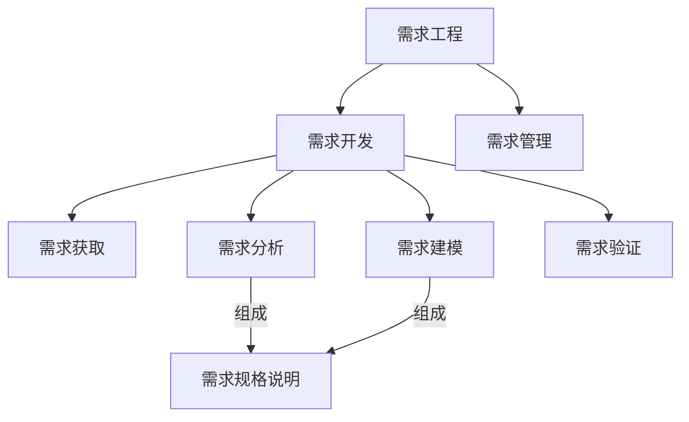

## 第一讲：绪论 
- 学习目标
> 依据需求工程理论及方法，面向对象的建模原则在需求阶段、系统分析及设计阶段面向对象的建模方法
- 课程内容
	- 需求工程
	- 需求过程(获取、分析、建模、管理)
	- 用力驱动的需求开发过程
	- 面向对象分析方法
	- 案例分析
- 成绩构成
	- `70%` 期末考试
	- `15%` 实验报告
		- 需求分析案例
		- 用例分析模型深入设计
		- 工程案例分析(小组)
	- `10%` 作业和随堂练习
	- ` 5%` 点名

### 软件需求
- 软件需求
	- 用户需求
	- 系统需求
		- 功能需求
		- 非功能需求
			- 产品需求
				- 可用性需求
				- 效率需求
					- 性能需求
					- 空间需求
				- 可靠性需求
			- 机构需求
			- 外部需求
		- 领域需求
	- 业务需求 

## 第二讲：需求基础
### 需求工程
>     是系统工程和软件工程的交叉分支，设计软件系统的目标、软件系统提供的服务、软件系统的约束和软件系统运行的环境。还涉及这些因素和系统精确规格说明以及系统进化间的关系。也提供显示需求和软件能力之间的桥梁
- 需求工程的基本活动
  - 获取需求[^ 深入实际，充分理解用户需求基础上，获取系统需求]
  - 需求分析[^ **形成需求基线集**，指定系统需要完成的任务]
  - 需求验证[^ 确保说明准确、完整表达系统的主要特性，并在技术上可行]
  - 需求管理[^ 维护需求基线、实现需求跟踪、控制变更]
  - 需求建模[^ 展现解释信息而进行的抽象描述活动，**最重要的一项任务**]

- 需求工程的特性
  - 复杂性 (需求获取耗时最长，模仿同类即可减少此方面开销)
- 需求工程师需要具备的知识和技能
  - 心里承受能力
  - 专业知识(软件)
  - 写作
  - 沟通
  - 领域知识

### 需求的定义
> 用户为了解决问题或达到某些目标需要的条件或能力
>
> 系统或系统部件为了满足合同、标准、规范或其他正是文档所规定的要求而需要具备的条件或能力
>
> 对上述中的一个条件或能力的一种文档化表述
- 需求的分类
	- 功能需求[^ 用量化的数据描述系统功能]
	- 性能需求[^ 系统整体或组成部分应该拥有的性能特征]
	- 质量属性[^ 形容词和副词描述，真实显示系统中决定成败]
	- 对外接口[^ 了解系统和其他系统间的软硬件接口]
		- 用途
		- 输入输出
		- 数据格式
		- 命令格式
		- 异常处理要求
		- 用户界面
	- 约束[^ 开发人员设计和构建系统时的选择范围]
		- 系统开发以及运行环境
		- 问题域内的相关标准
		- 商业规则
	- --
	- 硬件需求
	- 软件需求
	- 其他需求
- 功能需求的层次性
	- 业务需求`BR`
	    > - 高层次的**目标**：人力降低成本25%
	    > - 软件特性
	>     - 功能范围
	
	    ↓业务需求知道需求获取
	- 用户需求`UR`
	>    (用户具体的**任务**：能实时查课表)
	>    - 模糊
	
	    ↓转化用户需求为系统需求
	- 系统需求`SR`
	>    (给开发人员看的**系统行为**：具体实现)
	
### 优秀需求的特性
- 完整性

- 正确性[^ 真实反映用户意图，需签字予以确认]

- 精确性[^ 简洁清晰，仅描述必要的信息，实现所述指标]

- 可行性[^ 开发人员进行检查，约束的限定]

- 必要性[^ 满足用户业务需求所必须的]

- 无歧义[^ 每一项需求仅能有一种解释]

- 可验证[^ 通过分析检查模拟测试等方法预测需求是否被满足]
	> 为避免不可验证需求，描述时候需要
	> - 需求具体化
	> - 谨慎使用形容词副词
	> - 避免程度词的使用 
	
	### 常见需求定义错误
	
	- 需求未能反映用户真实需求[^ 主要情况]
	  - 原因
	    - 用户表达时潜意识的语言加工
	    - 信息在人际间传递过程中发生自然衰减和扭曲
	  - 解决
	    - 发现问题背后的问题
	    - 检查和确认
	- 模糊和歧义的需求
	  - 原因
	    - 无意：书写过程中选词造句不当
	    - 有意：应付对需求有不同立场的用户
	  - 解决
	    - 为项目中重要词汇建立公用标准词汇表
	    - 在项目前景指导下促进用户间协商解决
	- 明显的信息遗漏
	  - 原因
	    - 明显：项目范围定义不当
	    - 隐蔽：相关信息难以发现
	  - 解决
	    - 加强对业务需求的处理
	    - 难以解决，需要靠需求工程师经验加以避免
	- 不必要的需求
	  - 原因
	    - 用户和开发人员谈判筹码
	    - 用户倾向于表达各种需求
	    - 需求开发人员画蛇添足
	  - 解决
	    - 谈判技巧
	    - 根据业务需求进行用户需求的过滤选择
	    - 保持用户为中心

## 第三讲：需求获取

> 困难：难捕获易变

### 面谈法[^ 重要而直接，简单的需求获取技术]

> 可获得：

- 面谈中的问题
  - 开放式问题`30%-40%`
    - 选择可以是开放不受限制
    - 希望得到丰富(具有一定深度、广度)信息时，开放式问题较合适
  - 封闭式问题`60%-70%`
    - 答案有基本的形式，回答受到限制，较为具体
    - 优点：节省时间，切中要点，话题控制，快速探讨问题，贴切数据
    - 缺点：厌烦，难丰富细节，失去主要思想，不宜建立良好关系
  - 探究式问题[^ 为什么，例子，描述]
  - 诱导性问题[^ 引导回答]
  - 双问题
  - 元问题[^ 调节气氛]
- 面谈问题组织
  - 金字塔结构
  - 漏斗结构
  - 菱形结构
- 注意事项
  - 仪表着装
  - 礼仪
  - 委婉开始结尾收束
  - 持续时间
- 记录面谈
  - 笔录
  - 录音和摄像
- 优点和局限性
  - 优点：开展条件简单，经济成本较低；
  - 缺点：时间成本高，地理位置约束，谈话人水平相关

### 问卷调查法[^ 面谈法的补充]

- 适用情况：

  - 系统涉众在地理上分布

  - 涉众数量多，了解涉众统计倾向非常重要

  - 探究性问题，了解当前总体情况

- 问题的设置顺序

  - 重要问题优先
  - 相似主题应聚集在一起
  - 考虑问题之间的关联性
  - 先非争议性后争议性

### 众包与大数据

- 众包[^ 通过大量征集他人解决方案]

  - 可有偿可无偿

  - 许多公司和组织用自己的网站

  - 特定任务或项目投入方法

  - 通常通过互联网实现

- 大数据[^ 3V 大数据淘金]

  - 软件工程师职业操守

### 头脑风暴[^ 目的产生出尽可能多的新的想法]

鼓励参与者在无约束的环境下进行某些问题的自由思考自由讨论以获得新的想法

### 焦点小组[^ 专业带领下小组讨论]

### 原型化方法

### 观察法[^ 适用于用户无法准确表达需求的情况]

### 获取的其他事项