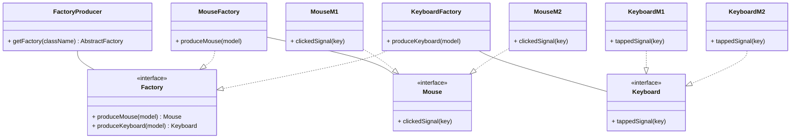

## `创建型模式` 工厂模式
- 意图

​		定义一个创建对象的接口，让其子类自己决定实例化哪一个工厂类，工厂模式使其创建过程延迟到子类进行

- 优点

  - 易使用: 创建对象仅需了解对象名
  - 易拓展: 增加产品仅需增加工厂类
  - 隐蔽性: 屏蔽产品具体实现，仅需关注接口

- 缺点

  - 类数量: 每1产品对应2个类
  - 依赖性: 增加了系统具体类的依赖

- 举例

## `创建型模式` 抽象工厂模式
- 意图

​		提供一个创建一系列相关或相互依赖对象的接口，而无需指定它们具体的类，即创建工厂的工厂

- 优点
  - 安全性: 保证客户始终只使用同一产品族的对象

- 缺点
  - 复杂性: 产品族拓展困难，代码修改幅度较大

- 举例

